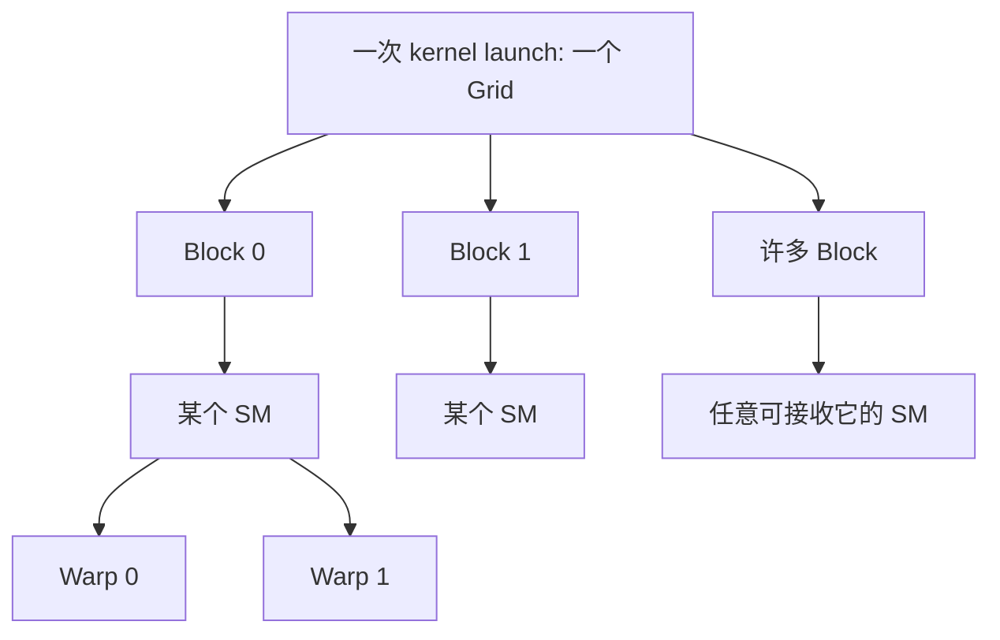

# 02 GPU、SM、Warp、Thread

## 1. 两套层次不要混在一起

学习 CUDA 时会同时遇到：

```text
硬件观察：GPU -> SM -> Warp -> Thread
程序组织：Grid -> Block -> Thread
```

它们有联系，但不是同一张图。

## 2. GPU 和 SM

GPU 是整块处理器。GPU 内部包含多个 Streaming Multiprocessor，简称 SM。

可以先把 SM 理解成：

> 能接收 thread block，并执行其中线程的硬件工作单元。

例如一块 GPU 有 40 个 SM，而一次 kernel 启动了 4000 个 block。硬件不会
要求“一块对应一个 SM”。多个 SM 会持续领取 block，完成后再领取新的。

### 2.1 SM 里有什么

第一层抽象中，SM 包含：

```text
warp 调度与发射资源
算术执行管线
load/store 管线
寄存器文件
shared memory/L1 相关资源
驻留 block 和 warp 的状态
```

不同架构的具体数量和组织不同，因此本卷只建立角色，不背微架构框图。

### 2.2 T4 数字

当前 T4 实测：

```text
SM count = 40
max threads per SM = 1024
max threads per block = 1024
```

`40 * 1024 = 40960` 是规格上 resident thread 上限推导，不代表任意 kernel
自动同时驻留 40960 thread。寄存器、shared memory、block 数等都可能先限制。

## 3. Block 是逻辑工作组

Block 由程序员在 kernel launch 时定义：

```cpp
kernel<<<grid, block>>>(...);
```

Block 的重要性质：

- 一个 block 被安排到一个 SM 上执行。
- block 开始执行后不会迁移到另一个 SM。
- block 内线程可以通过 shared memory 协作。
- block 内线程可以使用 block 级同步。
- 普通 kernel 中，不同 block 不能直接使用 `__syncthreads()` 同步。

Block 不是 GPU 芯片上预先固定画好的物理格子。

### 3.1 为什么不能迁移

Block 可能拥有：

- Shared memory 状态。
- Barrier 状态。
- 大量 thread register 状态。

这些状态驻留在一个 SM 的资源中。执行中迁移会非常昂贵，因此 CUDA 模型保证
block 在一个 SM 上完成。

### 3.2 为什么 Block 之间默认独立

调度器可以按任意顺序执行 block：

```text
Block 7 可能先于 Block 2
两个 Block 可能同时执行
Block 2 也可能等前一批完成后才开始
```

算法不能依赖 block index 顺序。独立性使同一个 kernel 能扩展到不同 SM 数量。

## 4. Thread 是程序员看到的执行实例

Kernel 代码会被许多 thread 各执行一次：

```cpp
__global__ void addOne(float* data, int count) {
  const int index = blockIdx.x * blockDim.x + threadIdx.x;
  if (index < count) {
    data[index] += 1.0F;
  }
}
```

每个 thread 看到自己的 `threadIdx` 和 `blockIdx`，因此可以处理不同元素。

### 4.1 Thread 拥有什么

概念上每个 thread 有：

- 自己当前执行到哪里的状态。更深入时会称为 program counter。
- 自己的寄存器值。
- 自己的 thread/block 索引。
- 私有局部变量。

但执行不是每个 thread 完全独立占用一套物理算术核心。

## 5. Warp 是硬件执行组织

在当前 CUDA GPU 中，一个 warp 包含 32 个 thread。

这句话很容易背下来，却很难真正理解。下面先用一个“只有 4 个 thread 的
假想小 warp”说明。真实 CUDA warp 仍然是 32 个 thread。

```text
假想 warp：

thread 0
thread 1
thread 2
thread 3
```

Kernel：

```cpp
__global__ void vectorAdd(const float* a,
                          const float* b,
                          float* c) {
  const int i = threadIdx.x;
  c[i] = a[i] + b[i];
}
```

假设：

```text
a = [10, 20, 30, 40]
b = [ 1,  2,  3,  4]
```

四个 thread 都执行相同的源代码：

```text
c[i] = a[i] + b[i]
```

但它们的 `i` 和数据不同：

| Thread | 自己的 `i` | 读取 `a[i]` | 读取 `b[i]` | 写入 |
|---:|---:|---:|---:|---:|
| 0 | 0 | 10 | 1 | `c[0]=11` |
| 1 | 1 | 20 | 2 | `c[1]=22` |
| 2 | 2 | 30 | 3 | `c[2]=33` |
| 3 | 3 | 40 | 4 | `c[3]=44` |

这里最重要的是：

```text
代码相同
thread 身份不同
访问的数据不同
最终结果也不同
```

程序员像是在描述一个 thread 应该做什么；GPU 再把相邻 thread 组织成 warp，
让它们一起推进指令。这就是 SIMT 最基本的直觉：

```text
Single Instruction, Multiple Threads

一条共同推进的指令
作用在多个拥有独立身份和数据的 thread 上
```

真实情况中，不是 4 个 thread，而是每 32 个 thread 组成一个 warp：

```text
warp 0:
  thread 0, thread 1, ..., thread 31

warp 1:
  thread 32, thread 33, ..., thread 63
```

### 5.1 “一起执行”到底是什么意思

我们继续看 vector add。一个 warp 的 32 个 thread 都要执行：

```cpp
const int i = ...;
c[i] = a[i] + b[i];
```

可以先把执行过程想成下面几个阶段：

```text
阶段 1：32 个 thread 各自计算自己的 i
阶段 2：32 个 thread 各自读取自己的 a[i]
阶段 3：32 个 thread 各自读取自己的 b[i]
阶段 4：32 个 thread 各自做加法
阶段 5：32 个 thread 各自写入自己的 c[i]
```

“一起”不是说 32 个 thread 共用一个 `i` 或一个结果。它表示硬件把这 32 个
thread 作为一个执行组来调度，它们通常推进同一条指令。

每个 thread 仍然有自己的：

```text
threadIdx
局部变量 i
寄存器中的 a 值和 b 值
访问地址
计算结果
```

因此不能把 warp 理解成“32 个 thread 合并成一个大 thread”。

### 5.2 Lane 就是 Warp 内的座位号

Lane 不是新的 thread，也不是新的硬件核心。

它只是：

> 一个 thread 在自己所属 warp 内的编号。

真实 warp 有 32 个座位，所以 lane 编号永远是：

```text
0, 1, 2, ..., 31
```

用电影院座位类比：

```text
warp = 一排 32 个座位
lane = 这一排中的座位号
thread = 坐在该座位上的执行实例
```

假设一个一维 block 有 128 个 thread：

```text
threadIdx.x = 0 ... 127
```

它会被分成 4 个 warp：

| `threadIdx.x` | 所属 Warp | Lane |
|---:|---:|---:|
| 0 | 0 | 0 |
| 1 | 0 | 1 |
| 31 | 0 | 31 |
| 32 | 1 | 0 |
| 33 | 1 | 1 |
| 63 | 1 | 31 |
| 64 | 2 | 0 |
| 103 | 3 | 7 |
| 127 | 3 | 31 |

计算公式：

```text
lane = linearThreadId % 32
warp = linearThreadId / 32
```

这里是整数除法。

以线性 thread ID `103` 为例：

```text
warp = 103 / 32 = 3
lane = 103 % 32 = 7
```

因为：

```text
103 = 3 * 32 + 7
```

意思是：

```text
前面已经有 3 个完整 warp
它位于第 4 个 warp（编号 3）
在这个 warp 内坐第 7 号位置
```

初学阶段，lane 只需要理解成“warp 内编号”。后续高级章节需要这个概念时会
重新从头解释，现在不用提前记忆其他术语。

### 5.3 二维 Block 中怎么找 Lane

二维 block 不能直接拿 `threadIdx.x` 计算 warp，因为 `threadIdx.x` 只表示当前
thread 在一行中的横向坐标，并不表示它在整个 block 中排第几个。

例如 `block=(16,16)` 时，坐标 `(3,0)` 和 `(3,2)` 的 `threadIdx.x` 都是 3，
但它们显然不是同一个 thread。我们需要先把 block 内所有 thread 排成一条队伍，
得到 block 内线性编号：

```text
linearThreadId =
    threadIdx.y * blockDim.x + threadIdx.x
```

例如：

```text
blockDim = (16, 16)
threadIdx = (3, 2)
```

先计算：

```text
linearThreadId = 2 * 16 + 3 = 35
```

再计算：

```text
warp = 35 / 32 = 1
lane = 35 % 32 = 3
```

因此，这个 thread 属于 warp 1，lane 3。

这里的 `35` 只表示它在自己 block 内排第 35，不是它负责的矩阵元素地址。
一维、二维、三维 Block 为什么需要线性编号，以及公式如何一步步推出来，见：

[一维、二维、三维 Block 与线性编号](02A_一维二维三维Block与线性编号.md)。

再看 `blockDim=(32,8)`：

```text
threadIdx=(7,3)
linearThreadId=3*32+7=103
warp=3
lane=7
```

因为一行正好 32 个 thread，所以：

```text
threadIdx.y 恰好等于 warp 编号
threadIdx.x 恰好等于 lane 编号
```

但这只对 `blockDim.x=32` 的这种布局成立，不是 CUDA 的普遍公式。

### 5.4 用 Sample 亲眼看 Warp 和 Lane

运行：

```bash
make -C labs/02_programming_model/index_mapping clean all
./labs/02_programming_model/index_mapping/index_mapping
```

程序会直接打印：

```text
thread=31 -> linear=31 warp=0 lane=31
thread=32 -> linear=32 warp=1 lane=0
```

这两行最值得观察。为什么 thread 32 的 lane 又变成 0？

因为 lane 是“warp 内编号”，不是 block 内编号：

```text
warp 0 已经坐满 0..31
thread 32 进入下一个 warp
所以它是 warp 1 的 lane 0
```

二维输出还会出现：

```text
local=(row=1,col=15)
-> thread_linear=31 warp=0 lane=31

local=(row=2,col=0)
-> thread_linear=32 warp=1 lane=0
```

这说明二维坐标在组成 warp 之前，会先按：

```text
x 先变化，走完一行后 y 再增加
```

转换为线性顺序。

### 5.5 现在再比较 SIMT 与 SIMD

如果 SIMD 这个词仍然陌生，可以暂时跳过本小节。理解 CUDA 编程并不要求先会
CPU 向量指令。

SIMD 可以粗略理解为：程序员或编译器使用一个“向量值”，一条指令同时处理
其中多个元素。

假设一个向量寄存器装着 4 个数：

```text
A = [10,20,30,40]
B = [ 1, 2, 3, 4]
```

一条向量加法得到：

```text
C = A + B = [11,22,33,44]
```

SIMT 中，程序员看到的是 4 个独立 thread：

```text
thread 0: 10 + 1
thread 1: 20 + 2
thread 2: 30 + 3
thread 3: 40 + 4
```

硬件再把它们组织起来共同推进。

第一遍只记这个区别：

```text
SIMD：
  从“一个向量包含多个元素”的角度写或生成指令。

SIMT：
  从“多个独立 thread 各自处理一个元素”的角度写程序，
  GPU 把 thread 组成 warp 执行。
```

它们底层有相似之处，但编程抽象不同。SIMT 让每个 thread 拥有显式身份、
独立地址和独立寄存器状态。

### 5.6 如果 Warp 内 Thread 想做不同事情

```cpp
if (threadIdx.x % 2 == 0) {
  pathA();
} else {
  pathB();
}
```

同一 warp 的 lane 走不同路径时，硬件需要分别推进路径并屏蔽不参与 lane。
它不会产生两个真正独立、同时满速的半 warp。

仍用 4-thread 假想 warp：

```text
thread 0: 偶数，走 pathA
thread 1: 奇数，走 pathB
thread 2: 偶数，走 pathA
thread 3: 奇数，走 pathB
```

可以先这样理解执行：

```text
执行 pathA 时：
  thread 0、2 有效
  thread 1、3 暂时不产生结果

执行 pathB 时：
  thread 1、3 有效
  thread 0、2 暂时不产生结果
```

两条路径都要走一遍，所以执行资源利用率下降。这叫 warp divergence。

注意：

```text
不同 warp 走不同路径，不叫同一个 warp 内的分歧。
```

## 6. Block 如何拆成 Warp

Block 中的 thread 按 block 内线性 thread ID 分组。完整推导已经放在
[一维、二维、三维 Block 与线性编号](02A_一维二维三维Block与线性编号.md)，
这里关注它如何影响 warp。

一维 block：

```text
linearThread = threadIdx.x
```

二维 block：

```text
linearThread =
    threadIdx.y * blockDim.x + threadIdx.x
```

三维 block：

```text
linearThread =
    threadIdx.z * blockDim.y * blockDim.x
  + threadIdx.y * blockDim.x
  + threadIdx.x
```

每连续 32 个线性 thread 组成一个 warp。

例如 `blockDim=(32, 8)`：

```text
warp 0: y=0, x=0..31
warp 1: y=1, x=0..31
...
warp 7: y=7, x=0..31
```

这种布局很适合让一个 warp 访问矩阵中的连续一行。

### 6.1 `16 x 16` 的 Warp

```text
blockDim=(16,16)
```

线性顺序先走完 x，再增加 y：

```text
warp 0:
  y=0,x=0..15
  y=1,x=0..15

warp 1:
  y=2,x=0..15
  y=3,x=0..15
```

所以“二维图上看起来一行”不一定对应一个 warp。

### 6.2 `8 x 8 x 4`

总 thread：

```text
8*8*4 = 256
```

线性化先 x、再 y、最后 z。Warp 0 覆盖：

```text
z=0,y=0..3,x=0..7
```

## 7. Block 不必是正方形

CUDA block 可以是一维、二维或三维，也可以是长方形：

```cpp
dim3 blockA(256);       // 256 x 1 x 1
dim3 blockB(16, 16);    // 16 x 16 x 1
dim3 blockC(32, 8);     // 32 x 8 x 1
dim3 blockD(8, 8, 4);   // 8 x 8 x 4
```

必须满足设备限制，包括：

```text
blockDim.x * blockDim.y * blockDim.z
    <= maxThreadsPerBlock
```

各维度还各自有最大值，应通过设备属性查询。

## 8. Grid、Block 如何映射到 SM



一个 SM 可以同时驻留多个 block，前提是线程、寄存器和 shared memory 等
资源允许。卷五会深入 occupancy。

### 8.1 调度示例

假设：

```text
GPU 有 4 个 SM
Grid 有 10 个 block
每个 SM 当前可驻留 2 个 block
```

第一批最多驻留 8 个 block，剩余 2 个等待。某个 block 完成并释放资源后，
调度器再安排等待 block。

程序不应假设具体是：

```text
SM0 一定执行 Block0
SM1 一定执行 Block1
```

### 8.2 Wave

当 grid block 数多于同时可驻留 block，执行会形成多批 wave。最后一批若只有
少量 block，部分 SM 空闲，叫 tail effect 的一种表现。

## 9. 常见误区

### 误区一：一个 block 对应一个 SM

错误。一个 SM 会依次执行很多 block，也可能同时驻留多个 block。

### 误区二：一个 thread 对应一个 CUDA Core

错误。Thread 是逻辑执行实例。硬件执行资源会随时间处理大量 thread 指令。

### 误区三：Grid 是 GPU 上固定的结构

错误。每次 kernel launch 都会创建一个逻辑 Grid，形状由程序指定。

### 误区四：二维 block 必须是 `n x n`

错误。`32 x 8`、`16 x 16` 都很常见，应根据数据和访存方式选择。

## 10. 实践

1. 计算 `block=(16,16)` 有多少 thread、多少 warp。
2. 计算 `block=(32,8)` 有多少 thread、多少 warp。
3. 写出 `block=(8,4)` 中 `(x=3,y=2)` 的线性 thread ID。
4. 运行卷二的 index mapping 实验，观察坐标。

5. 对 `block=(16,16)` 写出 warp 0 和 warp 1 的二维坐标。
6. 对 `block=(8,8,4)` 写出 `(x=3,y=2,z=1)` 的线性 ID、warp 和 lane。
7. 解释为什么 grid 有 4000 block，但 T4 只有 40 SM 仍然可以执行。

## 11. 本章小结

```text
SM 是硬件执行单元。
Block 是被调度到 SM 的逻辑线程组。
Thread 是 kernel 的逻辑执行实例。
Warp 是 32 个 thread 组成的硬件执行组织。
```

## 12. 资料映射

- CUDA Programming Guide：Programming Model、Writing SIMT Kernels。
- CUDA Programming Guide：Compute Capabilities。
- PMPP：数据并行执行模型与 GPU 计算架构基础。
