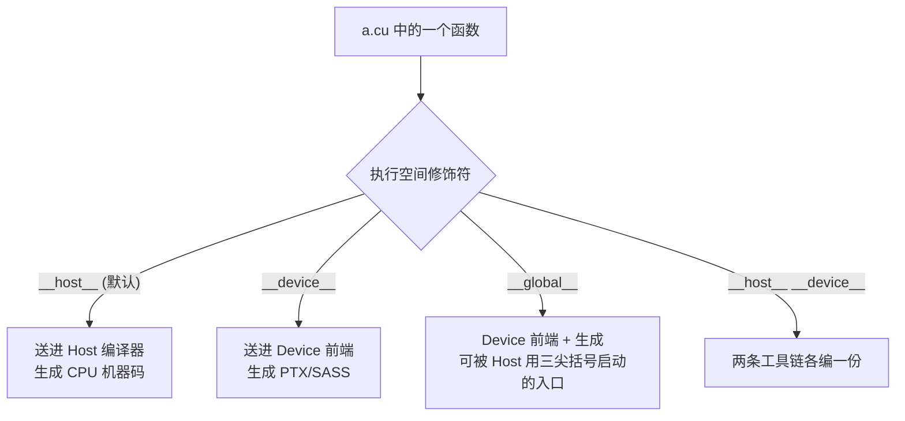

# 03 CUDA 函数修饰符与执行空间

## 1. 为什么需要修饰符

一个 `.cu` 文件里同时住着两个世界：跑在 CPU 上的 Host 代码，和跑在 GPU 上的
Device 代码。问题是——它们最终由**两条完全不同的编译工具链**翻译：Host 代码交给
系统的 C++ 编译器（g++/clang/MSVC），Device 代码交给 NVIDIA 的设备前端，编成
PTX/SASS（卷二第 06 章）。

于是编译器在看到一个函数时必须先回答三个问题，否则根本不知道该把它送进哪条工具链：

- 这个函数**由谁调用**？（Host 还是 Device）
- 它**在哪里执行**？
- 需不需要**同时生成两份**机器码（Host 一份、Device 一份）？

源代码里没有任何天然信息能回答这些——`float square(float)` 看起来对 CPU 和 GPU
都成立。所以 CUDA C++ 用**执行空间修饰符**把答案显式写在函数上。修饰符不是
语法糖，而是**编译期分流的路标**：写错一个，要么编译失败，要么生成了一份
根本无法在目标端运行的代码。



## 2. `__global__`

```cpp
__global__ void vectorAdd(...) {
  // Device 执行
}
```

基本规则：

```text
调用方：通常是 Host
执行方：Device
返回值：必须是 void
调用语法：kernel<<<grid, block>>>(arguments)
```

一次调用不是普通函数调用，而是向 CUDA runtime 提交 kernel launch。

### 2.1 为什么返回值必须是 `void`

这条规则常被当作"死规定"背下来，但它其实是 launch 异步性的**必然结果**。
`kernel<<<...>>>(...)` 这一行在 Host 看来只是"把工作提交到 stream 然后立刻返回"
（卷二第 05 章），此刻 GPU 可能**一条指令都还没执行**。既然 Host 不会停下来等
kernel 算完，就**没有任何时刻**能把一个返回值交回给调用者。

而且 kernel 是被成千上万个线程**各执行一次**的——就算允许返回，也无法定义
"哪个线程的返回值才算数"。所以 CUDA 的设计是：kernel 不返回，**结果只能写进
它收到的指针所指向的 device memory**，Host 之后再用 `cudaMemcpy` 取回。这也是
为什么本课所有 kernel 都以"输出指针"作参数，而不是 `return`。

### 2.2 三尖括号到底编译成了什么

`<<<grid, block>>>` 这个语法不是 C++，是 CUDA 的扩展。NVCC 会把它**改写成一串
普通的 runtime 调用**，概念上等价于：

```text
压入启动配置 (grid, block, sharedBytes, stream)
  -> 逐个压入 kernel 参数
  -> cudaLaunchKernel(入口函数地址, ...)   // 真正提交
```

理解这一点能解释两件事：一是为什么漏写 `<<<>>>` 直接 `kernel(args)` 会编译失败
（缺少启动配置，无法生成 launch 序列）；二是为什么 launch 错误要用
`cudaGetLastError()` 去查——因为它本质是一次 **runtime API 调用**，错误通过
runtime 的错误状态返回，而不是抛 C++ 异常。

## 3. `__device__`

```cpp
__device__ float addBias(float value, float bias) {
  return value + bias;
}
```

基本规则：

```text
调用方：Device code
执行方：Device
```

普通 Host 函数不能直接调用 `__device__` 函数。

## 4. `__host__`

普通 C++ 函数默认就是 Host 函数：

```cpp
float square(float x) {
  return x * x;
}
```

显式写法：

```cpp
__host__ float square(float x) {
  return x * x;
}
```

通常无需显式写 `__host__`，除非与 `__device__` 组合。

## 5. `__host__ __device__`

```cpp
__host__ __device__ float square(float x) {
  return x * x;
}
```

编译器分别生成 Host 和 Device 版本——注意是**两份独立的机器码**，不是一份共享。
这正是 §1 那张分流图里 `__host__ __device__` 走两条工具链的含义。配套实验
`function_qualifiers.cu` 里的 `square()` 被 Host 的 `main`（打印 `square(3)`）和
Device 的 `transformKernel` 同时调用，靠的就是这两份代码各自存在。

适合双修饰的场景：

- 小型数学函数（如 `square`）。
- 索引辅助函数（如行主序 `row*width+col`）：Host 验证和 Device kernel 共用同一份逻辑，避免两边各写一遍而算法不一致。
- Host/Device 共用的数据类型方法。

限制是函数体必须能在**两个执行环境都编译**。这条限制有实际后果：因为 Device
版本也要编译，函数里就不能出现只有 Host 才有的 API。例如往里塞一句
`std::cout << x;`，Host 版本没问题，但 Device 版本会编译失败——GPU 端根本没有
`std::cout` 这套 I/O 设施。这正是第 10 节那个经典报错的根因。

## 6. 一个调用关系图

```text
Host main()
  ├─ 调用普通 Host 函数
  ├─ 调用 __host__ __device__ 的 Host 版本
  └─ launch __global__ kernel
       ├─ 调用 __device__ 函数
       └─ 调用 __host__ __device__ 的 Device 版本
```

## 7. Sample

[`function_qualifiers.cu`](../../labs/02_programming_model/function_qualifiers/function_qualifiers.cu)

```bash
make -C labs/02_programming_model/function_qualifiers clean all
./labs/02_programming_model/function_qualifiers/function_qualifiers
```

Sample 中：

```cpp
square()          // Host 与 Device 都能调用
addBias()         // 只能由 Device 调用
transformKernel() // Host launch，Device 执行
```

## 8. 内联与 `__forceinline__`

`__forceinline__` 强烈要求编译器内联，`__noinline__` 抑制内联。不要把
`__forceinline__` 当作默认性能按钮：

- 内联可减少调用开销。
- 也可能增大代码、增加寄存器压力。
- 编译器本来就会做优化判断。

## 9. Device Function Pointer 与动态并行

CUDA 支持更复杂的 Device 调用能力，但存在编译、链接、架构和性能约束。
初学阶段优先使用静态可见的小函数。

Device 端 launch kernel 属于 dynamic parallelism，是高级能力，不属于普通
`__device__` 调用。

## 10. 常见编译错误

### Host 调用 Device-only 函数

```cpp
__device__ int f();
int x = f();  // 错误
```

### Device 函数调用 Host-only 库

```cpp
__host__ __device__ void f() {
  std::cout << "x";  // Device 版本通常无法编译
}
```

### 把 Kernel 当普通函数

```cpp
kernel(args);  // 错误，缺少 launch configuration
```

## 11. 练习

1. 写一个 `__host__ __device__` 行主序索引函数。
2. 在 Host 上测试它，再在 kernel 中测试。
3. 故意让双修饰函数调用 `std::cout`，阅读编译错误。

## 12. 面试题

- `__global__` 和 `__device__` 有什么区别？
- 为什么 kernel 返回值必须是 `void`？
- `__host__ __device__` 是否只生成一份代码？
- `__forceinline__` 为什么不一定更快？

