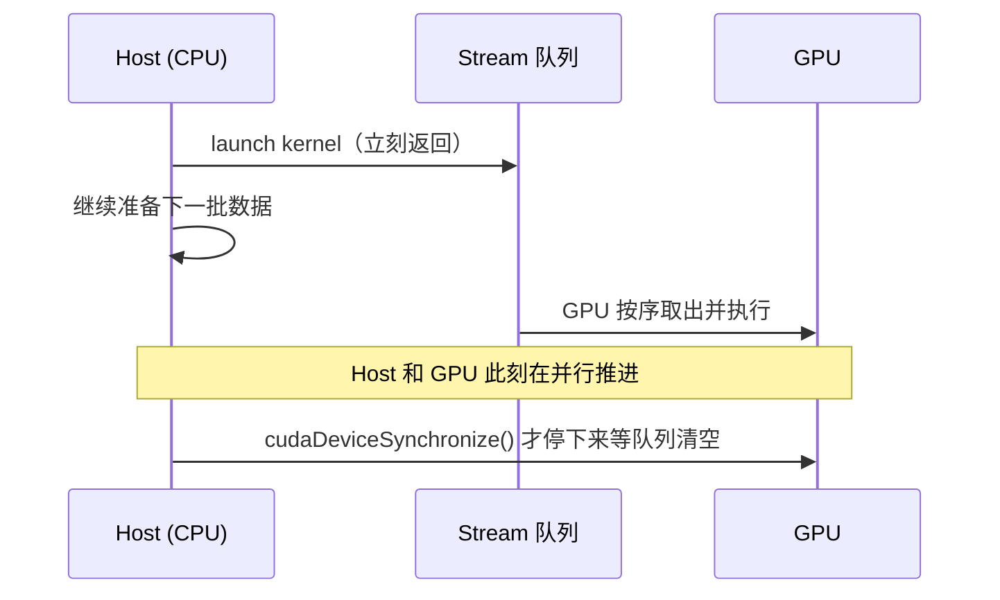

# 05 异步执行、同步与错误模型

## 1. Launch 是提交工作

```cpp
kernel<<<grid, block>>>(...);
```

通常表示 Host 将工作提交到 stream，然后继续执行。它不是“CPU 进入 GPU
函数，等函数返回”。
把 stream 想成 GPU 前面的一条**传送带（队列）**：Host 把任务放上传送带就转身
走了，GPU 在另一头按顺序取下来执行。这条传送带是理解本章所有现象的核心模型——
错误何时暴露、同步等的是什么、为什么过度同步会慢，全都能从它推出来。


## 2. 为什么异步重要

异步允许：

- CPU 准备下一批数据。
- 多 stream 组织工作。
- 传输与计算重叠。
- 避免每个 kernel 后都阻塞 Host。

但也带来错误暴露时机和资源生命周期问题。

## 3. 两类错误

异步模型带来一个反直觉的后果：**错误和它对应的代码行在时间上是错位的**。用
传送带模型看就很清楚——有些错误在"放上传送带的瞬间"就能发现，有些要等
"GPU 真正取下来执行"才暴露。

### Launch 配置错误

例如 thread 数超过限制：

```cpp
kernel<<<1, 2048>>>(...);          // T4 上限 1024/block
cudaError_t status = cudaGetLastError();
```

这类错误在**提交那一刻就能查出**：runtime 在把任务放上传送带前会校验配置
（block 维度、shared memory 大小等），不合法就直接拒绝。所以紧跟 launch 的
`cudaGetLastError()` 能立即捕获它。

### 执行错误

例如 kernel 中访问非法地址：

```cpp
kernel<<<...>>>(...);
CUDA_CHECK(cudaGetLastError());        // 这里往往还是 success！
CUDA_CHECK(cudaDeviceSynchronize());   // 错误在这里才浮出水面
```

配置完全合法，任务顺利上了传送带，所以紧跟其后的 `cudaGetLastError()` 通常
返回 success。非法访问要等 GPU **真正执行到那条指令**才发生，而 Host 此刻早已
跑到别处。于是错误被"推迟"到下一个**会等待 GPU 的同步点**才报告——可能是
`cudaDeviceSynchronize`、后续的 `cudaMemcpy`、或 event 同步。

一句话记忆：**配置错误在 launch 处抓，执行错误在同步处抓**。这就是为什么本课
的 `CUDA_CHECK` 模式总是"launch 后查一次 + 同步后再查一次"。

## 4. `cudaGetLastError` 与 `cudaPeekAtLastError`

```text
cudaGetLastError  返回并清除当前线程的 last error
cudaPeekAtLastError 返回但不清除
```

教学代码常在 launch 后用 `cudaGetLastError`。

## 5. 同步范围

```cpp
cudaDeviceSynchronize();   // 等当前 device 之前提交的工作
cudaStreamSynchronize(s);  // 等指定 stream
cudaEventSynchronize(e);   // 等 event
```

选择最小必要范围。全局同步简单但会破坏并发。

## 6. 默认 Stream 第一印象

没有指定 stream：

```cpp
kernel<<<grid, block>>>(...);
```

使用默认 stream。显式 stream：

```cpp
kernel<<<grid, block, 0, stream>>>(...);
```

默认 stream 语义还受 legacy/per-thread default stream 模式影响。卷七深入。

## 7. Sample

[`async_errors.cu`](../../labs/02_programming_model/async_errors/async_errors.cu)

安全运行：

```bash
make -C labs/02_programming_model/async_errors clean all
./labs/02_programming_model/async_errors/async_errors
```

故意非法访问：

```bash
./labs/02_programming_model/async_errors/async_errors --illegal-access
```

你会看到：

```text
Immediate launch check 可能成功
Synchronization check 报 illegal memory access
```

因为 launch 配置合法，但执行期间地址非法。

## 8. Sticky Error 与恢复

严重异步错误后 CUDA context 可能处于错误状态，后续 API 继续返回错误。教学
实验最好让故障程序单独进程运行，不在同一进程继续做其他验证。

这里要区分两种错误的"粘性"。像非法内存访问这类**执行错误是 sticky（粘滞）的**：
它破坏的是整个 CUDA context，一旦发生，**之后每一个** CUDA API 调用都会持续
返回同一个错误，且无法在本进程内清除——只能终止进程重来。而 launch 配置错误
之类的**非 sticky 错误**只反映"这一次调用"的状态，被 `cudaGetLastError` 读走后
就清掉了，不影响后续。

这正是为什么 `--illegal-access` 这种故障演示要**单独进程**跑：在同一进程里非法
访问之后，你后面写的任何"正常"验证都会被 sticky 错误污染，看到的失败是假象，
而非你新代码的问题。

## 9. 不要过度同步

错误性能模式：

```cpp
kernelA<<<...>>>();
cudaDeviceSynchronize();
kernelB<<<...>>>();
cudaDeviceSynchronize();
```

如果 B 在同一 stream 且依赖 A，stream 本身保证顺序，未必需要 Host 每次等待。

## 10. 练习

1. 运行安全与非法模式，记录两个检查点。
2. 把非法访问改成非法 launch 配置，比较错误时机。
3. 用 Compute Sanitizer 获取源代码行。

## 11. 面试题

- Kernel launch 为什么是异步的？
- Launch error 与 execution error 有何区别？
- `cudaDeviceSynchronize` 为什么会影响性能？
- 同一 stream 的 kernel 是否按提交顺序执行？

