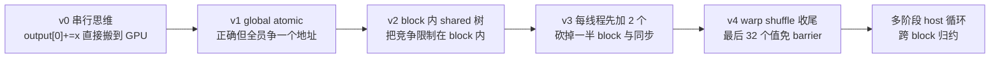

# 03 Reduction：从错误到优化

## 0. 本章的主线

Reduction（归约）是"把一个数组压缩成一个标量"的操作，求和、求最大值、求点积
都属于它。它看起来是入门级问题，却是整个 GPU 编程里**最值得反复打磨**的一课，
原因有两个：

- 它把前面学过的 race、`__syncthreads()`、shared memory、warp、原子操作
  全部串到一条主线上。
- 它的每一次优化都有**清晰可量化的动机**——你能说出"上一版慢在哪、这一版省下了什么"。

所以本章不直接给"最优 kernel"，而是从一个**会算错**的版本出发，一步步问
"它错在哪 / 慢在哪 / 怎么改"，最终走到配套实验里的两个 kernel
（`reduceShared` 与 `reduceWarpShuffle`）。读完你应当能对着代码复述每一步的因果。

主线一图：



## 1. 问题：为什么归约天然适合做成"树"

要计算的目标：

```text
sum = x0 + x1 + ... + x(n-1)
```

CPU 上就是一个 `for` 循环，复杂度 `O(n)`，而且是**严格串行**的——`sum`
这个累加器在每次迭代都被读改写，第 `i` 步必须等第 `i-1` 步完成。

但加法满足**结合律**：`(a+b)+(c+d)` 和 `((a+b)+c)+d` 结果相同。结合律允许我们
**改变求和顺序**，把链式依赖拆成一棵二叉树：

```text
x0  x1   x2  x3   x4  x5   x6  x7
 \  /     \  /     \  /     \  /
  +        +        +        +      第 1 轮：8 -> 4 个部分和
   \      /          \      /
     +                 +           第 2 轮：4 -> 2
        \             /
             +                     第 3 轮：2 -> 1
```

每一轮把元素数量**减半**，树的深度是 `ceil(log2(n))`。对 `n = 1,000,003`，
串行要 100 万步，而树高只有约 20 层。如果每一层的所有加法都能并行做完，
**关键路径**（必须串行的最长链）就从 `n` 缩短到 `log2(n)`。这就是把归约搬上
GPU 的根本动机：不是 GPU 把加法变快了，而是结合律让我们**暴露出了并行性**。

> 浮点提醒：结合律对实数严格成立，对 IEEE-754 浮点只是**近似**成立。不同的
> 求和顺序会产生不同的舍入误差，所以 GPU 归约的结果和 CPU 串行求和往往在末位
> 有微小差异。配套实验用 `tolerance = max(1e-3, |expected| * 1e-5)` 来判定，
> 而不是要求逐位相等——这正是因为我们**主动改了求和顺序**。

## 2. v0/v1：从一个会出错的版本说起

最自然的"翻译"是把 CPU 的累加器原样搬过来，让每个线程往同一个地址加：

```cpp
// v0：错误
output[0] += input[index];
```

这行代码隐含 `读 output[0] -> 加 -> 写回` 三步。成千上万个线程同时执行它，
就会发生 **race**（卷四第 01 章）：线程 A 和 B 可能读到同一个旧值，各自加完后
互相覆盖，于是大量加法**凭空丢失**。结果每次运行都不一样，而且几乎总是偏小。

修正方向只有一个：让"读-改-写"变成不可分割的整体，也就是 **atomic**：

```cpp
// v1：正确，但慢
atomicAdd(&output[0], input[index]);
```

现在结果对了。但请注意我们为正确性付出的代价——**所有线程都在抢同一个地址**。
硬件必须把这些原子操作**串行化**，一次只放一个进去：

```text
n 个线程 ── 全部排队 ──> [ output[0] ] 一次只服务一个
```

这等于把刚才好不容易暴露出来的并行性又**亲手收了回去**：关键路径重新退化到
约 `O(n)`。v1 给了我们本章第一条核心教训：

> **正确不等于高吞吐。** 用一个全局原子把所有线程串起来，是能跑对，但它把
> GPU 当成了一个很贵的单核 CPU。

## 3. v2：把竞争"关进 block 里"——shared memory 树

v1 的病根是"全员争一个全局地址"。改进思路顺理成章：**先在小范围内合作，
把竞争从全局缩小到 block 内部**。一个 block 的线程共享一块片上 shared memory
（卷三第 03 章），延迟比 global 低一两个数量级，而且 block 内可以用
`__syncthreads()` 精确排队。

每个 block 的流程：

1. 每个线程从 global memory 取一个（下一节会改成两个）元素，写进 shared memory。
2. `__syncthreads()` 确保整块数据都到位。
3. 在 shared memory 里做 `log2` 轮的树形归约，每轮活跃线程减半。
4. `tid == 0` 的线程把这个 block 的部分和写回 global。

对应 lab（`reduceShared`）里的树循环：

```cpp
for (int offset = blockDim.x / 2; offset > 0; offset /= 2) {
  if (tid < offset) {
    values[tid] += values[tid + offset];   // 把后半段加到前半段
  }
  __syncthreads();                          // 等本轮所有加法写完
}
```

用 8 个线程举例，看清楚每一轮"谁加谁、谁退场"：

```text
初始  values:  v0 v1 v2 v3 v4 v5 v6 v7
offset=4:      tid<4 干活, values[tid] += values[tid+4]
              v0+v4 v1+v5 v2+v6 v3+v7  |  (后半 4 个退场)
offset=2:      tid<2 干活
              (..+..) (..+..)          |  (再退场 2 个)
offset=1:      tid<1 干活
              全部之和落在 values[0]
```

三个关键点，每一个都对应一条硬件/正确性原因：

- **为什么每轮都要 `__syncthreads()`？** 因为 `values[tid] += values[tid+offset]`
  读的是**别的线程**上一轮写下的值。没有 barrier，快的线程会读到还没更新的旧数据
  （race）。barrier 在这里提供 block 范围的**顺序 + 可见性**保证。
- **为什么是 `offset` 折半而不是相邻配对？** 这叫 **sequential addressing**。
  活跃线程永远是连续的前 `offset` 个（`tid < offset`），所以一个 warp 内的 32 条
  lane 要么全干活、要么全退场，**没有 warp 分歧**（卷五第 03 章）。
  如果改成"`tid` 为偶数才干活"的 interleaved 写法，同一个 warp 里就会一半执行
  一半空转，吞吐立刻打折。
- **为什么 `tid == 0` 才写回？** 树根只有一个值，写在 `values[0]`，多写就是重复。

v2 把全局竞争降成了"每个 block 内部一棵安静的树"，全局只剩下"每个 block 一个
部分和"。这是从 v1 到能用的关键一跃。

## 4. v3：每个线程先加两个——把"加载"也变成有效计算

v2 还有一处浪费藏在第一步里。看树循环：第一轮 `offset = blockDim.x/2` 时，
**只有一半线程在干活**，另一半线程从加载完到第一轮结束几乎只是"把数搬进
shared 然后等着被加"。换句话说，**加载阶段已经动用了所有线程，但第一轮归约
立刻浪费掉一半**。

优化：让每个线程在写入 shared 之前，**先在寄存器里把两个 global 元素加起来**。
这正是 lab 里 `start` 要乘 2 的原因：

```cpp
const int start = blockIdx.x * blockDim.x * 2 + tid;  // 注意 *2

float sum = 0.0F;
if (start < count) {
  sum += input[start];                 // 第一个元素
}
if (start + blockDim.x < count) {
  sum += input[start + blockDim.x];    // 错开一个 blockDim 的第二个元素
}
values[tid] = sum;                     // 写进 shared 的已经是"两个之和"
```

### 为什么是 `blockDim.x * 2`？——block 的"跨度"翻倍了

`* 2` 不是魔法数，而是因为**每个 block 现在负责的输入从 256 个变成了 512 个**，
所以下一个 block 的"起跑线"也必须按 512 跳，而不是 256。

```text
v2：每 block 管 256 个 → 起点 = blockIdx.x * blockDim.x      （跳 256）
  block0 起点 0、block1 起点 256、block2 起点 512 ...

v3：每 block 管 512 个 → 起点 = blockIdx.x * (blockDim.x * 2)（跳 512）
  block0 起点 0、block1 起点 512、block2 起点 1024 ...
```

配图（blockDim.x = 256）：

```text
        block0 跨度512        block1 跨度512        block2 跨度512
input: [0 ........... 511][512 ......... 1023][1024 ........ 1535]
        ↑0=0*512            ↑512=1*512          ↑1024=2*512
        起点 = blockIdx.x * blockDim.x * 2
```

所以这一行拆开看是两个职责：`blockDim.x * 2` 定位到**本 block 的起点**（跨度翻倍），
`+ tid` 再定位到 block 内的**第 tid 个线程**。

一个 block（`blockDim.x = 256`）因此覆盖 `256 * 2 = 512` 个输入。带来三笔收益，
每一笔都能量化：

```text
block 数量      减半（512 而不是 256 个输入/block）
shared 树轮数   省去最浪费的第一轮（那一轮本就只有半数线程活跃）
内存访问        两次加载仍是合并访问，只是每线程多搬一个数，访存利用率更满
```

**为什么两个地址要分别判边界？** 因为输入长度不保证是 512 的倍数。`start`
合法不代表 `start + blockDim.x` 也合法，少判一个就会**越界读**。两个独立的 `if`
正是为非整除输入兜底。

> 访问模式细节：第二个元素取的是 `start + blockDim.x` 而不是 `start + 1`。
> 这样一个 warp 的 32 条 lane 在两次加载里都访问**连续地址**，保持合并访问；
> 若用 `start*2` 和 `start*2+1`，相邻 lane 会跨步，破坏合并。

### 满血版：grid-stride 让每个线程攒任意多个

"每线程加两个"只是入门形态——它把 block 跨度从 1 倍写死成了 2 倍。真正通用的
写法是 **grid-stride loop**：让每个线程在寄存器里**循环累加任意多个**元素，
步长等于"全网格总线程数"。这样 block 数量、每线程搬几个，都不再写死。

```cpp
const int gid    = blockIdx.x * blockDim.x + tid;   // 全局线程号
const int stride = gridDim.x * blockDim.x;          // 总线程数 = 步长

float sum = 0.0F;
for (int i = gid; i < count; i += stride) {         // 寄存器里攒任意多个
  sum += input[i];
}
values[tid] = sum;                                  // 进 shared 时已是一长串的和
```

**为什么步长是"总线程数"？** 同一拍，warp 的 32 条 lane 拿到的是 `gid, gid+1,
... gid+31`——地址连续，合并访问；下一圈整体平移 `stride` 个，warp 内**仍然连续**。
所以"跳着取"反而每一圈都保持合并，这是 GPU 上最反直觉、也最关键的一点。

```text
v3（加2个）：  block 跨度写死 2 倍，每线程恰好搬 2 个
满血版：       block/grid 大小随便设，每线程循环搬 count/总线程数 个
              → 一次把"加载阶段"压满，shared 树只需归约"每 block 一个长和"
```

收益对照（这正是 atomic_sum 里 reg+shared 版快 ~10x 的同款套路）：

```text
                每线程搬几个      atomic/同步次数      访存利用
v2 单加载         1               每元素都进树          一半线程第一轮就退场
v3 加两个         2               省第一轮              加载即计算
满血 grid-stride  任意多          砍到 ~每 block 一次    带宽吃满、固定开销摊薄
```

> 经验幅度：v2→v3 通常 1.3~2x；推广成 grid-stride 攒多个后，访存利用率进一步
> 拉满，整体可达数倍。三层聚合（寄存器 → shared → global）每多压一层，
> 下一层的 atomic/同步就少一个数量级——这是 reduction 与 atomic 优化共享的同一条主线。

## 5. v4：最后 32 个值——warp shuffle 收尾

树循环跑到后期，`offset` 越来越小。当 `offset < 32` 时，活跃线程已经全部落在
**同一个 warp** 内。此时还在用 `__syncthreads()` 就有点亏：

- `__syncthreads()` 是**整个 block** 的 barrier，但这时只剩一个 warp 在动，
  其余 warp 早已退场，让全 block 同步纯属多余开销。
- 一个 warp 内的 32 条 lane 本来就是 **lock-step（锁步）**执行的，天然同步，
  根本不需要显式 barrier。
- shared memory 的读写也可以换成**寄存器之间直接交换**，省掉 shared 往返。

这就是 **warp shuffle**。`__shfl_down_sync(mask, val, d)` 让每条 lane 直接读到
"lane 号 + d"那条 lane 寄存器里的 `val`，无需经过 shared memory。lab 中
`reduceWarpShuffle` 先用 shared 树降到 32，再切换到 shuffle 收尾：

```cpp
for (int offset = blockDim.x / 2; offset >= 32; offset /= 2) {  // 停在 32
  if (tid < offset) {
    values[tid] += values[tid + offset];
  }
  __syncthreads();
}

if (tid < 32) {                       // 只剩一个 warp
  sum = values[tid];
  sum += __shfl_down_sync(0xffffffffU, sum, 16);  // lane i += lane i+16
  sum += __shfl_down_sync(0xffffffffU, sum, 8);
  sum += __shfl_down_sync(0xffffffffU, sum, 4);
  sum += __shfl_down_sync(0xffffffffU, sum, 2);
  sum += __shfl_down_sync(0xffffffffU, sum, 1);
  if (tid == 0) {
    output[blockIdx.x] = sum;         // lane 0 持有 32 个值之和
  }
}
```

五次 `shfl_down`（偏移 16/8/4/2/1）正好是 `log2(32) = 5` 轮树形归约的寄存器版本：

```text
lane:   0  1  2  ... 15 16 ... 31
+16:    每条 lane 加上它右边第 16 条      32 -> 有效 16
+8:                                       16 -> 8
+4:                                        8 -> 4
+2:                                        4 -> 2
+1:                                        2 -> 1（结果在 lane 0）
```

- **`mask = 0xffffffff` 是什么？** 它声明这 32 条 lane 全部参与本次 shuffle。
  在可能有线程提前退出的代码里，mask 必须如实反映"哪些 lane 还活着"，否则行为
  未定义。这里因为 `tid < 32` 整组都在，所以是全 1。
- **省了什么？** 后 5 轮不再碰 shared memory、不再 `__syncthreads()`，
  换成纯寄存器移动——这正是 `reduceWarpShuffle` 相对 `reduceShared` 想要拿到的收益。

## 6. 跨 block：为什么必须多阶段、由 Host 循环驱动

到这里每个 block 都能算出自己的部分和，但**整个数组的总和还没出来**——它分散在
"每个 block 一个"的部分和数组里。能不能让所有 block 在 kernel 内部再同步一次，
直接合并？**不能**：CUDA 的 `__syncthreads()` 只在 block 内有效，**没有**通用的
"全 grid barrier"。不同 block 可能根本不在同一时刻驻留在 SM 上。

所以唯一可移植的跨 block 同步点，就是 **kernel launch 的边界**：一个 kernel 完全
结束，它写出的 global memory 才对下一个 kernel 全可见。于是把归约拆成多阶段，
由 Host 反复启动同一个 kernel，每次把数组缩短，直到只剩 1 个值。对应 lab 的
`runReduction`：

```cpp
const float* currentInput = input;
int currentCount = count;
while (currentCount > 1) {
  const int blocks = (currentCount + kThreads * 2 - 1) / (kThreads * 2);
  kernel<<<blocks, kThreads>>>(currentInput, currentOutput, currentCount);
  currentCount = blocks;               // 输出长度 = 本轮 block 数
  // currentInput/currentOutput 在 bufferA/bufferB 之间乒乓交换
}
```

`blocks` 的算式是 `ceil(currentCount / (kThreads*2))`，因为每个 block 吃掉
`kThreads*2 = 512` 个元素（第 4 节）。规模如何收敛（以 1,000,003 为例）：

```text
阶段 0:  1,000,003 元素 -> ceil(1000003/512) = 1954 个部分和
阶段 1:      1,954 元素 -> ceil(1954/512)    =    4 个部分和
阶段 2:          4 元素 -> ceil(4/512)        =    1 个结果   ✅
```

每一阶段把规模缩小约 512 倍，所以阶段数只有 `log_512(n)` 量级——三次 launch 就
从百万降到 1。注意 `currentInput` 和两个 buffer 之间的**乒乓交换**：上一阶段的
输出正好当作下一阶段的输入，避免反复分配。

## 7. 非 2 次幂与小输入：工业代码的底线

教科书插图常假设 `n = 2^k`，但真实数据不会这么配合。`reduceShared` 已经为
任意 `n` 做了防护，关键就在那两处带边界判断的加载：

```cpp
if (start < count)               sum += input[start];
if (start + blockDim.x < count)  sum += input[start + blockDim.x];
```

越界的线程不读内存、`sum` 保持 0，写进 shared 的 0 是加法单位元，**不影响结果**。
这就是为什么配套实验要专门用这些刁钻规模来验证：

```text
n = 1        只有 1 个元素，几乎所有线程都越界 -> 仍要得到 input[0]
n = 31       小于一个 warp
n = 257      跨过一个 block 边界一点点
n = 1000003  一个大素数，确保所有 ceil 除法都不整除
```

能在这些输入上全部 PASS，才说明边界逻辑、多阶段收敛、乒乓 buffer 都站得住。
注意 lab 的 `expected` 用 `double` 累加，再与 `float` 的 GPU 结果按容差比较——
呼应第 1 节的浮点提醒。

## 8. 运行与对比

```bash
make -C labs/04_parallel_algorithms/reduction clean all
./labs/04_parallel_algorithms/reduction/reduction 1
./labs/04_parallel_algorithms/reduction/reduction 31
./labs/04_parallel_algorithms/reduction/reduction 1000003
```

程序会同时跑 `reduceShared` 和 `reduceWarpShuffle`，打印各自的结果、耗时与
PASS/FAIL。读输出时请保持清醒：

- **先看正确性**：两个 kernel 都要 PASS。性能再好，算错就是 0 分。
- **再看时间**，但别过度解读：在小输入（`n = 1`、`31`）上，kernel 本身只跑几微秒，
  **launch 开销和测量噪声会淹没两者的差异**，warp shuffle 版甚至可能看起来更慢。
  shuffle 的收益要在大输入、shared 树后段占比可观时才明显。
- **一次短运行不能下结论**。多跑几次、用大规模（如 `16777216`）、再配合 profiler，
  才能区分"真的更快"和"这次恰好更快"。

## 9. 用 Profiler 验证因果，而不是猜

每一步优化都该有数据背书。用 Nsight Compute 对比两个 kernel：

```bash
ncu --set full --kernel-name regex:reduceShared \
  ./labs/04_parallel_algorithms/reduction/reduction 16777216

ncu --set full --kernel-name regex:reduceWarpShuffle \
  ./labs/04_parallel_algorithms/reduction/reduction 16777216
```

把指标和前面的"动机"逐条对上号：

| 指标 | 想验证的因果 |
|---|---|
| DRAM throughput | 归约是 memory-bound，第一阶段应接近带宽上限 |
| Barrier / stall | shuffle 版后段的 `__syncthreads()` 是否真的减少 |
| Shared load/store | 每线程加两元素 + shuffle 收尾，shared 流量应更低 |
| Warp execution efficiency | sequential addressing 是否避免了分歧（应接近 100%） |
| 每阶段 kernel 时间 | 第一阶段占绝大部分，后续阶段规模小、开销占比高 |

如果某个指标和你预期相反，那正是最有价值的学习点——回到对应小节追问"我哪一步的
假设错了"。

## 10. 实践阶梯

按下面顺序自己实现一遍，每升一级都先**说出动机、再写代码、最后用数据验证**：

1. Global atomic baseline（v1）——亲手感受"正确但慢"。
2. Shared tree（v2）——把竞争关进 block。
3. 每 thread 两元素（v3）——砍掉最浪费的第一轮。
4. Warp shuffle 收尾（v4）——后 32 个值免 barrier。
5. Grid-stride 多元素累加——让一个 block 吃远多于 512 个元素，进一步减少 block 数与阶段数。
6. 与 CUB `DeviceReduce` 对比——看工业库还领先在哪（向量化加载、动态调参等）。

## 11. 资料映射

- PMPP：Reduction 一章（树形归约、addressing 模式的演进）。
- CUDA Programming Guide：Synchronization、Warp Shuffle Functions。
- NVIDIA 经典讲义《Optimizing Parallel Reduction in CUDA》（Mark Harris）与 CUB `DeviceReduce` 文档。

