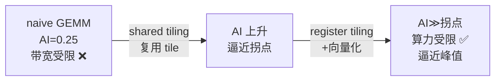

# 01 GEMM 数学、布局与性能上限

> GEMM（General Matrix Multiply，通用矩阵乘）是整个深度学习和 HPC 的"心脏"——
> Transformer 里的全连接、attention 的 QK^T 和 AV、卷积的 im2col 形式，本质都是
> GEMM。它也是 CUDA 优化的"终极练习题"：优化阶梯最长、每一步都能量化。本章先把
> 数学、内存布局和性能上限讲透，为后面的优化打地基。

## 1. 数学定义

```text
C = A × B

A: M 行 × K 列
B: K 行 × N 列
C: M 行 × N 列

C[i][j] = Σ(k=0..K-1) A[i][k] × B[k][j]
```

每个输出元素 `C[i][j]` 是 A 的第 i 行和 B 的第 j 列做**点积**（K 次乘加）。

实际工程里常见的是带系数的形式（cuBLAS 的标准接口）：

```text
C = α × (A × B) + β × C
```

`α`、`β` 是标量。`β=0` 时就是纯矩阵乘；`β=1` 可用于累加（残差连接很有用）。本章
先聚焦核心的 `A × B`。

## 2. 计算量与访存量（理解性能的基础）

### 2.1 计算量（FLOP）

每个 `C[i][j]` 需要 K 次乘 + K 次加 = 2K 次浮点运算。整个 C 有 M×N 个元素：

```text
总 FLOP = M × N × 2K = 2·M·N·K
```

> 约定：一次 FMA（fused multiply-add，乘加融合）算 2 FLOP。这是行业标准计法。

例：M=N=K=1024 的方阵乘：

```text
2 × 1024³ ≈ 2.15 × 10⁹ FLOP ≈ 2.15 GFLOP
```

### 2.2 访存量（bytes）—— 取决于实现

这才是关键，**同一个 GEMM，访存量随实现差几十倍**：

```text
理想（每个元素只从 global 读一次）：
  读 A: M×K 个元素
  读 B: K×N 个元素
  写 C: M×N 个元素
  总 = (M×K + K×N + M×N) × 4 bytes

naive（每个输出独立读 A 的一行和 B 的一列，大量重复）：
  读 A: M×N×K 次（每个输出读 K 个 A 元素）
  读 B: M×N×K 次
  总 ≈ 2·M·N·K × 4 bytes —— 比理想多了 N（或 M）量级！
```

## 3. 算术强度与 Roofline（为什么 naive 必慢）

回忆卷五：**算术强度（AI）= FLOP / 从内存搬运的 bytes**，它决定一个 kernel 是
"算力受限"还是"带宽受限"。

### 3.1 Naive GEMM 的算术强度

```text
AI_naive = 2·M·N·K FLOP / (2·M·N·K × 4 bytes) = 0.25 FLOP/byte
```

这个 0.25 极低，意味着 naive GEMM **严重带宽受限**——算术单元大部分时间在等数据。

### 3.2 理论上 GEMM 可以有很高的算术强度

GEMM 的美妙之处：它的计算量是 `O(N³)`，而数据量只有 `O(N²)`。所以**理论上**每个
数据可以被复用 `O(N)` 次：

```text
理想 AI（数据只读一次）：
  AI = 2·M·N·K / ((M·K + K·N + M·N) × 4)
  M=N=K 时 ≈ 2N³ / (12N²) = N/6 FLOP/byte
  N=1024 时 ≈ 170 FLOP/byte —— 远高于拐点，可以变成算力受限！
```

### 3.3 Roofline 落点

```text
T4 拐点（ridge point）= 峰值算力 / 峰值带宽 ≈ 8100 GFLOPS / 320 GB/s ≈ 25 FLOP/byte

naive GEMM:  AI=0.25  ≪ 25  → 死死卡在带宽屋顶下，浪费几乎全部算力
理想 tiling: AI=170   ≫ 25  → 越过拐点，进入算力受限区，能逼近峰值
```

**这就是 GEMM 优化的核心命题**：naive 的 AI=0.25 和理想的 AI=170 之间差了约 680 倍。
所有优化（tiling、register blocking、向量化）本质都在做一件事——**通过数据复用把
算术强度从 0.25 往 170 推**，让 GEMM 从带宽受限变成算力受限。



## 4. 内存布局：行主序、列主序与 cuBLAS 的坑

### 4.1 行主序 vs 列主序

```text
行主序（C/C++ 默认，本课约定）：
  A[i][j] 存在 A[i × K + j]   —— 同一行相邻元素地址连续

列主序（Fortran/cuBLAS 默认）：
  A[i][j] 存在 A[i + j × M]   —— 同一列相邻元素地址连续
```

### 4.2 为什么布局影响性能

回忆卷三 coalescing：一个 warp 的 32 个线程访问**连续地址**才能合并。所以布局决定
了"沿哪个方向访问是高效的"：

```text
行主序矩阵：warp 沿"行"方向（col 变化）访问 → 连续 → 合并 ✅
           warp 沿"列"方向（row 变化）访问 → 跨步 → 不合并 ❌
```

GEMM 里 `C[i][j] = Σ A[i][k]·B[k][j]`：
- 读 A：固定行 i、k 变化 → 行主序下连续 ✅
- 读 B：k 变化、固定列 j → 行主序下 `B[k][j]` 地址跨 N → 跨步 ❌

**B 的访问天然不合并**，这是 GEMM naive 的另一个痛点（除了重复读）。后面 tiling 会
用 shared memory 同时解决"重复读"和"B 不合并"两个问题。

### 4.3 cuBLAS 的列主序陷阱（实战必知）

cuBLAS 是**列主序**的。如果你的数据是行主序（C/C++ 常见），直接传给 cuBLAS 会算错。
常用技巧——利用转置恒等式：

```text
行主序的 C = A × B
等价于让 cuBLAS 算：C^T = B^T × A^T
而行主序的矩阵在内存里"看起来"正好是它转置的列主序版本
→ 所以常见写法是交换 A、B 的顺序调用 cuBLAS，得到正确的行主序结果
```

> 这个"行列主序 + 转置"的细节是 cuBLAS 新手最容易栽的坑，第 06 章会展开。现在只需
> 记住：**用 cuBLAS 前务必确认布局，否则结果错且不报错。**

## 5. 数值：FMA、精度与累加顺序

### 5.1 FMA（乘加融合）

GPU 的核心算术指令是 FMA：`d = a × b + c`，一条指令完成乘加，且**中间结果不舍入**
（比分开做乘、加更精确）。GEMM 的内层循环 `sum += A[i][k] × B[k][j]` 会被编译成 FMA。

### 5.2 为什么 GEMM 结果和 CPU 不完全一样

浮点加法**不满足结合律**（卷四讲过）。GPU 上 K 维的累加顺序、是否用 FMA、是否分块
累加，都和 CPU 串行不同，所以末位会有差异。因此验证 GEMM 正确性要用**容差**，不能
用 `==`：

```cpp
// CPU 参考用 double 累加，GPU 用 float，按相对误差比较
double rel_err = abs(gpu - cpu_ref) / abs(cpu_ref);
bool ok = rel_err < 1e-3;   // GEMM 常用容差
```

### 5.3 大 K 的精度问题

K 很大时（如 4096），float 累加几千项会累积舍入误差。工业实现常用**分块累加**
（每个 tile 内累加，tile 间再累加）来缓解，或用更高精度的累加器。

## 6. 本章小结

```text
GEMM = C[i][j] = Σ A[i][k]·B[k][j]
计算量 = 2·M·N·K FLOP（O(N³)）
数据量 = O(N²) → 理论可复用 O(N) 次 → 理论 AI 极高

naive AI = 0.25 → 带宽受限，浪费算力
理想 AI ≈ N/6  → 算力受限，逼近峰值
优化的本质 = 用数据复用把 AI 从 0.25 推向理想值

布局：行主序 vs 列主序影响 coalescing；cuBLAS 是列主序（坑）
数值：FMA 提精度；浮点非结合 → 用容差验证；大 K 注意累加误差
```

下一章开始爬优化阶梯：从 naive 到 shared-memory tiling。

## 7. 资料映射

- PMPP：Matrix Multiplication、Tiled Matrix Multiplication。
- CUDA C++ Best Practices Guide：Arithmetic Intensity、Memory Optimizations。
- 配套：[卷二第 09 章 Naive GEMM 完整推导](../volume02_programming_model/09_Naive_GEMM完整推导.md)、[卷五第 02 章 Roofline](../volume05_performance/02_性能指标_Scaling与Roofline.md)。
