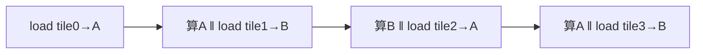

# 03 向量化、双缓冲与 Tensor Core

> 上一章把 GEMM 优化到 register tiling。本章爬最后一段阶梯：**向量化加载**（一次搬
> 4 个 float）、**双缓冲**（加载与计算重叠）和 **Tensor Core**（专用矩阵乘单元）。
> 这三步把手写 GEMM 推到接近 cuBLAS，也揭示了现代 GPU 算力的真正来源。

## 1. 向量化加载（float4）

### 1.1 动机：减少指令数、用满访存宽度

加载数据时，一次搬 1 个 float 和一次搬 4 个 float（`float4`，16 字节）相比：

```text
逐个加载：  4 条 load 指令，每条搬 4 字节
float4：    1 条 load 指令，搬 16 字节
→ 指令数 ÷4，且单条指令搬运更宽，更容易打满访存带宽
```

### 1.2 怎么写

```cpp
// 把 float* 当 float4* 用，一次读 4 个连续 float
float4 a4 = reinterpret_cast<const float4*>(A)[idx];
// 拆开用
float a0 = a4.x, a1 = a4.y, a2 = a4.z, a3 = a4.w;
```

### 1.3 三个约束（用错会崩或更慢）

```text
① 对齐：float4 要求 16 字节对齐的地址。cudaMalloc 返回的基址对齐，但你自己
        +1 偏移就可能破坏对齐 → 非法访问或降速。
② 数量整除：元素数要是 4 的倍数，否则尾部要单独处理。
③ 仍要合并：float4 不会修复错误的访问模式——warp 内相邻线程的 float4 仍需
        访问连续的 16 字节块，才能合并。向量化是"锦上添花"，不是"雪中送炭"。
```

> 一句话：向量化减少指令、用满带宽，但**前提是访问已经合理**（对齐 + 合并）。

## 2. 双缓冲（Double Buffering）：加载与计算重叠

### 2.1 问题：tiling 里加载和计算是串行的

回顾上一章的 tiling 循环：

```text
每个 K-tile：
  load tile 进 shared  ──→  __syncthreads()  ──→  从 shared 算  ──→  __syncthreads()
       ↑ 算的时候，加载单元闲着；加载的时候，算术单元闲着
```

这正是卷七讲的"串行流水线浪费"——只不过这次发生在 **kernel 内部**的 load 和 compute 之间。

### 2.2 解法：预取下一块，算当前块

开**两块 shared buffer**，轮流用：算当前 buffer 的同时，把下一个 K-tile 预取到另一个
buffer。加载和计算就重叠起来了：

```text
buffer A、buffer B 轮流：
  阶段0: load tile0 → A
  阶段1: 算 A(tile0)  ‖  同时 load tile1 → B    ← 重叠！
  阶段2: 算 B(tile1)  ‖  同时 load tile2 → A
  ...
```



### 2.3 收益与代价

```text
收益：加载延迟被计算"盖住"（延迟隐藏，卷一的思想用在 kernel 内）
     当 GEMM 较大、访存延迟可观时，提升明显
代价：要两倍 shared memory（两个 buffer）→ 可能降 occupancy
     代码复杂度上升（要管理双 buffer 的索引和同步）
```

新架构（Ampere+）有 `cp.async`（异步拷贝指令），能让 global→shared 的预取真正
异步进行，双缓冲效果更好。**T4（sm_75）不支持 `cp.async`**——这是为什么同样的
GEMM 代码在 A100 上能压榨出更高比例的峰值。

## 3. Tensor Core：算力的真正来源

### 3.1 为什么需要专用单元

到这里，手写 FP32 GEMM 用普通 CUDA Core 已经接近极限。但现代 GPU 的大部分算力
**不在 CUDA Core，而在 Tensor Core**——专门做矩阵乘加的硬件单元：

```text
T4（Turing）：
  FP32（CUDA Core）峰值 ≈ 8.1 TFLOPS
  FP16（Tensor Core）峰值 ≈ 65 TFLOPS    ← 8 倍！
```

Tensor Core 一条指令直接算一个小矩阵乘（如 16×16×16），而不是单个 FMA。深度学习的
算力爆发主要靠它。

### 3.2 WMMA：用 Tensor Core 的入口

CUDA 通过 **WMMA（Warp Matrix Multiply-Accumulate）** API 暴露 Tensor Core，
它是**warp 级**的——一个 warp 协作完成一个矩阵块乘：

```cpp
#include <mma.h>
using namespace nvcuda::wmma;

// 声明 fragment（warp 协作持有的矩阵块）
fragment<matrix_a, 16, 16, 16, half, row_major> a_frag;
fragment<matrix_b, 16, 16, 16, half, col_major> b_frag;
fragment<accumulator, 16, 16, 16, float> c_frag;

fill_fragment(c_frag, 0.0f);
load_matrix_sync(a_frag, A_ptr, lda);   // 加载 A 块
load_matrix_sync(b_frag, B_ptr, ldb);   // 加载 B 块
mma_sync(c_frag, a_frag, b_frag, c_frag);  // 一条 = 16×16×16 矩阵乘加
store_matrix_sync(C_ptr, c_frag, ldc, mem_row_major);
```

### 3.3 使用约束（为什么不能随便用）

```text
① 数据类型：输入通常是 half（FP16）/ bf16 / int8 等，累加器可以是 FP32。
   纯 FP32 GEMM 用不了 Tensor Core（除非用 TF32，Ampere+）。
② 尺寸：矩阵块要符合支持的形状（如 16×16×16），M/N/K 要是对应倍数。
② 对齐与布局：fragment 的加载要求特定对齐和 row/col major 声明。
③ 精度：FP16 动态范围小，容易溢出/下溢，常配合 loss scaling 等技巧。
```

### 3.4 混合精度（mixed precision）

实践中常用**混合精度**平衡速度和精度：

```text
输入/乘法：FP16（用 Tensor Core，快）
累加：    FP32（保精度，避免大 K 累加误差）
→ 速度接近 FP16，精度接近 FP32
这是现代深度学习训练/推理的标准做法。
```

## 4. CUTLASS：把这些思想工程化

手写把上面所有技巧（多级 tiling + 向量化 + 双缓冲 + Tensor Core）组合起来，代码会
极其复杂。**CUTLASS** 是 NVIDIA 开源的模板库，把 GEMM 拆成层次化的可组合组件：

```text
CUTLASS 的层次（和你学的优化阶梯一一对应）：
  threadblock tile  ← shared-memory tiling（第 02 章）
  warp tile         ← warp 级分块
  thread tile       ← register tiling（第 02 章）
  instruction       ← Tensor Core / WMMA（本章）
```

理解了前面的优化阶梯，CUTLASS 的设计思想就不神秘了——它就是把你手写时的每一级
tiling 做成了可配置的模板。**学习路径建议：先手写理解原理，再读 CUTLASS 看工业级
是怎么组织的。**

## 5. 完整优化阶梯回顾

```text
naive              AI=0.25，带宽受限
→ shared tiling    tile 复用，AI↑，B 合并
→ register tiling  寄存器复用，每线程多输出
→ 向量化加载       float4，减指令、满带宽
→ 双缓冲           load/compute 重叠，隐藏延迟
→ Tensor Core      专用矩阵单元，FP16 算力 ~8×
→ CUTLASS/cuBLAS   工业级，逼近峰值
```

每一步的动机都是同一条主线（卷六第 01 章）：**提升数据复用和硬件利用率，把瓶颈从
内存推向算力，再用专用单元放大算力**。

## 6. 本章小结

```text
向量化(float4)：减指令、满带宽，但要对齐+整除+本就合并
双缓冲：开两块 shared，算当前块时预取下一块，重叠 load/compute
        新架构 cp.async 让预取真异步（T4 不支持）
Tensor Core：专用矩阵乘单元，FP16 算力远超 CUDA Core，靠 WMMA(warp级)调用
        约束：数据类型/尺寸/对齐/精度
混合精度：FP16 乘 + FP32 累加，速度与精度平衡（DL 标准）
CUTLASS：把多级 tiling + Tensor Core 模板化，对应你学的优化阶梯
```

## 7. 资料映射

- CUDA C++ Programming Guide：Warp Matrix Functions (WMMA)、Vectorized Memory Access、Asynchronous Data Copies。
- CUTLASS 文档与 GTC 演讲：层次化 GEMM 设计。
- NVIDIA 混合精度训练指南。
- 配套：[卷七第 02 章 传输与计算重叠](../volume07_async_system/02_传输与计算重叠.md)（双缓冲是它在 kernel 内的体现）、[卷九 GPU 架构](../README.md)（Tensor Core 硬件）。
