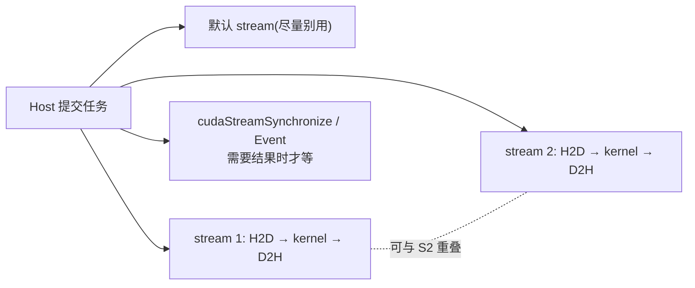

# 01 Stream 与异步执行模型

> 卷二第 05 章建立了"launch 是异步提交"的第一印象。本章把它系统化：什么是
> stream、它怎么决定并发、默认 stream 有哪些坑。这是整卷的地基。

## 1. 回顾：为什么 launch 是异步的

```cpp
kernel<<<grid, block>>>(...);   // Host 不等 kernel 算完，立刻返回
```

回忆卷二的**传送带模型**：`kernel<<<>>>()` 只是把任务放上传送带（提交到队列）就
返回，GPU 在另一头按顺序取出来执行。Host 和 GPU 因此可以**同时**推进——这就是
异步的来源，也是后面一切重叠优化的前提。

异步带来一个直接问题：既然有"队列"，那**多个任务之间谁先谁后、能不能并行**？
这正是 stream 要回答的。

## 2. 什么是 Stream

> **Stream（流）= 一条 GPU 任务队列。同一个 stream 里的任务严格按提交顺序执行；
> 不同 stream 之间没有顺序约束，可以并发。**

```text
stream A:  taskA1 → taskA2 → taskA3     （A 内部严格顺序）
stream B:  taskB1 → taskB2              （B 内部严格顺序）

A 和 B 之间：无顺序保证，硬件可以让它们重叠执行
```

这是 stream 唯一也是最重要的语义，记死它：

```text
同一 stream 内：顺序（serialize）
跨 stream 之间：并发（concurrent，若资源允许）
```

所有并发能力——传输与计算重叠、并发 kernel——本质都来自"把无依赖的任务放进
不同 stream"。

## 3. 创建与使用 Stream

```cpp
cudaStream_t s;
cudaStreamCreate(&s);

// 把工作提交到指定 stream（注意第 4 个 launch 参数 和 Async 后缀）
kernel<<<grid, block, 0, s>>>(...);
cudaMemcpyAsync(dst, src, bytes, cudaMemcpyHostToDevice, s);

cudaStreamSynchronize(s);   // 只等这个 stream 的任务排空
cudaStreamDestroy(s);
```

三个要点：

- kernel 的第 4 个 `<<<...>>>` 参数是 stream（第 3 个是动态 shared 字节数，用 0）。
- 异步操作要用带 `Async` 后缀的版本（`cudaMemcpyAsync`），并传入 stream。
- `cudaStreamSynchronize(s)` 只等 `s`，比 `cudaDeviceSynchronize()`（等整个设备）
  范围更小、更不破坏并发。

## 4. 同步的三个层次：选最小够用的

```cpp
cudaDeviceSynchronize();    // 等整个 device 上所有 stream 的所有任务
cudaStreamSynchronize(s);   // 只等 stream s
cudaEventSynchronize(e);    // 只等某个 event（见第 03 章）
```

范围越大，破坏的并发越多。一个常见性能反模式是无脑 `cudaDeviceSynchronize()`：

```cpp
// ❌ 反模式：每个 kernel 后都全设备同步，亲手扼杀所有并发
kernelA<<<...>>>();  cudaDeviceSynchronize();
kernelB<<<...>>>();  cudaDeviceSynchronize();
```

如果 A、B 在同一 stream 且 B 依赖 A，**stream 本身已经保证顺序**，根本不需要 Host
插手等待。同步只在"Host 真的需要读结果"或"需要跨 stream 建立依赖"时才用。

## 5. 默认 Stream（null stream）的坑

不指定 stream 时，工作进入**默认 stream**（也叫 null stream）：

```cpp
kernel<<<grid, block>>>(...);   // 等价于用默认 stream
```

默认 stream 有个容易踩的**同步语义**：在传统（legacy）模式下，**默认 stream 是
"阻塞型"的**——它会和其它普通 stream 互相等待，破坏并发：

```text
传统默认 stream 行为：
  默认 stream 的任务 会等所有其它 stream 排空才开始
  其它 stream 的任务 也会等默认 stream 排空才开始
  → 你以为开了多 stream 并发，结果被默认 stream 串成一条线
```

两个解法：

1. **别把工作混进默认 stream**：所有要并发的任务都显式放进自己创建的非默认 stream。
2. **改用 per-thread default stream 模式**：编译加 `--default-stream per-thread`，
   让每个 Host 线程有独立的、非阻塞的默认 stream。

> 教训：要并发，就**显式建 stream 并显式指定**，不要依赖默认 stream 的隐式行为。
> 本卷所有 lab 都遵循这一点。

## 6. 一个完整的并发心智模型



把它读成一句话：**Host 飞快地把一堆任务分发到若干 stream，每个 stream 内部顺序、
stream 之间并发，最后只在需要结果的点上做最小范围的同步。**

## 7. 实践

1. 创建 2 个 stream，各提交一串 `H2D → kernel → D2H`，对比和单 stream 的耗时。
   （完整可运行版见第 02 章的 `overlap_pipeline`。）
2. 故意把其中一些工作提交到默认 stream，用 Nsight Systems 观察并发是否被破坏。
3. 把 `cudaDeviceSynchronize()` 换成 `cudaStreamSynchronize()`，比较时间线差异。

## 8. 面试题

- Stream 的核心语义是什么？（同一 stream 顺序、跨 stream 并发）
- 为什么 `cudaMemcpyAsync` 要指定 stream？不指定会怎样？
- 默认 stream 为什么可能破坏并发？两种规避方式是什么？
- `cudaDeviceSynchronize` 和 `cudaStreamSynchronize` 的区别与取舍？

## 9. 资料映射

- CUDA C++ Programming Guide：Streams、Default Stream、Asynchronous Concurrent Execution。
- CUDA C++ Best Practices Guide：Concurrent Execution and Streams。
