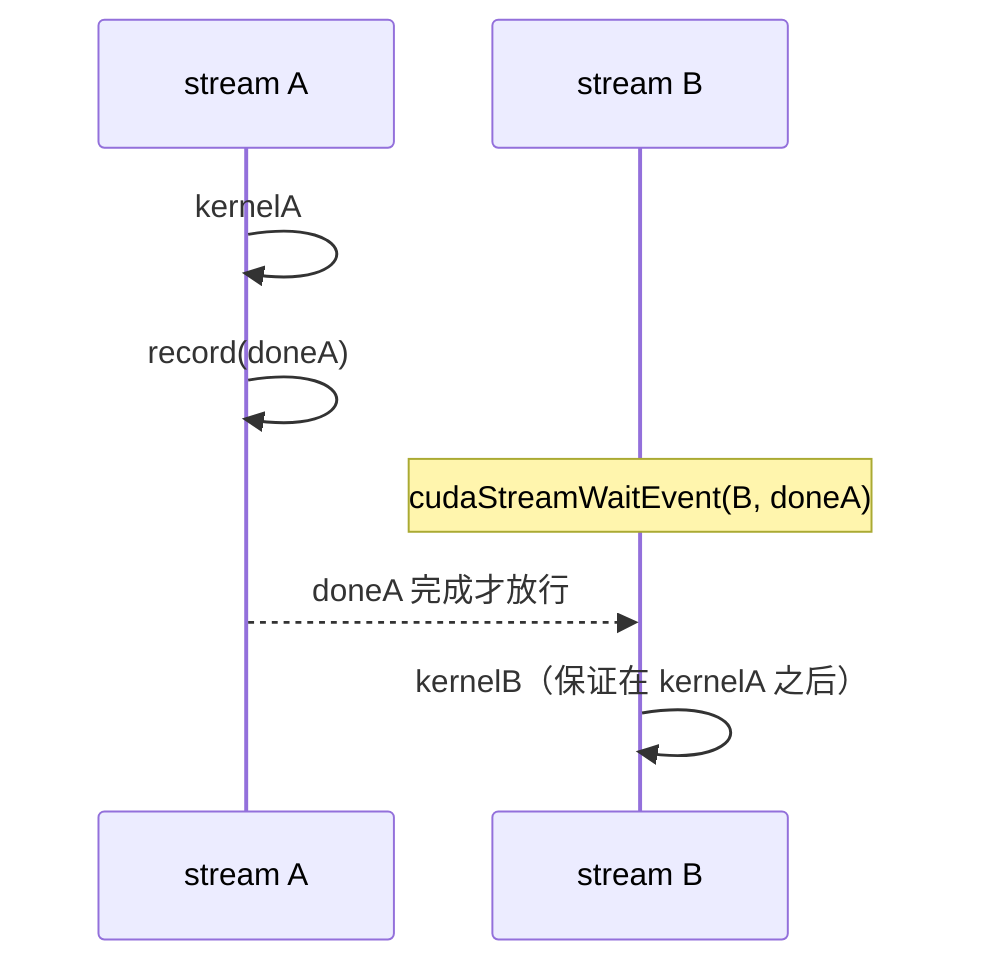

# 03 Event、并发 Kernel 与依赖

> 第 01 章用 stream 表达"并发"，第 02 章用它做重叠。但真实流水线里，任务之间
> 常有**跨 stream 的依赖**——A 流的某步必须等 B 流的某步完成。本章用 event 表达
> 这种依赖，并讲并发 kernel 与 stream 优先级。

## 1. Event 是什么

> **Event（事件）= 插在 stream 时间线上的一个标记。** 它能做两件事：
> ① 精确计时一段 GPU 工作；② 让一个 stream 等待另一个 stream 到达某个点。

```cpp
cudaEvent_t e;
cudaEventCreate(&e);
cudaEventRecord(e, stream);   // 在 stream 当前位置插入标记 e
```

`cudaEventRecord` 是异步的：它只是把"标记"排进队列，GPU 执行到这里时才真正
"盖上时间戳/置为完成"。

## 2. 用途一：正确计时（回顾卷二第 07 章）

```cpp
cudaEventRecord(start, s);
kernel<<<grid, block, 0, s>>>(...);
cudaEventRecord(stop, s);
cudaEventSynchronize(stop);            // 等 GPU 真正执行到 stop 标记
float ms;
cudaEventElapsedTime(&ms, start, stop);
```

关键：时间戳由 **GPU 执行到标记时**亲自盖，量的是 GPU 端真实区间，不含 Host 的
launch 抖动。这也是本卷所有 lab 计时的方式。

## 3. 用途二：跨 Stream 依赖（本章重点）

这是 event 比"同步"更强的地方。假设 stream B 的工作要用到 stream A 算出的结果，
但你**不想**用 `cudaDeviceSynchronize()`（那会停掉整个设备、破坏其它并发）。

用 event 精确表达"B 等 A 的某一点"：

```cpp
// 在 A 上做完一段工作，打一个标记
kernelA<<<..., streamA>>>(...);
cudaEventRecord(doneA, streamA);

// 让 B 在执行后续工作前，等待 doneA（只等这一个点，不停设备）
cudaStreamWaitEvent(streamB, doneA, 0);
kernelB<<<..., streamB>>>(...);   // 保证在 kernelA 完成后才开始
```

`cudaStreamWaitEvent(streamB, doneA)` 的语义：**streamB 之后提交的任务，必须等
doneA 这个标记完成才开始**，但它**不阻塞 Host**，也不影响其它 stream。这就是
"精确依赖"——只在该等的地方等，最大限度保留并发。



> 对比三种"等待"：`cudaDeviceSynchronize` 等全设备（最粗）、`cudaStreamSynchronize`
> 等一条流、`cudaStreamWaitEvent` 让 GPU 内部跨流等一个点且不阻塞 Host（最细）。
> 构建复杂依赖图时优先用 event。

## 4. 并发 Kernel

不只是传输和计算能重叠，**多个 kernel 也能同时在 GPU 上跑**——前提是：

1. 它们在**不同 stream**（无顺序约束）；
2. 单个 kernel **占不满** GPU（block 数少、资源占用低），有空余 SM/资源容纳另一个。

```cpp
smallKernelA<<<grid, block, 0, streamA>>>(...);
smallKernelB<<<grid, block, 0, streamB>>>(...);   // 可与 A 同时执行
```

反过来，如果一个 kernel 已经用满了所有 SM（大 grid），再放一个进别的 stream 也
只能排队——并发的前提是**有空闲资源**。

```text
能并发：两个小 kernel，各用一半 SM → 同时跑
不能并发：一个大 kernel 占满 SM → 第二个只能等
```

典型场景：推理服务里多个小请求、一个任务里多个互不依赖的小算子。

## 5. Stream 优先级

当多个 stream 竞争资源时，可以给延迟敏感的工作更高优先级：

```cpp
int low, high;
cudaDeviceGetStreamPriorityRange(&low, &high);   // 注意：数值越小优先级越高
cudaStream_t hiStream;
cudaStreamCreateWithPriority(&hiStream, cudaStreamNonBlocking, high);
```

高优先级 stream 的 block 在调度时更容易抢到 SM。适合"后台大批处理 + 前台低延迟
小任务"混跑的场景，让小任务不被大任务饿死。优先级是**调度提示**，不是硬实时保证。

## 6. 资源与同步对象的生命周期

- event、stream 都要 `cudaEventDestroy` / `cudaStreamDestroy` 释放。
- 销毁前确保相关工作已完成（或用同步点保证），否则销毁正在使用的对象是未定义行为。
- event 可复用（反复 `cudaEventRecord` 覆盖），不必每次新建。

## 7. 实践

1. 建 A、B 两个 stream，让 `kernelB` 用 event 依赖 `kernelA` 的输出，用 nsys 确认
   B 确实在 A 之后开始，且 Host 没有被阻塞。
2. 启动两个很小的 kernel 到不同 stream，用 nsys 看它们是否真的并发；再把 grid 调
   到占满 SM，观察并发消失。
3. 用高/低优先级 stream 各跑一批工作，观察高优先级任务的完成时间。

## 8. 面试题

- Event 的两个主要用途是什么？
- `cudaStreamWaitEvent` 和 `cudaDeviceSynchronize` 表达依赖时有何本质区别？
- 两个 kernel 在不同 stream 一定并发吗？决定因素是什么？
- stream 优先级能保证实时性吗？

## 9. 资料映射

- CUDA C++ Programming Guide：Events、Stream Synchronization、Concurrent Kernel Execution、Stream Priorities。
- CUDA Runtime API：Event Management、Stream Management。
- 配套：[卷二第 07 章 CUDA Event 与正确计时](../volume02_programming_model/07_CUDA_Event与正确计时.md)。
