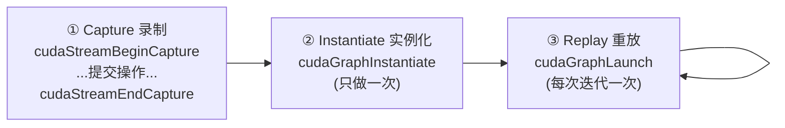

# 04 CUDA Graph

> 前三章把 GPU、PCIe 喂饱了。但当 kernel 很短、序列很固定且要重复成千上万次时，
> 新的瓶颈出现了：**CPU 反复 launch 的开销**。CUDA Graph 用"录制一次、重放多次"
> 解决它。配套 demo 实测 1.87x 加速。

## 1. 问题：launch 本身是有开销的

每次 `kernel<<<>>>()` 不是免费的——CPU 要做参数打包、配置校验、向驱动提交等工作，
单次开销约几微秒。平时这点开销淹没在 kernel 计算里看不见，但两种情况会放大它：

```text
放大条件：
  ① kernel 很短（计算几微秒，和 launch 开销同量级）
  ② 序列很长且重复多次（每次迭代要 launch 几十上百个 kernel）
```

此时 GPU 经常**空等 CPU 一个个发指令**——瓶颈从"算"变成了"发起算的动作"。

```text
传统逐个 launch（每次迭代 50 个短 kernel）：
CPU: launch launch launch ... (50次) │ launch launch ... (下一轮50次)
GPU:   K  K  K  ...                    每个 K 之间夹着 CPU launch 间隙
          ↑ GPU 在等 CPU 发下一个 kernel
```

## 2. 思路：把"一串操作"录成一张图，整体重放

CUDA Graph 的核心洞察：如果**每次迭代执行的操作序列完全一样**，那为什么要每次
都重新一个个 launch？不如把这一串操作**录制（capture）**成一张图，**实例化
（instantiate）**一次，之后每次迭代只需**一次** `cudaGraphLaunch` 把整张图丢给 GPU。

```text
Graph 重放：
CPU: graphLaunch │ graphLaunch │ graphLaunch   (每轮只 1 次)
GPU: [K K K ... 50个连续执行] │ [K K K ...]      kernel 之间无 CPU 间隙
          ↑ 整张图作为一个单元提交，GPU 连续跑，不等 CPU
```

省下的正是那些 CPU launch 间隙。

## 3. 三个阶段：capture → instantiate → replay



### 用 stream capture 录制（最常用）

最方便的录制方式是**捕获一段已有的 stream 代码**——你照常往 stream 上提交工作，
用 begin/end capture 把它们"录"下来，几乎不用改原逻辑：

```cpp
cudaGraph_t graph;
cudaGraphExec_t graphExec;

// ① 录制：begin/end 之间提交的操作被捕获成 graph，并不真正执行
cudaStreamBeginCapture(s, cudaStreamCaptureModeGlobal);
for (int c = 0; c < chain; ++c) {
    tinyKernel<<<blocks, threads, 0, s>>>(d_data, n, 0.0001f);
}
cudaStreamEndCapture(s, &graph);

// ② 实例化：把 graph 编译成可执行的 graphExec（只做一次）
cudaGraphInstantiate(&graphExec, graph, nullptr, nullptr, 0);

// ③ 重放：每次迭代只一次 launch，整串 kernel 一起跑
for (int it = 0; it < iters; ++it) {
    cudaGraphLaunch(graphExec, s);
}
```

> 注意 capture 期间这些 kernel **不会真的执行**，只是被"录像"。真正执行发生在
> `cudaGraphLaunch` 重放时。

## 4. 实测结果

`labs/07_async_system/cuda_graph/`，T4 上 iters=1000、每轮 chain=50 个短 kernel：

```text
逐个 launch (stream)   232.60 ms
CUDA Graph 重放        124.55 ms   加速 1.87x
```

省下的约 108 ms，正是 1000×50 = 5 万次 launch 的 CPU 开销被压成 1000 次重放的差值。
复现：

```bash
make -C labs/07_async_system/cuda_graph clean all
./labs/07_async_system/cuda_graph/cuda_graph
```

可以改参数感受规律：`chain` 越大（每轮 kernel 越多）、kernel 越短，Graph 收益越大；
反之 kernel 很长时，launch 开销占比小，Graph 收益就不明显。

## 5. 什么时候用 / 不用

```text
适合用 ✅：
  - 固定、重复的 kernel/拷贝序列（每次迭代结构不变）
  - kernel 短小、数量多，launch 开销占比可观
  - 深度学习推理（同一网络跑成千上万次）
  - 迭代求解器、信号处理（每步 kernel 序列固定）

不适合 ❌：
  - 序列每次都变（控制流高度动态）→ 反复重新 capture 反而亏
  - kernel 本身很长 → launch 开销可忽略，Graph 收益小
  - 一次性任务（不重复）→ 录制/实例化的成本收不回来
```

## 6. 进阶：图的更新（cudaGraphExecUpdate）

如果序列结构不变、只是**参数变了**（比如每次迭代喂不同的指针/标量），不必重新
capture 整张图，可以用 `cudaGraphExecUpdate` 只更新已实例化图里的节点参数，比
重新 instantiate 便宜。这让 Graph 也能用在"结构固定、数据每轮不同"的训练/推理循环里。

> 细节随 CUDA 版本演进，工程中以官方文档为准。本章只需建立"图可以低成本更新参数"
> 的概念。

## 7. 实践

1. 跑 demo，把 `chain` 从 10 调到 200，记录 Graph 加速比的变化，解释趋势。
2. 把 `tinyKernel` 的计算量调大（拉长 kernel），观察 Graph 收益如何缩小。
3. 用 nsys 对比逐个 launch 版和 Graph 版的时间线，找出 kernel 之间的 CPU 间隙在
   Graph 版里是否消失。

## 8. 面试题

- CUDA Graph 解决的是什么开销？什么条件下这个开销才显著？
- capture → instantiate → replay 三个阶段各做什么？
- 为什么 capture 期间 kernel 不真正执行？
- 序列结构不变但参数每轮变化，如何避免每次重新 capture？

## 9. 资料映射

- CUDA C++ Programming Guide：CUDA Graphs、Creating a Graph Using Stream Capture、Graph Update。
- CUDA Runtime API：Graph Management。
- 配套 lab：`labs/07_async_system/cuda_graph/`。
