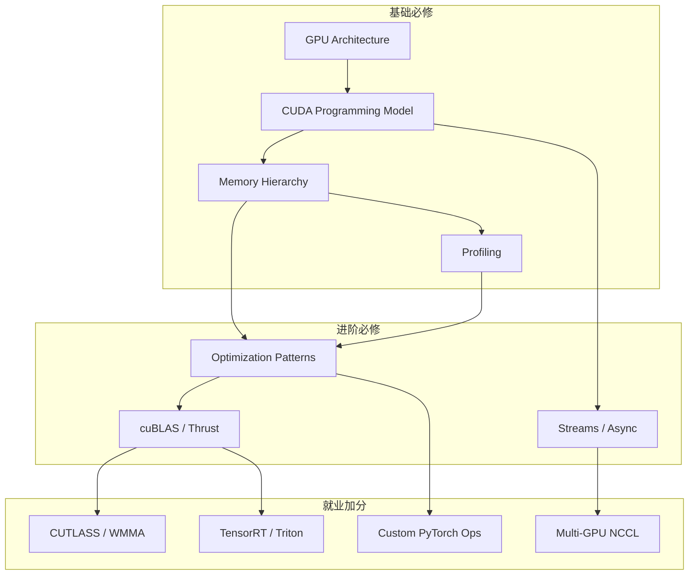

# CUDA 系统学习路线图（0 → 就业向）

> **目标**：2 个月内具备 CUDA 相关岗位（GPU 算子开发、推理优化、HPC、AI Infra）的实战能力与作品集。  
> **硬件**：Tesla T4 · 16GB · SM 7.5 (Turing) · CUDA 13.x  
> **前提**：熟练 C/C++、基本数据结构与算法、Linux 命令行；有线性代数基础更佳。

---

## 一、为什么不能只学「写几个 kernel」

CUDA 岗位通常要求的不只是 `__global__ void kernel()`，而是：

| 能力维度 | 岗位常见要求 | 仅学入门示例的缺口 |
|----------|--------------|-------------------|
| **性能** | 达到 roofline 合理区间、带宽/算力利用率可量化 | 代码能跑但慢 10–100 倍 |
| **调试与分析** | Nsight、cuda-gdb、错误模式（非法访问、死锁） | 只会 `printf` 调试 |
| **工程生态** | cuBLAS/cuDNN/CUTLASS/TensorRT/NCCL | 与业务框架脱节 |
| **系统设计** | 多流流水线、CPU-GPU 重叠、显存预算 | 单 kernel 思维 |
| **作品集** | GitHub 项目 + 性能报告 + 可复现 | 无差异化 |

本路线按 **「理解 → 实现 → 测量 → 优化 → 应用」** 闭环设计，每周都有可交付物。

> **官方文档说明（CUDA 13.x，最新结构）**  
> 主教材为 [CUDA Programming Guide](https://docs.nvidia.com/cuda/cuda-programming-guide/)（5 部分结构，非旧版 `Ch.1–7`），官方最近更新（2026-05）已**完整发布 Part 3/4/5 全部小节**。  
> 下文 **Programming Guide** 均指新版；完整小节清单与 Legacy 对照见 [Week1详细步骤.md 附录 D](Week1详细步骤.md#附录-d新版-vs-legacy-章节对照查阅用)。  
> **重要更正**：原子操作、`__syncthreads`/`__syncwarp`、warp shuffle、WMMA/Tensor Core 等的**权威定义现集中在 5.4 C/C++ Language Extensions**（旧计划误指到 2.3/3.2）。

**Programming Guide v13.x 与 8 周路线速查（精确到小节）**

| 周 | 官方章节（v13.x） | 本地文档 |
|----|------------------|----------|
| 1 | **Part 1** + **2.1** + **2.3**（分段）+ **2.5**（扫读）+ **2.7** + **5.1** | [Week1详细步骤](Week1详细步骤.md)、[每日清单](Week1_Day2-Day5学习清单.md) |
| 2 | **2.3** Shared Memory / Coalescing / Transpose + **5.4.4** 同步原语 | [Week2详细步骤](../study_plan/Week2详细步骤.md) |
| 3 | **2.5** Async 深入 + **5.4.5** Atomics + **5.4.6** Warp Functions（shuffle）+ **4.1** Unified Memory + **4.3** Stream-Ordered Allocator + **4.4** Cooperative Groups | Week 3 |
| 4 | cuBLAS / Thrust + **3.1** Advanced CUDA APIs（浏览）+ **3.5** Tour of CUDA Features | Week 4 |
| 5 | **2.4** Tile Kernels + **2.3** Occupancy + **5.4.11** Warp Matrix（WMMA）+ **4.11** Async Data Copies / **4.10** Pipelines + Best Practices | Week 5 |
| 6 | Nsight + **3.2** Advanced Kernel（选读）+ **4.2** CUDA Graphs + **4.13** L2 Cache Control | Week 6 |
| 7–8 | 按方向选读 **Part 4**（4.1 Unified Memory / 4.2 Graphs / 4.18 Dynamic Parallelism 等）+ **3.4** Multi-GPU + 作品集 | Week 7–8 |

---

## 二、8 周总览

```
Week 1  架构与编程模型     → 向量化、矩阵乘 naive
Week 2  内存层次与正确性   → transpose、reduction、边界处理
Week 3  并行模式与同步     → scan、histogram、stream/event
Week 4  GEMM 优化 + ncu 入门 → naive→tiling→register、cuBLAS 当标尺、Nsight 初识
Week 5  性能方法论 + Nsight 深化 → Occupancy、Roofline、ncu/nsys 系统学
Week 6  核心算子           → softmax、layernorm、融合（卷六）
Week 7  作品集项目         → 挑一个算子做到极致 + 技术报告
Week 8  面试冲刺           → 四大手写题默写 + 概念题 + 模拟面试
```

> **路线已调整（2026-06-17）**：原 Week4「库与抽象层」单独占一周偏多——cuBLAS/Thrust 本质是
> API 调用，不值得整周。现把 **GEMM 手写优化提前到 Week4** 并与 **ncu 实测绑定**（GEMM 是练
> profiler 的最佳载体），cuBLAS 降为"性能标尺"。详见 [Week4 清单](../study_plan/Week4_Day1-Day7学习清单.md)。
> 连锁后移：Nsight 系统学→Week5，核心算子→Week6，作品集→Week7，面试冲刺→Week8。

**每周时间分配建议（全职）**

- 理论 + 官方文档：25%
- 手写代码 + 实验：50%
- 笔记 + 性能记录：15%
- 复盘 / 社区（Reddit、GPU Mode）：10%

---

## 三、分周详细计划

### Week 1：GPU 架构与 CUDA 编程模型

**学习目标**

- 理解 SIMT、Warp（32 线程）、SM、Block/Grid 映射关系
- 掌握 host/device 代码分离、编译链接流程、`cudaMemcpy` 数据流
- 能在 T4 上编译运行并解释 occupancy 基本概念
- 能独立完成 `vec_add` 计时、`mat_mul_naive` 基线与 GFLOPS 记录

**7 天节奏（与 Step 对照）**

| Day | Step | v13.x 重点 |
|-----|------|------------|
| 1 | 01–03 | Part 1 + 2.1 |
| 2 | 04 | 2.5（扫读）+ Event API |
| 3 | 05–06 | 5.1 + 1.2 + 2.3（SIMT） |
| 4 | 07 | 2.7 NVCC |
| 5 | 08 | CPU matmul |
| 6 | 09–10 | 2.1/2.3 2D + matmul GPU |
| 7 | 11–12 | 2.3 Occupancy + 复盘 |

**核心知识点**

1. Turing / T4：15.7 TFLOPS FP16、8.1 TFLOPS FP32、300 GB/s 显存带宽
2. 线程层次：`threadIdx` / `blockIdx` / `gridDim` / `blockDim`（来自 **1.2** + **2.1/2.3**）
3. 设备查询：`cudaGetDeviceProperties`、**5.1** Compute Capabilities 7.5
4. 错误处理：`cudaGetLastError`、`CUDA_CHECK`、**2.7** 编译 `-arch=sm_75`

**必读材料（按阅读顺序）**

1. [Programming_Model详解.md](Programming_Model详解.md) §1–§8（本地，建议 Day 1 先读）
2. [CUDA Programming Guide v13.x](https://docs.nvidia.com/cuda/cuda-programming-guide/) — **1. Introduction to CUDA**（1.1–1.3）
3. 同上 — **2.1 Intro to CUDA C++**（Day 1–2 主战场）
4. 同上 — **2.3 Writing SIMT Kernels**（Day 3/6/7 分段读，见 [Week1详细步骤.md](Week1详细步骤.md) 阅读边界）
5. 同上 — **2.5 Asynchronous Execution**（Day 2 扫读，Week 3 深入 Stream）
6. 同上 — **2.7 NVCC**（Day 4）
7. 同上 — **5.1 Compute Capabilities**（Day 3 浏览）
8. [CUDA Runtime API](https://docs.nvidia.com/cuda/cuda-runtime-api/) — Device / Event Management
9. 书籍选读：《CUDA by Example》Ch.1–4 或 PMPP Ch.1–5

**Week 1 暂不读**：2.2 Python、2.4 Tile Kernels、2.6 Unified Memory、Part 3–4

**实战任务**

| 任务 | 验收标准 |
|------|----------|
| `vec_add` | 1M 元素，与 CPU 结果一致，测 host/device 拷贝耗时 |
| `mat_mul_naive` | 512³ FP32，记录 GFLOPS，作为后续优化基线 |
| 设备信息打印 | 输出 SM 数、最大 block 维度、shared memory 大小 |

**T4 注意**

- 最大线程块 1024，warp 32；先习惯 `block=(16,16)` 或 `(256,1)`
- 16GB 显存足够 Week 1–6 所有实验

**本周交付**

- `week01_basics/` 代码 + `notes/week01.md`（含 GFLOPS 表格）

**逐步清单**：[Week1详细步骤.md](Week1详细步骤.md)（12 Step）· [Week1_Day2-Day5学习清单.md](Week1_Day2-Day5学习清单.md)（Day1–Day7 可勾选）

---

### Week 2：内存层次、合并访问与正确性

**学习目标**

- 理解 Global / Shared / Local / Constant / Texture / Register 差异与延迟
- 掌握 **合并访问（Coalescing）**、对齐、结构体数组 vs 数组结构体
- 能分析 Bank Conflict 并用 padding 解决

**核心知识点**

1. 内存合并：连续线程访问连续地址
2. Shared Memory：48KB/SM（T4 可配置），bank width 4B
3. `__syncthreads()` 与竞态条件
4. 矩阵转置：经典「未合并 vs 合并」对比实验

**必读材料**

- Programming Guide v13.x — **2.3 Writing SIMT Kernels**（Global/Shared Memory、Coalescing、Matrix Transpose 示例）
- [CUDA C++ Best Practices Guide](https://docs.nvidia.com/cuda/cuda-c-best-practices-guide/) — Memory Optimizations
- [GPU架构图资源.md](GPU架构图资源.md) — Memory Hierarchy 归档配图
- 文章：Mark Harris «Optimizing Parallel Reduction in CUDA»（后续 reduction 基础）

**Week 2 暂不读**：2.4 Writing Tile Kernels（Week 5 再读）

**实战任务**

| 任务 | 验收标准 |
|------|----------|
| `transpose` | naive / coalesced / shared 三版，带宽对比（GB/s） |
| `reduction` | 1M→1 sum，至少实现 shared memory 树形归约 |
| 越界与对齐实验 | 故意制造非合并访问，用 Nsight Compute 看 `memory_throughput` |

**本周交付**

- `week02_memory/` 代码 + [Week2详细步骤.md](../study_plan/Week2详细步骤.md) + `notes/week02.md`
- 性能对比表（至少 3 个 kernel × 3 种实现）
- 一篇短笔记：「T4 上合并访问实测结论」

**逐步清单**：[Week2详细步骤.md](../study_plan/Week2详细步骤.md)（12 Step）· [Week2_Day1-Day7学习清单.md](../study_plan/Week2_Day1-Day7学习清单.md)（每日勾选）

---

### Week 3：并行模式、Warp 级思维与异步执行

**学习目标**

- 掌握 prefix sum（scan）、histogram 等典型并行模式
- 理解 Warp divergence、shuffle 指令（`__shfl_down_sync`）
- 使用 **CUDA Stream / Event** 实现拷贝与计算重叠

**核心知识点**

1. Blelloch scan 算法（work-efficient）
2. Atomic 操作适用场景与性能代价
3. 默认流 vs 非默认流；`cudaMemcpyAsync`
4. Unified Memory 概念与 T4 上的 page fault 开销（了解即可，生产慎用）

**必读材料**

- Programming Guide v13.x — **2.5 Asynchronous Execution**（Stream / Event 深入）
- Programming Guide v13.x — **5.4.5 Atomic Functions** + **5.4.6 Warp Functions**（`__shfl_down_sync`、vote/reduce）+ **5.4.4 Synchronization Primitives**（`__syncwarp`、memory fence）
- Programming Guide v13.x — **4.1 Unified Memory**（完整版，生产慎用）+ **4.3 Stream-Ordered Memory Allocator**（`cudaMallocAsync`）+ **4.4 Cooperative Groups**（现代 warp/block 同步抽象）
- Harris reduction 全文 + 配套代码
- [GPU Gems 3 Ch.39](https://developer.nvidia.com/gpugems/gpugems3/part-vi-gpu-computing) — Parallel Prefix Sum（选读）

**Week 3 可选深入**：3.2 Advanced Kernel Programming（SIMT 调度、active mask 等）、5.7 CUDA C++ Memory Model（同步语义）

**实战任务**

| 任务 | 验收标准 |
|------|----------|
| `scan` |  inclusive/exclusive，1M 元素，与 CPU 验证 |
| `stream_overlap` | H2D + kernel + D2H 流水线，比串行快 ≥15% |
| `warp_reduce` | 用 shuffle 实现 reduction，对比 shared 版延迟 |

**本周交付**

- 时序图（手绘即可）：stream 重叠前后 timeline
- 理解并能口述：何时用 atomic vs shuffle vs shared reduction

---

### Week 4：CUDA 库生态与工程化封装

**学习目标**

- 会用 **cuBLAS** 做 GEMM，会查 leading dimension、layout
- 会用 **Thrust** 做 sort/reduce/scan，理解与手写 kernel 的取舍
- 能把 kernel 封装成可复用模块（头文件 + 单元测试 + CMake）

**核心知识点**

1. cuBLAS `cublasSgemm` / `cublasGemmEx`（FP16 需 Week 5）
2. Thrust `device_vector`、`transform`、`sort`
3. CMake + `FindCUDAToolkit` 现代写法
4. 错误检查与 RAII 风格 CUDA 包装（了解 [cuda-api-wrappers](https://github.com/eyalroz/cuda-api-wrappers)）

**必读材料**

- [cuBLAS Documentation](https://docs.nvidia.com/cuda/cublas/)
- [Thrust Quick Start](https://nvidia.github.io/thrust/)
- Programming Guide v13.x — **3.1 Advanced CUDA APIs and Features**（浏览生态）
- 官方 sample：`0_Introduction/vectorAdd`、`1_Utilities/bandwidthTest`

**实战任务**

| 任务 | 验收标准 |
|------|----------|
| `gemm_cublas` | 1024³ FP32，与 naive 比加速比并记录 |
| `sort_thrust` | 1e7 元素 sort，测吞吐 |
| `cmake_project` | 统一构建 week01–04 所有 target |

**本周交付**

- 一张「何时手写 kernel vs 用库」决策表
- 可 `cmake --build` 的一键工程骨架

---

### Week 5：性能优化方法论（就业核心周）

**学习目标**

- 实现 **分块矩阵乘（Tiled GEMM）**，shared memory double buffering 入门
- 会算 **Roofline**：算术强度 vs 带宽/算力上限
- 理解 Occupancy、寄存器压力、block size 调参

**核心知识点**

1. Roofline Model：T4 FP32 ~8 TFLOPS，带宽 ~300 GB/s → 拐点算术强度 ~26 FLOP/B
2. `cudaOccupancyMaxActiveBlocksPerMultiprocessor`
3. Tensor Core 入门：WMMA API（T4 支持 FP16），与 FP32 路径对比
4. 向量化加载：`float4` / `ld.global.nc` 概念

**必读材料**

- Best Practices Guide — 全文精读
- Programming Guide v13.x — **2.4 Writing Tile Kernels**（新版 tile 编程模型 `__tile__` / `cuda::tiles`）+ **2.3** Kernel Launch and Occupancy（深入）
- Programming Guide v13.x — **5.4.11 Warp Matrix Functions**（WMMA / Tensor Core，T4 支持 FP16）+ **5.1 Compute Capabilities**（能力表）
- Programming Guide v13.x — **4.11 Asynchronous Data Copies**（`cp.async` / `memcpy_async`）+ **4.10 Pipelines**（现代分块 GEMM 双缓冲基础）
- [CUTLASS](https://github.com/NVIDIA/cutlass) — 读 README + `examples/00_basic_gemm`（不急于手写 CUTLASS 级）
- 论文笔记：Roofline（Williams et al.）

**实战任务**

| 任务 | 验收标准 |
|------|----------|
| `gemm_tiled` | 1024³ 达到 naive 的 ≥5×（T4 上合理起点） |
| `roofline_plot` | Python 脚本画出 kernel 落点 |
| `occupancy_sweep` | block 32–512 扫描，记录 GFLOPS 曲线 |

**T4 现实预期**

- 手写 GEMM 很难追上 cuBLAS；目标是 **理解差距来源**，不是 beat cuBLAS
- FP16 Tensor Core 路径值得单独测一条 WMMA 样例

**本周交付**

- GEMM 优化报告（基线 → tiled → 调参），含 Nsight Compute 截图 2–3 张

---

### Week 6：Profiling 与性能回归体系

**学习目标**

- 熟练使用 **Nsight Systems**（系统级 timeline）和 **Nsight Compute**（kernel 级指标）
- 建立 **benchmark harness**：warmup、多次取中位数、固定时钟
- 能读关键指标：`sm__throughput`、`dram__throughput`、`achieved_occupancy`

**核心知识点**

1. Profiling 流程：先 Systems 找瓶颈，再 Compute 挖 kernel
2. CPU-GPU 同步隐藏开销：`cudaEvent` 计时
3. 常见误区：仅看 kernel 时间忽略 H2D/D2H
4. `nvprof`/`ncu` 命令行与 CI 友好基准

**必读材料**

- [Nsight Compute Documentation](https://docs.nvidia.com/nsight-compute/)
- [Nsight Systems Documentation](https://docs.nvidia.com/nsight-systems/)
- NVIDIA GTC 历年 «CUDA Optimization» 相关 session（选 1–2 个）

**实战任务**

| 任务 | 验收标准 |
|------|----------|
| Profile Week 5 GEMM | 输出瓶颈结论：memory / math / latency bound |
| `bench_framework` | 可复用计时宏 + JSON/CSV 输出 |
| 回归对比 | 改一行代码前后对比表格自动化 |

**本周交付**

- 《T4 性能分析手册》个人笔记（问题 → 指标 → 手段）

---

### Week 7：行业方向深化（三选一或交叉）

根据目标岗位选择 **主修 1 条 + 辅修 1 条**：

#### 方向 A：AI 推理 / 算子优化（岗位最多）

- PyTorch CUDA Extension 或 Triton 入门
- TensorRT：ONNX → engine → INT8 calibration
- 学习 fused kernel（layernorm + bias + activation）
- 资料：TensorRT Developer Guide、[PyTorch CUDA C++ Extension](https://pytorch.org/tutorials/advanced/cpp_extension.html)

**项目示例**：ResNet50 单层卷积 PyTorch vs cuDNN vs 自写 im2col+GEMM

#### 方向 B：HPC / 科学计算

- 多 GPU：`nccl` / 单节点多卡 AllReduce 概念
- 稀疏线性代数：CSR SpMV kernel
- 资料：Programming Guide **3.4 Programming Systems with Multiple GPUs**、CUDA Fortran（了解）、NVIDIA HPC SDK

**项目示例**：Jacobi 迭代或 2D 热传导方程 GPU 求解器

#### 方向 C：图像 / 视频 / 信号处理

- 卷积、形态学、FFT（cuFFT）
- 实时 pipeline：解码 → 预处理 → 推理（T4 常见于边缘推理）

**项目示例**：高斯模糊 + Sobel 边缘检测 pipeline，对比 OpenCV CPU

**本周交付**

- 方向主项目的 MVP（可运行 + 初步性能数字）

---

### Week 8：作品集、文档与面试准备

**学习目标**

- 打磨 **1 个主打项目**（README、架构图、性能表、复现步骤）
- 覆盖 CUDA 高频面试题
- 简历可写：量化成果（加速比、延迟、显存占用）

**主打项目建议（选 1）**

1. **高性能 GEMM 优化系列**：naive → tiled → WMMA，完整 profiling 报告
2. **推理算子库**：Layernorm + Softmax + GEMV fused，对接 PyTorch
3. **GPU Reduction/Scan 库**：多算法对比 + API 设计文档

**面试题清单（必须能答）**

- Warp 是什么？divergence 如何发生？
- Shared memory 与 L1 的关系？bank conflict 如何排查？
- `__syncthreads()` 与 `__syncwarp()` 区别？
- 如何实现 atomic 与 shared reduction 的选择？
- CUDA stream 如何保证依赖？多 stream 为何能加速？
- Occupancy 高一定快吗？为什么？
- 如何从 Nsight 判断 memory bound vs compute bound？
- T4 vs A100 架构差异对编程有何影响？

**本周交付**

- GitHub 仓库整理：LICENSE、README、benchmark 结果
- 模拟面试录音或自问自答文档 10 题+

---

## 四、知识图谱（按优先级）



---

## 五、检验标准：你是否「可以找工作了」

满足以下 **至少 6/8** 条，可开始投 CUDA 相关初级–中级岗：

1. 能不看资料写出 transpose、reduction、scan 的正确实现
2. 能解释自己项目里每一轮优化的 Nsight 证据
3. 至少 1 个项目有 **可复现** 的 benchmark 数字
4. 熟悉 cuBLAS 基本 GEMM 调用与 leading dimension
5. 知道 Tensor Core / WMMA 适用场景（即使只在 T4 上跑通过）
6. 能读 CUDA 编译错误与 illegal memory access 栈
7. 简历上有 **量化性能成果**（不是「学习了 CUDA」）
8. 了解目标公司业务（推理 / 训练 / HPC）并调整作品集侧重点

---

## 六、常见陷阱

| 陷阱 | 正确做法 |
|------|----------|
| 只抄 kernel 不理解 occupancy | 每个优化必问「瓶颈在算力还是带宽」 |
| 忽略 H2D/D2H | 端到端测时，推理岗位尤其重要 |
| 追求 beat cuBLAS | 目标是学会分析差距，库是 upper bound |
| 不写笔记 | 每周固定「三张表」：知识点 / 性能 / 踩坑 |
| T4 显存够就乱分配 | 养成显存预算习惯，为日后 A100/H100 做准备 |

---

## 七、每日学习模板（可复制到笔记）

```markdown
## 日期 / Week X Day Y

### 今日目标
- [ ] ...

### 新学概念（3 条以内）
1.
2.
3.

### 代码与实验
- 文件：
- 性能：

### 问题与待查
-

### 明日计划
-
```

---

**配套文档**：[学习资料索引.md](学习资料索引.md) · [GPU卡型专项学习指南.md](GPU卡型专项学习指南.md) · [T4实战指南.md](T4实战指南.md) · [项目清单.md](项目清单.md) · [Week1详细步骤.md](Week1详细步骤.md)（v13.x 章节 + Legacy 对照）
