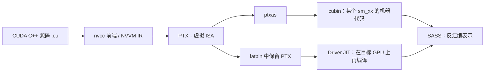
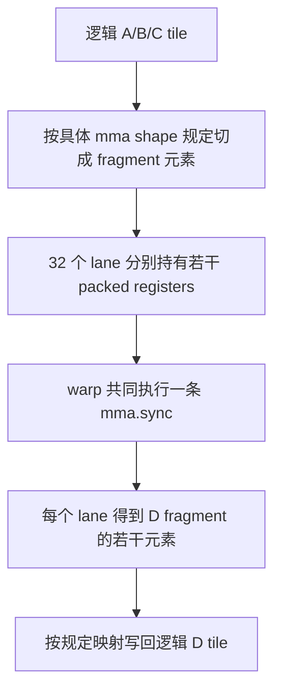
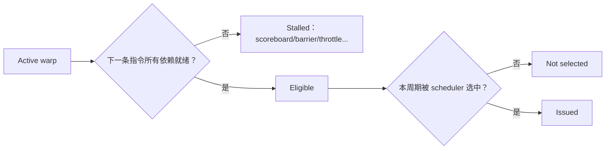
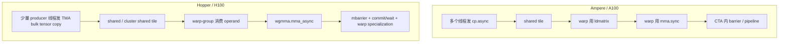
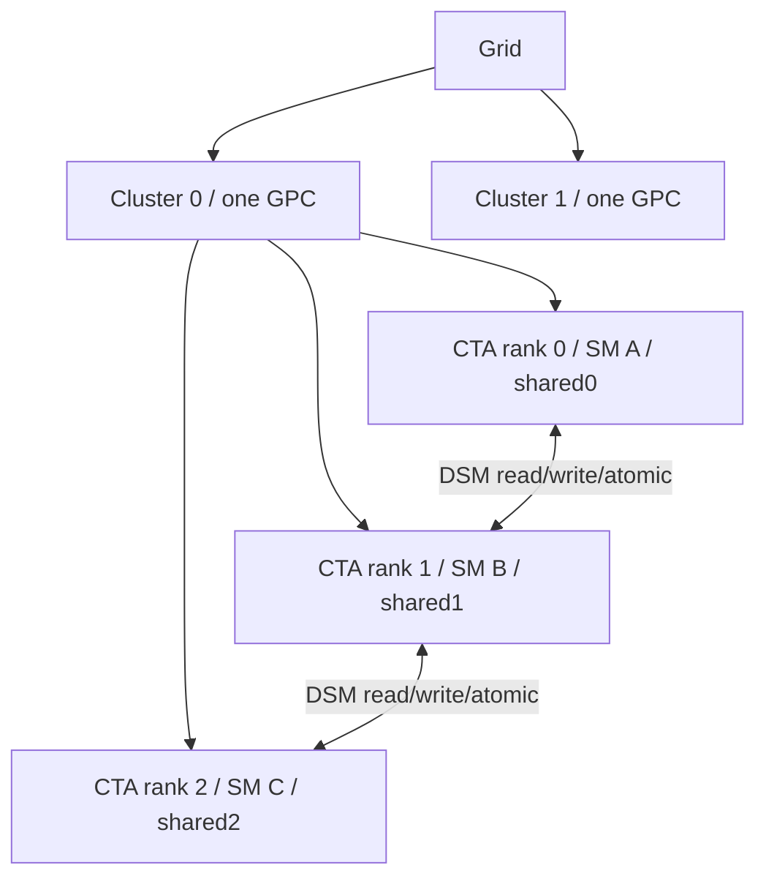

# CUDA 深水区：PTX/SASS、Warp MMA、异步流水、调度与 Hopper

> 一份面向 A100 的 14 天高强度教材。纯 CUDA、硬件与性能视角，不讨论 ML。

## 0. 你从哪里出发

这不是 CUDA 入门。默认你已经能独立完成：

- grid/block/warp 映射，正确处理边界；
- coalescing、shared memory、bank conflict、padding；
- atomic、shuffle、ballot、reduction、scan、histogram；
- naive → shared tiled → 2D register tiled → float4 → double buffering GEMM；
- 用 CUDA Event、GFLOPS、Roofline、ncu 和 compute-sanitizer 建立证据；
- 使用 WMMA 编写 FP16 GEMM，并在 SASS 中找到 HMMA。

你接下来要建立的是更深的一条链：

```text
源码为什么这样写
→ 编译器生成了什么
→ warp 如何消费寄存器和 shared tile
→ 数据搬运和计算怎样重叠
→ scheduler 为什么发不出下一条指令
→ Hopper 为什么重构这套组织方式
```

本书的核心原则：

> 不以“看到一个高级名词”为完成标准，而以“代码、指令、指标三层证据互相对得上”为完成标准。

## 1. 两周总览

| 天 | 主题 | 当天必须产出 |
|---:|---|---|
| 1 | CUDA C++ → PTX → SASS | 编译链图；能解释三层的职责 |
| 2 | PTX/SASS 读法 | 五版 GEMM 指令观察表 |
| 3 | 寄存器、spill、向量化 | 一份 ptxas+SASS+ncu 取证记录 |
| 4 | MMA 的 shape 与 fragment | 一张 lane/register/matrix 映射图 |
| 5 | `ldmatrix` | shared→register 地址与布局推演 |
| 6 | `mma.sync` microkernel | 完成核心 TODO；正确性与 SASS 证据 |
| 7 | `cp.async` 语义 | async group 状态机图 |
| 8 | 2-stage → 3-stage | 完成 pipeline TODO；正确性通过 |
| 9 | 流水性能验证 | stage/资源/stall/GFLOPS 对照表 |
| 10 | Scheduler 与 Scoreboard | load-use 与 ILP microbenchmark |
| 11 | Stall 诊断 | 一次“指标→假设→修改→复测”闭环 |
| 12 | Hopper：TMA/WGMMA | Ampere/Hopper mainloop 对照图 |
| 13 | Hopper：Cluster/DSM | cluster/DSM/warp specialization 口述 |
| 14 | 综合分析 | 一个现有 GEMM 的完整证据链报告 |

每天建议 2–4 小时。你学习速度快，所以正文不会把同一个定义重复五遍；但每次跨抽象层都会明确说明“上一层的哪个对象，在下一层变成了什么”。

## 2. 本项目的实验对象

后面所有命令优先复用这些已有代码：

| 观察对象 | 文件 | 用途 |
|---|---|---|
| naive GEMM | [gemm_naive.cu](../week04_gemm/gemm_naive/gemm_naive.cu) | global load、地址计算、FFMA 基线 |
| shared tiled GEMM | [gemm_tiled.cu](../week04_gemm/gemm_tiled/gemm_tiled.cu) | LDS/STS、barrier、global 复用 |
| 2D register tiled | [gemm_2d_thread_tiling.cu](../week05_gemm_advanced/gemm_2d_thread_tiling.cu) | accumulator、寄存器压力、ILP |
| float4 加载 | [gemm_vectorized_load.cu](../week05_gemm_advanced/gemm_vectorized_load.cu) | 宽访存是否真的生成 |
| 两级异步流水 | [gem_double_buffering.cu](../week05_gemm_advanced/gem_double_buffering.cu) | 从 `cuda::pipeline` 下钻到 `cp.async` |
| WMMA GEMM | [wmma_fp16_gemm.cu](../week06_tensorcore/wmma_fp16_gemm.cu) | WMMA→PTX MMA→SASS HMMA |
| A100 ncu 记录 | [ncu_notes.md](../week05_gemm_advanced/ncu_notes.md) | 寄存器/occupancy/bank conflict 证据 |
| Tensor Core 记录 | [tensor_core_profile.md](../week06_tensorcore/tensor_core_profile.md) | HMMA 与 Tensor pipe 证据 |

---

# Part I：读懂 GPU 最终执行了什么（Day 1–3）

## 3. Day 1：CUDA C++、PTX、SASS 不是同一层

### 3.1 编译链



三层最容易混淆：

| 层 | 是什么 | 能回答什么 | 不能保证什么 |
|---|---|---|---|
| CUDA C++ | 你写的程序与抽象 | 算法意图、线程映射 | 最终指令数量与选择 |
| PTX | NVIDIA 定义的虚拟并行线程 ISA | 地址空间、操作语义、目标能力 | GPU 最终逐条执行这些文本指令 |
| SASS | 特定架构机器码的反汇编 | 目标 GPU 实际执行的指令 | 跨代稳定的公开 ABI |

PTX 很像“GPU 的中间汇编”，但它仍会被 `ptxas` 优化、合并、重排和选择实际机器指令。分析“代码最终执行了什么”时，SASS 更接近事实；分析“我要表达某条底层 CUDA 语义”时，PTX 更适合阅读和内联。

官方入口：[PTX ISA](https://docs.nvidia.com/cuda/parallel-thread-execution/)、[CUDA Programming Guide](https://docs.nvidia.com/cuda/cuda-programming-guide/)。

### 3.2 `compute_80` 与 `sm_80`

```text
compute_80：PTX 采用的虚拟架构能力集合
sm_80：    ptxas 要生成的 Ampere A100 机器代码
```

常见构建：

```bash
# 只生成 A100 cubin 路径
nvcc -O3 -lineinfo -arch=sm_80 kernel.cu -o kernel

# 同时嵌入 sm_80 cubin 和 compute_80 PTX，便于新架构 JIT
nvcc -O3 -lineinfo kernel.cu -o kernel \
  -gencode arch=compute_80,code=sm_80 \
  -gencode arch=compute_80,code=compute_80
```

不要把“包含 PTX”与“运行时一定走 JIT”画等号：如果 fatbin 中已有目标 GPU 可用的 cubin，driver 通常直接使用它。

### 3.3 第一组命令：生成三层证据

以 naive GEMM 为例：

```bash
mkdir -p /tmp/cuda_deep_dive/day1

nvcc -O3 -lineinfo -arch=sm_80 \
  week04_gemm/gemm_naive/gemm_naive.cu \
  -o /tmp/cuda_deep_dive/day1/gemm_naive

nvcc -O3 -arch=compute_80 -ptx \
  week04_gemm/gemm_naive/gemm_naive.cu \
  -o /tmp/cuda_deep_dive/day1/gemm_naive.ptx

nvcc -O3 -lineinfo -arch=sm_80 -Xptxas=-v \
  week04_gemm/gemm_naive/gemm_naive.cu \
  -o /tmp/cuda_deep_dive/day1/gemm_naive_verbose

cuobjdump --dump-sass /tmp/cuda_deep_dive/day1/gemm_naive \
  > /tmp/cuda_deep_dive/day1/gemm_naive.sass
```

命令分别回答：

- `-ptx`：前端用什么 PTX 语义表达 kernel；
- `-Xptxas=-v`：每个 kernel 使用多少寄存器、shared、constant，以及是否 spill；
- `cuobjdump --dump-sass`：目标 `sm_80` 最终机器指令是什么；
- `-lineinfo`：帮助 ncu/反汇编工具把指令关联回源码，不等同于 `-G`；
- `-G`：设备调试构建，会明显改变优化结果，不用于性能取证。

如果可执行文件包含多个 kernel：

```bash
cuobjdump --list-elf /tmp/cuda_deep_dive/day1/gemm_naive
cuobjdump --dump-sass --function '<实际 mangled 名>' \
  /tmp/cuda_deep_dive/day1/gemm_naive
```

函数名以 `cuobjdump --dump-sass` 实际输出为准，不要硬背 C++ mangled name。

### 3.4 Day 1 验收

闭卷回答：

1. PTX 为什么不是 GPU 最终执行的机器码？
2. `ptxas` 做什么？
3. cubin 和 fatbin 有什么区别？
4. 为什么性能分析用 `-lineinfo`，不随手加 `-G`？
5. 发布程序为什么可能同时携带 cubin 与 PTX？

你应能口述：

> CUDA C++ 先被前端降到 PTX，PTX 是带版本和 target 能力的虚拟 ISA；ptxas 再为具体 `sm_xx` 生成机器码并进行寄存器分配。SASS 是机器码的反汇编表示。已有兼容 cubin 时通常直接加载，只有需要时才用内嵌 PTX 做 driver JIT。

## 4. Day 2：怎样开始读 PTX 与 SASS

### 4.1 先读数据流，不要逐字符翻译

读一个 kernel 时按顺序找：

```text
1. 线程/warp 索引怎样计算？
2. global 地址怎样形成？
3. load 进了哪些寄存器？
4. 中间是否经过 shared？
5. 主计算指令是什么？
6. 循环、谓词、barrier 在哪里？
7. 最终 store 在哪里？
```

不要第一天就试图解释控制码、reuse flag、每个 stall field。先建立“数据从哪来、在哪里复用、由什么指令消费”的骨架。

### 4.2 PTX 最小词典

```ptx
.reg .b32 %r<8>;       // 8 个 32-bit 虚拟寄存器
.reg .f32 %f<4>;       // 4 个 float 虚拟寄存器
.reg .pred %p<2>;      // 谓词寄存器

ld.global.f32 %f0, [%rd1];
ld.shared.f32 %f1, [%r2];
st.global.f32 [%rd3], %f2;
fma.rn.f32 %f2, %f0, %f1, %f2;
setp.lt.s32 %p0, %r0, %r1;
@%p0 bra LOOP;
bar.sync 0;
```

重要直觉：PTX 中 `%r` 数量不等于最终物理寄存器数量。虚拟寄存器经过活跃区间分析和分配后，才由 ptxas 决定真实资源。

### 4.3 SASS 阅读时看“类别”，不背跨代拼写

在 Ampere 反汇编中你通常会看到以下类别：

| 类别 | 常见助记符方向 | 意义 |
|---|---|---|
| global load/store | `LDG` / `STG` | global/L1/L2 路径 |
| shared load/store | `LDS` / `STS` | shared memory 路径 |
| local load/store | 常见为 local 相关 load/store 形式 | 线程私有的片外 local 地址空间，可能来自 spill |
| 浮点乘加 | `FFMA` | CUDA Core FMA |
| 整数地址计算 | `IMAD` 等 | 索引、stride、地址形成 |
| predicate/branch | `ISETP`、`@P... BRA` 等 | 条件与控制流 |
| 同步 | `BAR` 等 | CTA/warp 同步 |
| Tensor Core | `HMMA` / `IMMA` / `DMMA` 等 | 架构相关矩阵指令 |

SASS 助记符和编码是架构相关的。教材里的名字是阅读入口，不是要求你背成跨代规范；最终以你当前 `cuobjdump`/`nvdisasm` 输出为准。

### 4.4 五版 GEMM 应该观察什么

| 版本 | 先提出的假设 | PTX/SASS 证据 | ncu 证据 |
|---|---|---|---|
| naive | A/B 被大量重复从 global 取 | 主循环频繁 global load + FFMA | DRAM/L1 路径压力、低 AI |
| shared tiled | global load 被 tile 摊薄 | tile load/store shared、barrier、计算阶段 LDS+FFMA | DRAM 降，shared/L1TEX 可能成为墙 |
| register tiled | 一次 shared load 服务多个 accumulator | 更多独立 FFMA、更多长寿命寄存器 | registers/thread 上升，ILP 上升，occupancy 可能下降 |
| float4 | 少量宽 load 替代多条窄 load | 实际宽度必须从 SASS 确认 | load 指令/sector 利用率变化 |
| WMMA | 编译器生成 Tensor Core 路径 | HMMA/MMA 类指令 | Tensor pipe 活跃度 |

“应该”只是待验证假设。例如源码写了 `float4`，如果地址对齐、别名信息或后续标量化使编译器无法保留宽操作，最终不一定得到你想象的单条宽 load。

### 4.5 实验记录模板

```markdown
| kernel | registers | spill load/store | global load 形态 | shared 指令 | 主计算 | barrier | 我的解释 |
|---|---:|---:|---|---|---|---|---|
| naive | | | | | | | |
| shared | | | | | | | |
| 2D reg | | | | | | | |
| float4 | | | | | | | |
| WMMA | | | | | | | |
```

### 4.6 Day 2 练习

对 naive 与 tiled 两版分别回答：

1. 主 K 循环里每次迭代有哪些 load？
2. tiled 版 global load 是在哪一段发生，shared load 又在哪一段发生？
3. barrier 前后的数据所有权是什么？
4. 地址计算指令是否占了显眼比例？
5. 你能否从 SASS 单独证明“没有 bank conflict”？为什么不能？

最后一题答案要点：SASS 能告诉你 shared 指令与地址形成，但 bank conflict 是 warp 各 lane 的动态地址映射问题，通常还要结合布局推导和 ncu 指标。

## 5. Day 3：寄存器、spill 与向量化

### 5.1 寄存器多不等于一定慢

寄存器的三重作用：

```text
更多 accumulator → 更多数据复用和 ILP
更多寄存器/线程 → 每 SM 可驻留 warp 可能减少
寄存器不够      → 值可能 spill 到 local memory
```

你已经在 A100 上测过：寄存器从 122 降到 78，achieved occupancy 从约 14.5% 升至 30.1%，性能提升约 18%；但继续缩小线程 tile 后，复用和 ILP 下降，性能反而回落。这正说明目标不是“最少寄存器”，而是最好的资源平衡。

### 5.2 三层 spill 证据

第一层：ptxas 资源报告。

```bash
nvcc -O3 -lineinfo -arch=sm_80 -Xptxas=-v source.cu -o app 2>&1 | tee ptxas.log
```

关注 `Used N registers`、spill stores、spill loads、stack frame。

第二层：SASS/local 指令和地址空间。

```bash
cuobjdump --dump-sass ./app > app.sass
rg 'LOCAL|LDL|STL|LD.*\.L|ST.*\.L' app.sass
```

不同工具链的助记符可能变化，所以先读完整上下文；不要因为某个 grep 没匹配就断言没有 spill。

第三层：ncu 的 local memory traffic 与源代码关联。

```bash
ncu --section LaunchStats --section Occupancy \
    --section MemoryWorkloadAnalysis \
    --section SourceCounters ./app
```

只有三层一致，结论才稳：资源报告出现 spill、机器码存在 local 路径、运行时 local traffic 也显著。

### 5.3 练习：故意制造压力（由你完成）

```cpp
template<int N>
__global__ void register_pressure(const float* x, float* y, int n) {
    int i = blockIdx.x * blockDim.x + threadIdx.x;
    if (i >= n) return;

    float acc[N];
    #pragma unroll
    for (int k = 0; k < N; ++k) {
        // TODO 1：让 acc[k] 都依赖输入且最终可观察，防止被优化删除。
    }

    float sum = 0.0f;
    #pragma unroll
    for (int k = 0; k < N; ++k) {
        // TODO 2：汇总所有 acc[k]。
    }
    y[i] = sum;
}
```

编译 `N=8/32/64/128`，记录 registers、spill、occupancy 和时间。

- 提示 1：不能让所有 `acc[k]` 都成为编译期常量。
- 提示 2：使用 `x[(i+k)&mask]` 一类可运行时变化的输入。
- 提示 3：若数组被动态索引，编译器可能直接放 local；要区分“动态索引导致 local”与“寄存器不足导致 spill”。

### 5.4 练习：验证 `float4` 是否落地

检查 [gemm_vectorized_load.cu](../week05_gemm_advanced/gemm_vectorized_load.cu) 时依次问：

1. 基地址是否至少 16-byte 对齐？
2. 行首 `row*K` 是否保持 4 元素对齐？
3. 尾部是否单独处理？
4. `reinterpret_cast<float4*>` 是否违反对象/对齐前提？
5. SASS 是一条宽事务还是被拆成标量？
6. 即使指令更少，kernel 是否原本就受 load instruction throughput 限制？

### 5.5 `__launch_bounds__` 的正确位置

```cpp
__global__ __launch_bounds__(256, 2)
void kernel(...);
```

它向编译器声明最大 block 线程数，并可给出期望的最少驻留 block 数，进而影响寄存器分配策略。它不是“强制 occupancy 达到某值”，也不保证性能上升。实验必须同时检查：

```text
寄存器是否下降？
是否出现 spill？
理论与 achieved occupancy 是否变化？
ILP/复用是否受损？
最终时间是否改善？
```

### 5.6 Part I 验收

你真正掌握 Part I 的标志：

- 能给出源码→PTX→SASS 的命令；
- 能说明某条优化是否真的生成预期机器指令；
- 能区分虚拟寄存器、物理寄存器、local memory 和 spill；
- 不把“寄存器少”“occupancy 高”“宽 load”单独当成性能结论；
- 能用 naive 与 register tiled GEMM 的指令差异解释复用与 ILP。

---

# Part II：从 WMMA 下钻到 `ldmatrix + mma.sync`（Day 4–6）

## 6. Day 4：WMMA、PTX MMA、SASS HMMA 的关系

### 6.1 三层仍然成立

你现有代码调用：

```cpp
wmma::load_matrix_sync(a_frag, a_tile, K);
wmma::mma_sync(c_frag, a_frag, b_frag, c_frag);
```

可以粗略理解为：

```text
C++ WMMA API
    ↓ 编译器选择与 lowering
PTX wmma/mma 语义（不保证一一对应）
    ↓ ptxas 针对 sm_80 选指令
SASS HMMA/MMA 指令序列
```

你已经在 [tensor_core_profile.md](../week06_tensorcore/tensor_core_profile.md) 中找到 `HMMA.16816.F32`。这能证明 Tensor Core 路径，但不代表每个 WMMA 调用只变成一条 SASS，也不代表你已经知道 fragment 在 32 个线程中的寄存器布局。

WMMA 的价值是让编译器管理 fragment 类型、加载和 MMA；直接 PTX 的价值是让你明确控制具体 MMA shape、寄存器 operand 和 shared→register 的加载方式。代价是：布局约束和正确性责任回到你手里。

### 6.2 MMA 的 `M×N×K`

矩阵乘加：

```text
D[M,N] = A[M,K] × B[K,N] + C[M,N]
```

以 Ampere 上常见的一类 PTX 形状为例：

```ptx
mma.sync.aligned.m16n8k16.row.col.f32.f16.f16.f32
```

从左到右读：

| 字段 | 含义 |
|---|---|
| `mma` | warp 级矩阵乘加 |
| `.sync` | warp 线程在该指令处协作；参与条件必须一致 |
| `.aligned` | warp 内线程使用相同 qualifier，且执行必须一致 |
| `.m16n8k16` | 逻辑 D 是 16×8，K 归约长度 16 |
| `.row.col` | A 按 row-major 解释，B 按 column-major 解释 |
| `.f32.f16.f16.f32` | D、A、B、C 的类型顺序 |

精确 operand 数量和元素映射必须查对应 PTX ISA 小节，不能只看 `16×8×16` 猜。PTX ISA 会针对每种 shape/type 定义每线程持有哪些矩阵元素。[PTX MMA 官方定义](https://docs.nvidia.com/cuda/parallel-thread-execution/#warp-level-matrix-instructions-mma)。

### 6.3 一个 warp 持有一个逻辑矩阵，不等于每线程持有一行

错误想象：

```text
lane 0 持 A 的第 0 行
lane 1 持 A 的第 1 行
...
```

真实情况更像：



fragment 是“warp 共同持有的逻辑 tile”的分布式寄存器表示。你不能只看某个线程的寄存器就理解完整矩阵，也不能随意交换 lane 的 operand。

### 6.4 纸上练习

选定 `m16n8k16.row.col.f32.f16.f16.f32` 后，从当前 PTX ISA 抄一张**只针对这个形状**的表：

```markdown
| lane 组 | A 寄存器对应逻辑元素 | B 寄存器对应逻辑元素 | C/D 对应元素 |
|---|---|---|---|
| 0..3 | | | |
| 4..7 | | | |
| ... | | | |
```

验收不是背表，而是能回答：

1. 一个 lane 需要多少个 32-bit A operand？
2. 两个 FP16 为什么常打包进一个 32-bit operand？
3. C/D 为什么用若干 FP32 accumulator？
4. 相邻 lane 持有的逻辑元素为何不一定在同一连续行？

## 7. Day 5：`ldmatrix` 到底解决什么

### 7.1 普通 shared load 的问题不是“不能加载”

你当然可以让每个线程用普通 `ld.shared` 把 half 数据搬进寄存器。但 MMA operand 对 lane 和寄存器的分布有固定要求。如果每个线程按自然二维坐标加载，之后可能需要额外 shuffle、重排或复杂地址计算。

`ldmatrix.sync.aligned` 是 warp 协作的 shared→register 矩阵加载指令族。它按矩阵行读取 shared 数据，并直接生成适合矩阵指令消费的分布式寄存器 fragment。


### 7.2 读指令名字

```ptx
ldmatrix.sync.aligned.m8n8.x4.shared.b16
ldmatrix.sync.aligned.m8n8.x2.trans.shared.b16
```

关键字段：

| 字段 | 含义 |
|---|---|
| `m8n8` | 基本加载对象是 8×8 矩阵 |
| `.x1/.x2/.x4` | 一个 warp 同时加载 1/2/4 个这样的矩阵 |
| `.b16` | 矩阵元素按 16-bit 读取 |
| `.trans` | 使用转置加载形式，常用于匹配 B operand 布局 |
| `.shared` | 地址指向 shared 地址空间 |

对于 `.x1/.x2/.x4`，提供行地址的 lane 数量不同；每四个连续线程协作处理一个 16-byte 矩阵行。精确的 address provider 和目标寄存器映射以 [PTX `ldmatrix` 官方定义](https://docs.nvidia.com/cuda/parallel-thread-execution/#warp-level-matrix-load-instruction-ldmatrix) 为准。

### 7.3 为什么必须关心 shared layout

`ldmatrix` 不会猜你的逻辑矩阵。你必须同时满足：

- shared 中的数据布局与 MMA 的 A/B layout 相容；
- 每个地址提供 lane 指向正确矩阵行；
- 地址和 stride 满足指令对齐要求；
- warp 内参与线程满足 `.sync/.aligned` 的一致执行要求；
- tile 边界已经被 padding 或 guard 正确填充。

同一份逻辑矩阵可以有多种 shared layout。工业 kernel 常使用 swizzle，不只是为了 `ldmatrix` 映射，也为了减少 shared bank conflict。

### 7.4 地址转换

inline PTX 的 shared operand 通常需要 shared address，而 C++ 指针是 generic pointer。常用转换：

```cpp
__device__ __forceinline__ unsigned smem_u32addr(const void* p) {
    return static_cast<unsigned>(__cvta_generic_to_shared(p));
}
```

这不是把数据复制到 shared，只是把地址转换到 PTX shared address 语义可接受的表示。

### 7.5 最小观察实验

不要第一步就做完整 GEMM。先让一个 warp：

1. 把可识别序列写入 shared 的 8×8/多个 8×8 tile；
2. `__syncthreads()`；
3. 使用 `ldmatrix` 加载；
4. 把每个 lane 的目标寄存器以十六进制写回 global；
5. 在 host 端打印 lane→register 映射。

骨架：

```cpp
__global__ void inspect_ldmatrix(uint32_t* out) {
    __shared__ __align__(16) half tile[4][8][8];
    int lane = threadIdx.x & 31;

    // 外围框架：用可识别模式初始化 tile，例如 value = matrix*100 + row*10 + col。
    for (int i = lane; i < 4 * 64; i += 32) {
        // TODO 1：写入可识别的 half 数据。
    }
    __syncthreads();

    uint32_t r0, r1, r2, r3;
    unsigned addr;
    // TODO 2：根据 PTX ISA 计算当前 lane 应提供的行地址。
    // TODO 3：完成 ldmatrix.sync.aligned.m8n8.x4.shared.b16 inline PTX。

    out[lane * 4 + 0] = r0;
    out[lane * 4 + 1] = r1;
    out[lane * 4 + 2] = r2;
    out[lane * 4 + 3] = r3;
}
```

三级提示：

1. 先不要管 MMA，只验证寄存器中的 half pair 是否来自预期位置；
2. 把 `uint32_t` 的低/高 16 bit 解释成两个 half；
3. `.x4` 需要四个 32-bit 目标寄存器，地址 provider 覆盖四个 8×8 矩阵的行。

## 8. Day 6：最小 `mma.sync` microkernel

### 8.1 先规定学习边界

本练习只追求：

```text
一个 warp
一个固定 MMA shape
输入尺寸正好匹配
FP16 A/B
FP32 accumulator
CPU 参考正确
SASS 出现矩阵指令
```

暂不追求任意 M/N/K、多 warp、极致布局或 cuBLAS 性能。

### 8.2 外围框架与核心空位

以下代码展示接口和状态，不给出 inline PTX 完整答案：

```cpp
#include <cuda_fp16.h>
#include <cstdint>

struct FragA { uint32_t x[4]; };   // 数量需与你选择的 shape/type 再核对
struct FragB { uint32_t x[2]; };
struct FragC { float x[4]; };

__device__ __forceinline__ void mma_m16n8k16(
        FragC& d, const FragA& a, const FragB& b, const FragC& c) {
    // TODO 1：按 PTX ISA 写 operand list。
    // TODO 2：为 packed half operand 选择正确 inline asm constraint。
    // TODO 3：完成 mma.sync.aligned.m16n8k16.row.col.f32.f16.f16.f32。
}

__global__ void mma_microkernel(const half* A, const half* B, float* D) {
    // 一个 block 先只用一个 warp。
    // TODO 4：协作把 A/B 搬到满足对齐和布局要求的 shared tile。
    // TODO 5：用 ldmatrix 构造 FragA/FragB。
    // TODO 6：初始化 FragC 为 0，调用 mma。
    // TODO 7：按该 MMA shape 的 D fragment 映射写回。
}
```

这里的数组数量只针对指定教学形状，仍需用当前 PTX ISA operand 表逐项核对。你真正要学的是核对过程，不是复制一段神秘 asm。

三级提示：

1. 先在 host 生成简单输入：A 全 1，B 每列用不同常数；这样输出容易肉眼判断；
2. 先完成“手工从 global 填寄存器 fragment”的版本，再替换为 `ldmatrix`，可隔离问题；
3. inline asm 的 operand 顺序是 D、A、B、C；D/C 是多个标量寄存器，A/B 常是 packed 32-bit operand。

### 8.3 正确性验证

至少使用三组：

```text
A 全 1，B 每列常数
A/B 递增小整数
固定随机种子的小浮点数
```

CPU 参考：

```cpp
for (int m = 0; m < 16; ++m)
  for (int n = 0; n < 8; ++n) {
    float sum = 0;
    for (int k = 0; k < 16; ++k)
      sum += __half2float(A[m*16+k]) * __half2float(B[k*8+n]);
    ref[m*8+n] = sum;
  }
```

FP16 输入、FP32 累加仍允许由于乘法输入量化和求和顺序产生小误差。使用绝对/相对容差，不做逐 bit 对比。

### 8.4 指令验证

```bash
nvcc -O3 -lineinfo -arch=sm_80 mma_microkernel.cu -o mma_microkernel
compute-sanitizer --tool memcheck ./mma_microkernel
cuobjdump --dump-sass ./mma_microkernel | rg 'HMMA|MMA|LDSM'
```

`LDSM` 是某些架构/工具版本中 `ldmatrix` lowering 的常见 SASS 名称，但仍以实际输出为准。

### 8.5 为什么正确的 microkernel 仍可能很慢

它通常缺少：

- 多个 MMA tile 的寄存器复用；
- 多 warp 覆盖较大 CTA tile；
- global→shared 合并加载；
- shared swizzle；
- K 循环流水；
- epilogue 合并与向量化 store；
- 足够 grid 规模。

所以本练习的性能目标不是战胜 WMMA/cuBLAS，而是把“逻辑矩阵→shared layout→lane fragment→MMA→写回”打通。

### 8.6 Part II 验收

1. 为什么 fragment 不能理解成“每线程一行”？
2. `ldmatrix` 解决的是 global→shared 还是 shared→register？
3. `.x4` 的 4 是 4 个线程、4 个寄存器，还是 4 个 8×8 矩阵？
4. `.trans` 为什么常与 B operand 有关？
5. 为什么 warp 内分歧地执行 `.aligned` MMA 是错误的？
6. 怎样证明 C++/inline PTX 最后真的走了 Tensor Core？

---

# Part III：A100 原生 `cp.async` 多级流水（Day 7–9）

## 9. Day 7：`cp.async` 不是“异步 memcpy”四个字

### 9.1 普通搬运与 Ampere 路径

普通 CUDA C++：

```cpp
float x = global[idx];  // global → register
shared[tid] = x;        // register → shared
```

抽象数据路径：

```text
global/L2/L1 → 通用寄存器 → shared
```

Ampere 提供硬件加速的 global→shared 异步复制，使数据搬运可以不经过一个显式的中间通用寄存器，并允许程序显式组织搬运/计算重叠。[Ampere Tuning Guide](https://docs.nvidia.com/cuda/ampere-tuning-guide/)

```text
global/L2/(可选 L1 行为) ──cp.async──→ shared
                     计算线程继续执行独立指令
```

“异步”是相对于发起线程后续指令而言：指令发出后，控制可以继续，但数据尚未保证完成。你必须使用它支持的完成机制等待，不能靠“中间算了很多东西，应该已经好了”来猜。

### 9.2 指令骨架

```ptx
cp.async.ca.shared.global [dst_smem], [src_gmem], 16;
cp.async.cg.shared.global [dst_smem], [src_gmem], 16;
```

核心字段：

| 字段 | 含义 |
|---|---|
| `.ca` | cache at all levels 的缓存提示 |
| `.cg` | 只在 global level（L2）缓存的提示；该形式用于 16-byte copy |
| `.shared.global` | 目标 shared、来源 global |
| `cp-size` | 单条 copy 的静态大小，常用 4/8/16 bytes |

缓存操作符是性能提示，不是“强制命中某级缓存”的正确性语义。A100 上是否用 `.ca`/`.cg` 要结合复用、L1 污染与实测。

### 9.3 尾部的 `src-size` 与 zero fill

PTX 支持给出实际有效源字节数，小于 `cp-size` 的尾部由硬件补 0；有效大小必须满足指令约束。

概念形式：

```ptx
cp.async.ca.shared.global [dst], [src], 16, valid_bytes;
```

这对 K/N 尾部 tile 很有用：目标 shared slot 仍被完整定义，越界部分是 0，而不是读取非法 global 地址。但不要把任意运行时字节数直接塞进去，具体合法形式以当前 [PTX `cp.async` 定义](https://docs.nvidia.com/cuda/parallel-thread-execution/#data-movement-and-conversion-instructions-cp-async) 为准。

### 9.4 Async group 状态机

单纯发出若干 `cp.async` 后，还没有形成可等待的批次：

```ptx
cp.async ... tile_part_0;
cp.async ... tile_part_1;
cp.async.commit_group;
```

`commit_group` 把此前尚未提交的 `cp.async` 组成一个 group。之后：

```ptx
cp.async.wait_group 0;  // 等待所有先前 group 完成
cp.async.wait_group 1;  // 允许至多 1 个较新的未完成 group 留在飞行中
```

把它想成“允许还欠几个 group”：

```text
wait_group 0：现在要消费最新需要的数据，不能欠
wait_group 1：允许预取的下一组继续飞，较旧组必须完成
```

但这个口述必须配合具体提交顺序理解，不能脱离代码死背 `N`。

### 9.5 两个经常混淆的同步问题

问题 A：copy 完成了吗？

```text
cp.async.wait_group / wait_all / 受支持的 mbarrier 完成机制
```

问题 B：block 中其他线程现在可以安全消费 shared tile 吗？

```text
还要建立参与线程之间正确的控制与可见性关系，常见教学实现使用 __syncthreads()
```

`wait_group` 不是任意 CTA 屏障；`__syncthreads()` 也不能替代 `cp.async` 的专用完成等待。官方 PTX 明确指出，未使用其完成机制时，普通同步不能保证 async copy 已完成。

### 9.6 Inline PTX 包装器（保留核心空位）

```cpp
__device__ __forceinline__ void cp_async_16(
        void* smem_dst, const void* gmem_src) {
    unsigned dst = static_cast<unsigned>(__cvta_generic_to_shared(smem_dst));
    // TODO 1：写 cp.async.ca.shared.global，copy size 为 16。
}

__device__ __forceinline__ void cp_async_commit() {
    // TODO 2：写 cp.async.commit_group。
}

template<int N>
__device__ __forceinline__ void cp_async_wait_group() {
    // TODO 3：把编译期常量 N 放入 cp.async.wait_group。
}
```

三级提示：

1. shared 地址用 32-bit integer operand，global pointer 通常使用 64-bit address operand；
2. 没有输出寄存器时 inline asm 仍应声明 `volatile`，并考虑 memory side effect；
3. `wait_group` 的立即数最好是模板参数，避免试图把普通运行时变量当 PTX immediate。

## 10. Day 8：2-stage 与 3-stage 的真正区别

### 10.1 没有流水时

```text
时间 →
load tile0 | compute tile0 | load tile1 | compute tile1 | load tile2 | compute tile2
```

如果 load latency 没有其他 warp/指令隐藏，计算单元会等数据。

### 10.2 两级 ping-pong

```mermaid
gantt
    title 2-stage 概念时间线
    dateFormat X
    axisFormat %L
    section copy
    preload tile0 :a0, 0, 2
    copy tile1    :a1, 2, 3
    copy tile2    :a2, 5, 3
    section compute
    compute tile0 :b0, 2, 3
    compute tile1 :b1, 5, 3
    compute tile2 :b2, 8, 3
```



两个 shared slot：

```text
slot 0：consumer 正在算 tile k
slot 1：producer 正在装 tile k+1
下一轮交换角色
```

必须保证：

1. consumer 不读尚未完成的 slot；
2. producer 不覆盖 consumer 尚未用完的 slot；
3. 所有需要该 tile 的线程在正确同步点协作。

### 10.3 三级环形流水

三个 slot 允许更早预取：

```text
prologue：先提交 tile0、tile1（根据设计决定预填深度）

steady state 每轮：
  等待将要消费的 tile k 已完成
  消费 slot[k % 3]
  向已经安全释放的 slot[(k+prefetch_distance) % 3] 发起未来 tile
  commit 新 group

epilogue：没有更多新 tile，只排空已提交 group 并消费剩余 tile
```

概念时间线：

```text
阶段      slot0       slot1       slot2
预填      copy T0     copy T1     空
轮次0     compute T0  ready T1    copy T2
轮次1     copy T3     compute T1  ready T2
轮次2     ready T3    copy T4     compute T2
轮次3     compute T3  ready T4    copy T5
```

真正困难的不是 `%3`，而是每个 slot 的状态：

```text
FREE → COPYING → READY → CONSUMING → FREE
```

### 10.4 3-stage 教学骨架

```cpp
template<int STAGES, int BK>
__global__ void gemm_pipeline_3stage(/* A, B, C, M, N, K */) {
    extern __shared__ unsigned char storage[];
    // 将 storage 划分为 STAGES 份 A tile 和 STAGES 份 B tile。

    const int tiles = (K + BK - 1) / BK;

    // Prologue
    #pragma unroll
    for (int t = 0; t < STAGES - 1 && t < tiles; ++t) {
        int stage = t % STAGES;
        // TODO 1：协作发起 A_t/B_t 的 cp.async，尾部安全补零。
        // TODO 2：每个逻辑 tile 的 copies 全部发出后 commit_group。
    }

    for (int k_tile = 0; k_tile < tiles; ++k_tile) {
        int read_stage = k_tile % STAGES;
        int future = k_tile + (STAGES - 1);

        // TODO 3：选择 wait_group 深度，保证 read_stage 已完成。
        // TODO 4：建立 block 内 shared consumer 所需同步。

        // TODO 5：从 read_stage 加载到寄存器并计算当前 tile。

        // TODO 6：确保所有 consumer 用完 read_stage，才能覆盖。
        if (future < tiles) {
            int write_stage = future % STAGES;
            // TODO 7：向 write_stage 发起 future tile 并 commit。
        }
    }

    // TODO 8：必要的最终等待与结果写回。
}
```

这只是状态机骨架，不直接保证最佳指令调度。第一次实现可以把 wait/barrier 写得保守，先正确；再逐步缩短等待范围。

### 10.5 与现有代码的连接

[gem_double_buffering.cu](../week05_gemm_advanced/gem_double_buffering.cu) 使用 `cuda::pipeline<thread_scope_block>` 和 `cuda::memcpy_async`。阅读时画出：

```text
API 的 producer_acquire/commit
API 的 consumer_wait/release
shared stage 数
每轮当前计算 tile
每轮下一预取 tile
```

然后再看生成 PTX/SASS，确认高层 API 是否降成预期 async copy。不要因为源码调用了 `memcpy_async` 就直接断言每个 copy 都走了硬件异步路径；对齐、大小和编译目标都会影响 lowering。

## 11. Day 9：流水的性能证据

### 11.1 为什么 stage 更多不保证更快

增加 stage 可能：

```text
+ 提前更久发起 global→shared，隐藏更长 latency
- 每 CTA shared memory = 单 stage tile 大小 × stages
- 更复杂的索引、同步和 prologue/epilogue
- 可能降低每 SM 驻留 CTA 数和 occupancy
- 短 K 循环可能来不及摊薄预填/排空成本
```

因此要比较完整资源账：

| 版本 | GFLOPS | shared/CTA | reg/thread | active CTA/SM | achieved occupancy | eligible warps | 主要 stall |
|---|---:|---:|---:|---:|---:|---:|---|
| sync | | | | | | | |
| 2-stage | | | | | | | |
| 3-stage | | | | | | | |
| 4-stage（可选） | | | | | | | |

### 11.2 推荐命令

```bash
ncu --set full -s 1 -c 1 \
    --kernel-name regex:gemm \
    -o /tmp/cuda_deep_dive/gemm_stage3 \
    ./gemm_stage3 2048
```

先看：

- SpeedOfLight：整体 compute/memory 利用；
- LaunchStats：register/shared/block；
- Occupancy：理论与 achieved；
- SchedulerStats：active/eligible/issued；
- WarpStateStats/SourceCounters：等待症状；
- MemoryWorkloadAnalysis：global/shared 行为。

不要一次收集几十个 metric 然后只挑一个支持自己观点。先写假设，例如：

> 2-stage 仍有明显 global dependency 等待；3-stage 会提高 eligible warps 或减少相关等待，但 shared/CTA 增加可能降低 active CTA。

再收集能证伪它的指标。

### 11.3 正确性与同步排错表

| 症状 | 首查 |
|---|---|
| 偶发错误，重复运行不同 | slot 被提前覆盖、缺 barrier、warp 执行不一致 |
| 尾部 K 错 | `src-size`/zero fill、越界地址是否仍被形成 |
| 全零或旧 tile | wait 深度与 group 提交顺序 |
| compute-sanitizer 不报错但数值错 | async 完成和逻辑 tile/stage 对应关系 |
| 3-stage 比 2-stage 慢 | shared 限制 occupancy、K 太短、同步更重、原本不 latency-bound |

运行：

```bash
compute-sanitizer --tool memcheck ./gemm_stage3 257
compute-sanitizer --tool racecheck ./gemm_stage3 257
compute-sanitizer --tool synccheck ./gemm_stage3 257
```

`racecheck`/`synccheck` 能提供证据，但不能替你证明 async group 状态机完全正确；仍需参考结果和压力重复测试。

### 11.4 Part III 验收

1. `cp.async` 绕过了哪个显式中间步骤？
2. `.ca` 与 `.cg` 是正确性规则还是缓存提示？
3. `commit_group` 和 `wait_group` 各改变什么状态？
4. 为什么 wait 之后仍可能需要 CTA 同步？
5. 三级流水的 slot 在何时可以复用？
6. 为什么 stage 增加可能降低 occupancy？
7. 怎样用数据证明它隐藏了 latency，而不是只因别的代码变化而更快？

---

# Part IV：Warp Scheduler、Scoreboard 与 Stall（Day 10–11）

## 12. Day 10：为什么“有很多 warp”仍可能发不出指令

### 12.1 四个数量不要混

以某个 scheduler 观察窗口为例：

```text
active warps：   已驻留在 SM、尚未结束的 warp
eligible warps：下一条指令已准备好、有资格 issue 的 warp
selected warp： 本周期被 scheduler 选中的 warp
issued warp：   实际发出指令的 warp
```

可能出现：

```text
active 很多，eligible 很少
```

这通常说明大量 warp 都在等依赖、barrier 或资源；仅仅提高 occupancy 未必能解决。如果 active 很少但每周期仍有足够 eligible，低 occupancy 也可能不妨碍吞吐。



### 12.2 Latency、Throughput、ILP、TLP

| 概念 | 问题 |
|---|---|
| latency | 一条操作从发出到结果可被依赖者使用，需要多久？ |
| throughput | 某类硬件单位每周期能接收/完成多少工作？ |
| ILP | 同一线程/warp 有多少互不依赖指令可穿插？ |
| TLP | 有多少其他 ready warp 可在当前 warp 等待时运行？ |

隐藏延迟的两条路：

```text
同一 warp 内：用多个独立 accumulator 提高 ILP
不同 warp 间：scheduler 切换到其他 eligible warp，提高 TLP
```

register tiled GEMM 正是在增加 ILP 和复用，但会消耗寄存器、降低 TLP 上限。这就是你已经测到的甜点效应。

### 12.3 Scoreboard 是依赖跟踪，不是缓存

概念模型：

```text
LDG R8, [addr]       // R8 的结果尚未就绪，scoreboard 标记
FFMA R12, R8, R9... // 依赖 R8，不能提前 issue
```

如果中间有独立工作：

```text
LDG R8, [addr0]
FFMA acc1, a1, b1, acc1
FFMA acc2, a2, b2, acc2
FFMA acc3, a3, b3, acc3
FFMA acc0, R8, b0, acc0
```

load latency 可能被部分隐藏。scoreboard 的职责是阻止依赖数据未就绪时错误发射，不是导致延迟的根因；根因可能是内存延迟、bank conflict、流水线延迟或依赖链过长。

### 12.4 Microbenchmark A：依赖链 vs 多 accumulator

```cpp
__global__ void fma_dependency(const float* x, float* y, int iters) {
    float a = x[threadIdx.x];
    float acc = a;
    #pragma unroll 1
    for (int i = 0; i < iters; ++i) {
        acc = fmaf(acc, 1.00001f, a); // 每轮依赖上一轮 acc
    }
    y[threadIdx.x] = acc;
}

__global__ void fma_ilp(const float* x, float* y, int iters) {
    float a = x[threadIdx.x];
    float acc0=a, acc1=a+1, acc2=a+2, acc3=a+3;
    #pragma unroll 1
    for (int i = 0; i < iters; ++i) {
        // TODO 1：更新四条互不依赖的 accumulator 链。
    }
    y[threadIdx.x] = acc0+acc1+acc2+acc3;
}
```

控制变量：总 FMA 数应可比较，防止“ILP 版只是做了四倍工作”导致错误结论。观察 issued/eligible、cycles per instruction、吞吐和 registers/thread。

### 12.5 Microbenchmark B：load-use 距离

版本 1：

```cpp
float v = x[idx];
acc += v * scale;   // 立刻消费
```

版本 2：

```cpp
float v0 = x[idx0];
float v1 = x[idx1];
float v2 = x[idx2];
// 插入与 v0 无关的工作
acc0 += v0 * scale;
acc1 += v1 * scale;
acc2 += v2 * scale;
```

TODO 2：保证两版访问字节和算术量尽量相同，只改变独立操作组织。比较 long scoreboard、eligible warp 和吞吐。

### 12.6 Microbenchmark C：Occupancy sweep

对同一 kernel 扫：

```text
block = 64/128/256/512
不同动态 shared 限额
不同 accumulator 数量
可选 __launch_bounds__
```

每组记录理论 occupancy、achieved occupancy、eligible warps、issue rate、GFLOPS。目标是找到：

```text
occupancy 变化但性能不变的区间
occupancy 上升同时 ILP 下降的拐点
资源限制导致 launch failure 的边界
```

## 13. Day 11：怎样读 Warp Stall，而不被指标牵着走

### 13.1 先看 scheduler 是否真的缺 issue

NVIDIA 的 Nsight Compute 文档明确提醒：stall 并不一定影响整体性能，也不可能全部消除；只有 scheduler 无法稳定 issue 时，才应优先分析 stall。[Nsight Compute Profiling Guide](https://docs.nvidia.com/nsight-compute/ProfilingGuide/)

> **Stall 指标首先是症状，不是根因。** 根因必须继续追到具体依赖、指令、地址模式、资源限制或同步协议。

诊断顺序：

```text
1. 正确性和 benchmark 是否可信？
2. 总体 compute/memory 哪些管线接近繁忙？
3. active、eligible、issued warps 怎样？
4. 主要 stall 是什么症状？
5. Source/SASS 中哪条指令贡献明显？
6. 形成一个可证伪假设。
7. 只改一个关键因素，再复测。
```

### 13.2 常见 stall 的工程解释

| 类别 | 表面含义 | 下一步证据 | 不应机械得出的结论 |
|---|---|---|---|
| Long Scoreboard | 等待 L1TEX 路径依赖，常含 global/local/texture/surface | source/SASS load、cache/DRAM、local spill、load-use 距离 | “一定是 DRAM 慢” |
| Short Scoreboard | 等待 MIO 路径依赖，常见 shared 或特殊单元 | shared bank conflict、LDS、MUFU、分支 | “一定要加更多 warp” |
| Barrier | 等 CTA/warp 同伴到同步点 | barrier 前工作不均、分歧、block 大小 | “删掉同步就快” |
| Wait | 等待固定延迟操作或异步依赖等 | 指令关联、pipeline 状态 | “wait 指令本身是根因” |
| LG Throttle | local/global 指令队列压力 | load/store 频率、宽度、合并、spill | “提高 occupancy” |
| Math/Dispatch Throttle | 某执行/分发管线供给受限 | 指令混合、pipe utilization | “内存优化一定有效” |
| Not Selected | warp 已 eligible，但其他 warp 被选 | eligible 数和 issue rate | “这是一种坏 stall” |

`Not Selected` 很高常表示 ready warp 足够多；它可能恰好说明延迟隐藏不错，而不是性能故障。

### 13.3 四个诊断案例

案例 A：

```text
DRAM 低、L1TEX 高、Short Scoreboard 高、shared bank conflict 高
```

合理假设：shared 访问模式或带宽限制，而不是 global DRAM。你的 2D GEMM padding 实验就是这一类。

案例 B：

```text
registers/thread 很高、active warps 少、eligible 接近 0、Long Scoreboard 高
```

可能是 global/local latency 缺少 TLP 隐藏，也可能有 spill。先查 ptxas/local traffic，不要直接减小 tile。

案例 C：

```text
occupancy 100%、Not Selected 高、主要计算管线接近满
```

并行度大概率已足够；继续提 occupancy 没有意义，应看是否接近目标管线吞吐上限。

案例 D：

```text
3-stage 比 2-stage 慢，shared/CTA 增大，active CTA 降低，Long Scoreboard 变化不大
```

说明原本 load latency 未必是主墙，而 stage 成本降低了 TLP。应考虑退回 2-stage 或改变 tile，而不是继续加 stage。

### 13.4 你的诊断记录模板

```markdown
## 现象
输入规模、GPU、编译参数、时间、正确性：

## 高层瓶颈
SOL Compute / Memory：

## 调度状态
active / eligible / issued：

## 指令症状
主要 stall、对应源码/SASS：

## 单一假设
我认为 X 是根因，因为 Y；若正确，改 Z 后指标 A 应变化。

## 最小修改

## 复测
性能、资源、指标、结论：
```

### 13.5 Part IV 验收

1. active warp 与 eligible warp 的区别是什么？
2. occupancy 高为什么仍可能没有 eligible warp？
3. ILP 和 TLP 怎样分别隐藏延迟？
4. Long Scoreboard 为什么不能直接翻译成“DRAM 慢”？
5. Not Selected 高为什么可能是好现象？
6. 一次合格的 stall 优化为什么必须写出可证伪预测？

---

# Part V：从 Ampere 迁移到 Hopper（Day 12–13）

## 14. Day 12：Hopper 不是“把 A100 每项都加宽”

### 14.1 主循环范式对照



四组迁移关系：

| Ampere 认知 | Hopper 扩展 | 解决的主要组织问题 |
|---|---|---|
| 每线程/warp 发 `cp.async` | TMA descriptor 驱动 bulk tensor copy | 减少地址生成和搬运指令、支持多维 tile |
| warp 级 `mma.sync` | warp-group 级异步 WGMMA | 更大协作范围和异步矩阵管线 |
| CTA 是主要协作边界 | Thread Block Cluster | 一组 CTA 被保证在同一 GPC 协同调度 |
| shared 只属于本 CTA | Distributed Shared Memory | cluster 内访问其他 CTA 的 shared 分区 |

Hopper Tuning Guide 将 TMA 描述为 Ampere async copy 之上的更复杂异步复制引擎，可搬运 1D 到 5D tensor，并减少用 SM 指令和寄存器做地址/数据搬运。[Hopper Tuning Guide](https://docs.nvidia.com/cuda/hopper-tuning-guide/)

## 15. TMA：不是“更宽的 `cp.async`”

### 15.1 `cp.async` 仍然是线程级地址表达

Ampere 中，每条 copy 通常仍由线程提供具体 global/shared 地址。一个大 tile 需要 warp/CTA 中许多线程发出许多 copy 指令。

TMA 的思路：host 或 device 侧准备 tensor map/descriptor，描述：

```text
global base
维度与 extent
global stride
元素类型
tile box
interleave / swizzle / L2 promotion / OOB fill 等属性
```

kernel 中由少量线程给出坐标并发起 bulk tensor transfer，TMA 单元负责多维地址遍历和搬运。这样计算 warp 不必都花指令生成每个元素地址。

### 15.2 TMA 带来的三个变化

1. **地址生成卸载**：大量 per-thread address arithmetic 不再占用同样的 SM 指令预算；
2. **寄存器路径减轻**：搬运不需要显式经过通用寄存器；
3. **角色分工自然化**：少量 producer 发 TMA，consumer warp-group 专注 WGMMA。

TMA 仍然需要：

- descriptor 正确；
- shared 目标布局与对齐正确；
- barrier/transaction byte count 正确；
- consumer 等待数据到达；
- stage slot 生命周期正确。

硬件更自动不等于同步自动正确。

### 15.3 概念伪代码

```cpp
// host：构造 tensor map，描述 global A 的多维布局
CUtensorMap mapA = make_tensor_map(...);

__global__ void hopper_mainloop(CUtensorMap mapA, ...) {
    // producer warp
    if (is_producer) {
        // 1. 为 stage barrier 设置 expected transaction bytes
        // 2. 用 tile 坐标发起 TMA global→shared
    }

    // consumer warp-group
    if (is_consumer) {
        // 3. 等待对应 stage barrier 到达
        // 4. 发起 wgmma.mma_async
        // 5. 管理 WGMMA commit/wait
        // 6. 释放 stage 给 producer
    }
}
```

这段只用于建立阅读模型，不是可在 A100 上编译运行的代码。

## 16. WGMMA：从 32 线程扩展到 warp-group

### 16.1 协作单位改变

```text
mma.sync：       一个 warp = 32 线程协作
wgmma.mma_async：一个 warp-group = 4 个连续 warp = 128 线程协作
```

WGMMA 是异步矩阵乘加指令族。它的 operand 形式、shape、shared descriptor、寄存器布局以及 fence/commit/wait 规则必须按具体指令查 PTX ISA。[PTX WGMMA 官方定义](https://docs.nvidia.com/cuda/parallel-thread-execution/#asynchronous-warpgroup-level-matrix-instructions)。

还要核对 Target ISA Notes：部分 Hopper 专属指令/变体要求 architecture-specific target（例如工具链中的 `sm_90a`），不能只看到“compute capability 9.0”就假设任意 `sm_90` 构建都支持。本文没有 H100 实测，因此不提供一条声称普遍可用的 WGMMA 编译命令。

### 16.2 为什么异步 MMA 有价值

同步 MMA 口述模型：

```text
发出 MMA → 后续依赖受同步/结果就绪约束
```

异步 WGMMA 模型：

```text
发出一批 WGMMA
→ commit group
→ 在等待前穿插更多独立工作/搬运
→ wait group 到安全深度
→ 消费 accumulator
```

这使计算本身也进入显式 pipeline，而不只是 global→shared 搬运进入 pipeline。

### 16.3 不要套用 Ampere fragment 表

Hopper WGMMA 与 Ampere `mma.sync` 的协作规模、operand 来源和布局不同。不能把 m16n8k16 的 lane mapping 放大四倍当作 WGMMA。阅读顺序应是：

```text
选具体 WGMMA shape/type
→ 确认 A/B 来自 shared descriptor 还是 registers
→ 查 accumulator registers/thread
→ 查 fence/commit/wait 规则
→ 再映射 CUTLASS/CuTe abstraction
```

## 17. Day 13：Thread Block Cluster 与 DSM

### 17.1 为什么需要 cluster

传统 CTA 的核心保证：同 block 线程在一个 SM 上协作，可以共享 shared memory 和 CTA barrier。不同 block 原则上可能在任意 SM、任意时刻调度，不能安全直接共享 shared。

Hopper 的 Thread Block Cluster 增加一层：cluster 内 block 被保证协同调度在同一 GPC，并获得 cluster 级同步和通信能力。portable cluster size 上限为 8 个 block；实际设备/MIG 条件可能更小，非 portable 能力需查询。官方说明见 [CUDA Thread Block Clusters](https://docs.nvidia.com/cuda/cuda-programming-guide/01-introduction/programming-model.html#thread-block-clusters)。



### 17.2 DSM 不是一块新的统一 shared 芯片

Distributed Shared Memory 是 cluster 内各 CTA shared memory 分区形成的可寻址空间：

```text
每 CTA 仍有自己的 shared 分配与容量
cluster 内线程可把一个 shared 地址映射到指定 block rank
然后读、写或原子访问远端 CTA 的 shared 分区
```

总 DSM 逻辑容量约为：

```text
cluster blocks × shared memory per block
```

但远端 DSM 访问不等同于本地 shared 的延迟和带宽，也不应当成一个自动缓存。需要考虑 coalescing、对齐、bank/网络路径和 cluster 生命周期。

### 17.3 生命周期边界

如果 CTA 0 读取 CTA 1 的 shared：

1. cluster 中相关 CTA 必须已经存在并完成初始化；
2. 需要 `cluster.sync()` 或等价协议建立阶段边界；
3. CTA 1 不能在远端访问完成前退出，否则其 shared 生命周期结束。

这比普通 `__syncthreads()` 的范围更大，也更昂贵，不能无脑替代 global memory。

### 17.4 `mbarrier` 与异步事务阶段

在看角色分工前，先补上 Hopper pipeline 中常见的 `mbarrier` 直觉。

#### 17.4.1 `mbarrier` 不只是“计数版 `__syncthreads()`”

一个 shared-memory barrier 对象可以表示一个异步阶段的完成状态。概念上它同时跟踪：

```text
phase：当前是环形 stage 的哪一轮
pending arrivals：还有哪些参与者没有到达
pending transaction bytes：与 barrier 绑定的异步事务还有多少字节未完成
```

TMA producer 发起复制时，可以把事务完成关联到该 stage 的 barrier；consumer 等待相应 phase 完成后再读 shared。消费结束后，stage 进入下一 phase，供 producer 重用。

```text
EMPTY phase p
  → producer 配置 expected bytes 并发 TMA
FULL phase p
  → consumer 等待、读取、发 WGMMA
RELEASE
  → 同一 slot 进入 phase p+1
```

phase 很重要：如果只看“barrier 当前完成”，可能把上一次环形复用的完成状态误认为当前 tile 已完成。实际 PTX/CUDA barrier API 的 token、parity、arrival 和 transaction 规则必须跟所选接口一起阅读，不能混用不同伪代码的协议。

#### 17.4.2 为什么它适合 TMA

`__syncthreads()` 要求整个 CTA 在一个控制点集合；TMA 事务则是“producer 已经发出，但硬件搬运稍后完成”。transaction-aware barrier 能把硬件事务完成纳入 stage 状态，consumer 不需要轮询每条 copy，也不要求所有计算 warp 和 producer 每一步走完全相同控制流。

### 17.5 Warp specialization

Hopper 高性能 mainloop 常把 warp 分成角色：

```text
producer warp：
  计算 tile 坐标
  发 TMA
  管理 empty/full stage barrier

consumer warp-group：
  等待 full
  发 WGMMA
  管理 WGMMA group
  消费完成后释放 empty

epilogue warp/线程：
  格式转换、缩放、store
```

好处：不同角色的控制流与寄存器需求被分离，搬运和计算可以更深地重叠。代价：

- 某些 warp 不直接做矩阵计算；
- barrier、stage、角色间协议复杂；
- 寄存器/shared/occupancy 分配更难；
- 小问题可能因为固定 producer 成本而不划算。

### 17.6 阅读 Hopper kernel 的正确顺序

读 CUTLASS/CuTe 或其他 Hopper mainloop 时，不要从模板参数第一行开始硬啃。按数据流定位：

```text
1. CTA tile 和 cluster shape 是什么？
2. producer/consumer 各有哪些 warp？
3. TMA descriptor 描述 A/B 的什么布局？
4. shared 有几个 stage，每个 stage 多大？
5. full/empty barrier 怎样配对？
6. WGMMA shape 和 accumulator 数量是什么？
7. prologue / steady / epilogue 的边界在哪里？
8. epilogue 如何写回？
```

遇到 CuTe layout 时，把它翻译回三句话：

```text
逻辑坐标是什么？
物理地址/stride 是什么？
哪个 thread/lane 持有哪个元素？
```

### 17.7 Part V 验收

1. TMA 为什么不只是宽一点的 `cp.async`？
2. WGMMA 的协作单位是什么？
3. 为什么 WGMMA 需要自己的 commit/wait 模型？
4. cluster 提供了什么调度保证？
5. DSM 与本 CTA shared 的关系是什么？
6. 远端 CTA 为什么不能提前退出？
7. warp specialization 如何帮助 TMA/WGMMA 重叠？
8. 没有 H100 时，哪些结论只能称为架构理解，不能称为性能验证？

---

# Day 14：把五层证据连起来

## 18. 选择一个 kernel

推荐从 [gemm_2d_thread_tiling.cu](../week05_gemm_advanced/gemm_2d_thread_tiling.cu) 开始。它已经有：

- 正确性和 benchmark；
- shared tile；
- register accumulator；
- A100 ncu 记录；
- 明确的寄存器/occupancy 权衡。

它没有直接使用 MMA，因此 SASS 结构相对容易读；完成后再选 WMMA 或 double-buffered 版本。

## 19. 综合报告模板

### 19.1 实验元数据

```text
GPU：NVIDIA A100 具体型号
Compute Capability：8.0
CUDA Toolkit：
Driver：
编译命令：
Git commit：
输入 M/N/K：
warmup/repeat：
正确性容差：
```

没有元数据的性能数字很难复现。

### 19.2 源码数据流

画出：

```text
global A/B
→ 哪些线程协作加载
→ shared layout
→ 每线程 regM/regN
→ acc[TM][TN]
→ global C
```

标注每层复用次数和同步点。

### 19.3 PTX 与 SASS

至少截取并解释：

- 一段 global 地址形成与 load；
- 一段 shared load；
- 主 FFMA/MMA 区域；
- 循环控制；
- store；
- ptxas 寄存器/shared/spill 报告。

不要粘整份反汇编。每段只保留能支持结论的上下文。

### 19.4 ncu 证据

回答：

```text
哪类硬件资源最忙？
active / eligible / issued warps 怎样？
主要 stall 是症状还是根因？
寄存器/shared 限制了多少 occupancy？
global/shared 的实际访问是否符合源码推导？
```

### 19.5 单一改动

只能选一项，例如：

- 改 TM/TN 以调整 ILP/寄存器；
- 改 BK；
- 改 shared padding；
- 改 load 宽度；
- 改 stage 数；
- 改 block 大小。

改动前写预测：

```text
如果我的根因判断正确：
指标 X 应从 __ 变为 __；
资源 Y 可能付出 __；
最终时间应 __。
```

结果与预测不符也算有效实验，只要重新解释证据，而不是挑指标掩盖失败。

### 19.6 Hopper 迁移判断

最后回答：

```text
如果迁到 H100：
哪些 global→shared 搬运适合交给 TMA？
当前 warp MMA/FFMA 如何重构为 WGMMA？
是否需要 cluster/DSM，还是单 CTA 已足够？
producer/consumer warp 应怎样分工？
哪些收益只是推断，必须等 H100 实测？
```

## 20. 最终口述模板

> 我先从源码画数据流，再用 `-Xptxas=-v` 看寄存器/shared/spill，用 PTX 理解编译器表达的地址空间和操作语义，用 SASS 确认目标 A100 真正执行的 load、FFMA/MMA、shared 和控制流。接着用 ncu 先看整体管线，再看 scheduler 的 active/eligible/issued 和 stall，把指标关联回具体指令。我只形成一个可证伪假设，做单一修改并复测。对于 Hopper，我会从同一数据流判断哪些 per-thread copy 能迁到 TMA、哪些 warp 计算能迁到 WGMMA，以及是否真的需要 cluster/DSM，而不会只因为新架构有这些功能就全部使用。

---

# 两周执行清单

## Day 1：编译链

- [ ] 画出 CUDA C++→PTX→SASS/JIT。
- [ ] 为 naive GEMM 生成 PTX、ptxas log、SASS。
- [ ] 闭卷解释 `compute_80` 与 `sm_80`。
- [ ] 产出：`day01_compile_chain.md` 或你的学习笔记。

## Day 2：五版指令观察

- [ ] 编译 naive/shared/register/float4/WMMA。
- [ ] 填写五版观察表。
- [ ] 为每版写一句“指令层发生了什么”。
- [ ] 产出：不是截大量汇编，而是 5–10 个关键片段。

## Day 3：寄存器与 spill

- [ ] 完成 register pressure TODO。
- [ ] 扫 4 组 N。
- [ ] 对比 `ptxas`、SASS、ncu local traffic。
- [ ] 给 float4 做真实宽度验证。

## Day 4：MMA fragment

- [ ] 选定一个 `m16n8k16` 类型组合。
- [ ] 从 PTX ISA 抄出该组合的 operand 数量。
- [ ] 画 lane→A/B/C/D 元素图。
- [ ] 能解释为什么图不能推广到所有 shape。

## Day 5：`ldmatrix`

- [ ] 完成 `inspect_ldmatrix` 的 TODO。
- [ ] 打印 32 lane 的目标寄存器。
- [ ] 对照 PTX ISA 逐项核验。
- [ ] 尝试 `.trans` 前后数据解释差异。

## Day 6：`mma.sync`

- [ ] 完成最小 microkernel 核心 TODO。
- [ ] 三组输入通过参考对齐。
- [ ] memcheck 0 errors。
- [ ] SASS 找到矩阵指令。
- [ ] 写出为什么它暂时不快。

## Day 7：Async group

- [ ] 完成三个 inline PTX wrapper TODO。
- [ ] 画 copy→commit→wait→consume 状态机。
- [ ] 解释 wait 与 CTA barrier 的区别。

## Day 8：3-stage

- [ ] 先画 slot 状态，不先写循环。
- [ ] 完成 prologue/steady/epilogue TODO。
- [ ] 测 `K=16/17/255/256/257` 等边界。
- [ ] 重复运行确认无偶发错误。

## Day 9：流水 profile

- [ ] 比较 sync/2/3 stage。
- [ ] 填资源和调度表。
- [ ] 解释 stage 增加的收益与成本。
- [ ] 若 3-stage 更慢，也要给出证据链。

## Day 10：Scheduler

- [ ] 完成 dependency vs ILP microbenchmark。
- [ ] 完成 load-use 距离实验。
- [ ] 能区分 active、eligible、issued。

## Day 11：Stall

- [ ] 选择一个现有 GEMM。
- [ ] 写单一假设和预测。
- [ ] 做单一修改并复测。
- [ ] 禁止只写“long scoreboard 高，所以访存慢”。

## Day 12：TMA/WGMMA

- [ ] 画 Ampere/Hopper mainloop 对照。
- [ ] 能解释 descriptor、坐标、barrier。
- [ ] 能解释 warp 与 warp-group 的边界。
- [ ] 不写无法在 A100 验证的性能数字。

## Day 13：Cluster/DSM

- [ ] 画 GPC/cluster/CTA/shared 关系。
- [ ] 解释 DSM 生命周期。
- [ ] 画 producer/consumer 角色与 stage 协议。

## Day 14：综合报告

- [ ] 完成第 19 节全部内容。
- [ ] 做 10 分钟闭卷讲解。
- [ ] 把仍无法证明的结论明确标为假设。

---

# 附录 A：命令速查

## A.1 编译与资源

```bash
# A100 优化构建
nvcc -O3 -lineinfo -arch=sm_80 source.cu -o app

# PTX
nvcc -O3 -arch=compute_80 -ptx source.cu -o app.ptx

# ptxas 资源报告
nvcc -O3 -lineinfo -arch=sm_80 -Xptxas=-v source.cu -o app

# 同时包含 cubin 与 PTX
nvcc -O3 -lineinfo source.cu -o app \
  -gencode arch=compute_80,code=sm_80 \
  -gencode arch=compute_80,code=compute_80
```

## A.2 二进制查看

```bash
cuobjdump --list-elf ./app
cuobjdump --dump-ptx ./app
cuobjdump --dump-sass ./app > app.sass
nvdisasm app.sm_80.cubin > app.nvdisasm.txt
```

`nvdisasm` 直接处理 cubin；若手里只有 host executable，可先用 `cuobjdump` 查看/提取其中 ELF/cubin，具体选项以 `cuobjdump --help` 为准。

## A.3 Nsight Compute

```bash
# 快速总览
ncu --set basic ./app

# 常用 section
ncu --section SpeedOfLight \
    --section LaunchStats \
    --section Occupancy \
    --section SchedulerStats \
    --section WarpStateStats \
    --section MemoryWorkloadAnalysis \
    --section SourceCounters ./app

# 保存报告
ncu --set full -o /tmp/report ./app
```

section 名称和可用 metric 会随 ncu 版本、架构变化。先运行：

```bash
ncu --list-sections
ncu --query-metrics-mode suffix --metrics smsp__warps_active
```

不要把别人的完整 metric 名原样复制后就假定本机可用。

## A.4 正确性工具

```bash
compute-sanitizer --tool memcheck ./app
compute-sanitizer --tool racecheck ./app
compute-sanitizer --tool initcheck ./app
compute-sanitizer --tool synccheck ./app
```

建议顺序：memcheck → initcheck → racecheck/synccheck。越界错误可能让后续竞态报告充满噪声。

---

# 附录 B：术语速查

| 术语 | 一句话定义 |
|---|---|
| PTX | NVIDIA 的虚拟并行线程 ISA，由 ptxas/JIT 再编译 |
| SASS | 特定 GPU 架构机器码的反汇编表示 |
| cubin | 针对具体 `sm_xx` 的 device binary |
| fatbin | 可打包多架构 cubin/PTX 的容器 |
| spill | 本应在寄存器的活跃值被放到 local memory |
| fragment | warp/warp-group 分布式持有的逻辑矩阵 operand |
| `ldmatrix` | warp 协作的 shared→register 矩阵加载 |
| `mma.sync` | warp 级同步矩阵乘加 |
| async group | 一组已 commit、可由 wait_group 跟踪的 `cp.async` 操作 |
| stage | pipeline 中一个 shared tile slot 及其状态 |
| scoreboard | 跟踪指令数据依赖是否就绪的硬件机制 |
| eligible warp | 下一条指令已就绪、可以被 scheduler 选择的 warp |
| TMA | Hopper 的 descriptor 驱动异步多维 tensor 搬运引擎 |
| WGMMA | Hopper warp-group 级异步矩阵乘加 |
| cluster | 被保证在同一 GPC 协同调度的一组 thread blocks |
| DSM | cluster 内可跨 CTA 访问的 distributed shared address space |
| warp specialization | 不同 warp/warp-group 固定承担搬运、计算或 epilogue 角色 |

---

# 附录 C：高频误区

| 误区 | 修正 |
|---|---|
| PTX 就是 GPU 最终执行汇编 | 最终机器码是架构相关 SASS；PTX 还要经 ptxas/JIT |
| 寄存器越少越快 | 可能损失 ILP/复用，甚至 spill |
| occupancy 越高越快 | 只表示潜在 TLP，不表示目标管线利用率 |
| 源码写 `float4` 就一定是一条 128-bit load | 必须检查对齐、别名和最终 SASS |
| 每个 lane 持 MMA 的一整行 | fragment 映射由具体 shape/type 定义 |
| `ldmatrix` 从 global 加载 | 它解决 shared→register 的矩阵 fragment 加载 |
| `cp.async` 发出后过一会自然完成 | 必须使用支持的完成机制 |
| `wait_group` 等于 `__syncthreads()` | 一个处理 async completion，一个处理参与线程协作；职责不同 |
| stage 越多越快 | shared/同步/occupancy 成本可能超过隐藏延迟收益 |
| Long Scoreboard 就是 DRAM 慢 | 还可能涉及 L1TEX、local spill、cache 和依赖距离 |
| TMA 是更宽的 `cp.async` | 它使用 descriptor，卸载多维地址遍历和 bulk transfer |
| DSM 是全 GPU 共享内存 | 它只在同一 cluster 的 CTA 之间有效 |
| 没有 H100 也能证明 Hopper 性能 | 只能验证文档/编译语义，性能必须在目标硬件实测 |

---

# 附录 D：官方资料阅读顺序

1. [PTX ISA](https://docs.nvidia.com/cuda/parallel-thread-execution/)：按需查 `mma`、`ldmatrix`、`cp.async`、`wgmma`，不要从第一页通读到最后。
2. [CUDA Programming Guide](https://docs.nvidia.com/cuda/cuda-programming-guide/)：编译模型、内存层次、异步模型、cluster/DSM。
3. [Ampere Tuning Guide](https://docs.nvidia.com/cuda/ampere-tuning-guide/)：A100 occupancy、async copy、split arrive/wait barrier。
4. [Nsight Compute Profiling Guide](https://docs.nvidia.com/nsight-compute/ProfilingGuide/)：section、metric 和 warp stall 的当前定义。
5. [Hopper Tuning Guide](https://docs.nvidia.com/cuda/hopper-tuning-guide/)：TMA、cluster、DSM 与 H100 资源边界。

阅读官方资料时，每条笔记标记来源层级：

```text
[PTX语义] 指令保证了什么
[编译观察] CUDA 13.3 + sm_80 实际生成什么
[A100实测] 当前硬件指标和性能
[Hopper官方] 架构提供什么
[待实测] 没有 H100 时不能验证的性能假设
```

---

# 结语：你真正要升级的能力

完成这两周后，目标不是“会背更多指令”，而是面对一个未知 kernel 能稳定执行：

```text
先画数据流和依赖
→ 建立可靠 benchmark
→ 看资源与高层瓶颈
→ 用 PTX/SASS 证明编译结果
→ 用 scheduler/stall 解释为什么发不出指令
→ 做单一、可证伪的优化
→ 在新架构上重新判断，而不是机械搬技巧
```

这就是从“能写和优化 CUDA C++”进入“能解释编译器、指令和硬件为何如此表现”的分界线。
