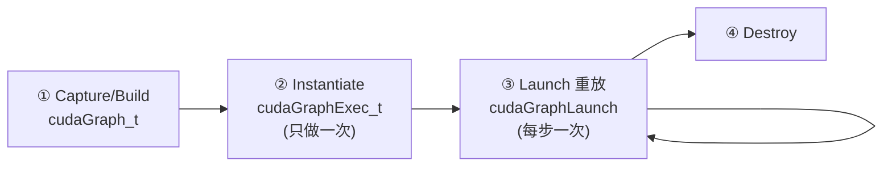

# Cooperative Groups 与 CUDA Graph 深度教程

> 面向：已经会手写 `__shfl_*_sync`、`__syncthreads()`、CUDA Event 计时的人。
> 目标：不是背 API，而是搞懂**底层机制、硬件映射、驻留约束、SASS 证据、真实场景与坑**。
> 硬件基准：A100 `sm_80`（涉及 Hopper 的部分会标注）。

---

## 目录

- [第一部分：Cooperative Groups](#第一部分cooperative-groups)
  - [1. 为什么需要它：裸 shfl/syncthreads 的三个痛点](#1-为什么需要它)
  - [2. 组的层级体系](#2-组的层级体系)
  - [3. Warp 级：tiled_partition 与 cg::reduce](#3-warp-级)
  - [4. Sub-warp tile：16/8/4 线程组](#4-sub-warp-tile)
  - [5. coalesced_group：动态发现活跃线程](#5-coalesced_group)
  - [6. Block 级同步](#6-block-级同步)
  - [7. Grid 级：cooperative launch 与驻留约束](#7-grid-级)
  - [8. cg::reduce / cg::scan / memcpy_async](#8-cgreduce--cgscan--memcpy_async)
  - [9. Cluster（Hopper）](#9-clusterhopper)
  - [10. 常见坑](#10-cg-常见坑)
- [第二部分：CUDA Graph](#第二部分cuda-graph)
  - [11. 为什么需要它：launch 开销](#11-为什么需要它launch-开销)
  - [12. 生命周期](#12-生命周期)
  - [13. 两种构图方式](#13-两种构图方式)
  - [14. Stream capture 详解](#14-stream-capture-详解)
  - [15. 显式 API 构图](#15-显式-api-构图)
  - [16. cudaGraphExecUpdate：不重新实例化更新参数](#16-cudagraphexecupdate)
  - [17. 真实场景：decode 循环](#17-真实场景decode-循环)
  - [18. 限制与现实](#18-限制与现实)
  - [19. 常见坑](#19-graph-常见坑)
- [第三部分：CG + Graph 结合](#第三部分cg--graph-结合)
- [附录：验证工具](#附录验证工具)

---

# 第一部分：Cooperative Groups

## 1. 为什么需要它

你已经会手写 warp 归约：

```cpp
__device__ float warpReduceSum(float v) {
    for (int off = 16; off > 0; off >>= 1)
        v += __shfl_down_sync(0xffffffff, v, off);
    return v;
}
```

这能用，但有三个真实痛点：

### 痛点 1：mask 容易写错
`__shfl_down_sync(mask, ...)` 的 mask 必须**精确覆盖参与本次 collective 的活跃 lane**。一旦 warp 内有分支导致部分 lane 不活跃，硬编码 `0xffffffff` 就是未定义行为（可能读到无效值，且不报错）。手动算 mask（`__activemask()`）繁琐易错。

### 痛点 2：同步范围不在类型里，靠约定
`__syncthreads()` 同步整个 block，`__syncwarp()` 同步一个 warp——但代码里看不出"这段归约到底是 warp 级还是 block 级"，靠注释和脑补。范围写错（该 `__syncthreads` 写成 `__syncwarp`）编译器不拦。

### 痛点 3：跨 block 同步根本没有原语
普通 kernel 里，你**无法**让所有 block 互等——没有 `__syncgrid()`。想做全局归约只能拆成两个 kernel。

Cooperative Groups（下称 CG）解决这三点：
1. **组对象自带正确的 mask/范围**，`group.sync()` / `cg::reduce(group, ...)` 自动用对的活跃线程。
2. **同步范围写进类型**（`thread_block` / `thread_block_tile<32>` / `grid_group`），一眼看出粒度。
3. **提供 `grid_group`**，配合 cooperative launch 实现全 grid 同步。

> **一句话记忆**：CG = 把"哪些线程一起协作"变成**显式的类型化对象**，让 mask/同步范围不再靠手算和约定。

---

## 2. 组的层级体系

CG 把线程按硬件层级组织成"组"，每个组能 `.sync()`、查 `.size()` / `.thread_rank()`，部分组能 `cg::reduce`：

```
multi_grid_group        跨多 GPU（已弃用方向，了解即可）
  └─ grid_group         整个 grid（需 cooperative launch）
       └─ cluster_group Hopper：一组 CTA（sm_90+）
            └─ thread_block   一个 block（= __syncthreads 范围）
                 └─ thread_block_tile<N>   静态 tile：32/16/8/4/2/1
                 └─ coalesced_group        动态：当前活跃的那些 lane
```

| 组类型 | 范围 | `.sync()` 等价于 | 需要特殊 launch |
|---|---|---|---|
| `thread_block_tile<32>` | 一个 warp | `__syncwarp()` | 否 |
| `thread_block_tile<16/8/4>` | sub-warp | 分区内同步 | 否 |
| `coalesced_group` | 当前活跃 lane | 动态 mask 同步 | 否 |
| `thread_block` | 一个 block | `__syncthreads()` | 否 |
| `cluster_group` | 一组 CTA | cluster barrier | 需 cluster launch（sm_90） |
| `grid_group` | 整个 grid | 全局 barrier | **需 cooperative launch** |

获取组对象：

```cpp
#include <cooperative_groups.h>
namespace cg = cooperative_groups;

auto block = cg::this_thread_block();          // thread_block
auto warp  = cg::tiled_partition<32>(block);   // thread_block_tile<32>
auto grid  = cg::this_grid();                  // grid_group（仅 cooperative launch 有效）
auto active = cg::coalesced_threads();         // coalesced_group（当前活跃 lane）
```

**关键区分（回答"CG 是不是只是 API/原理同 shfl"）**：

| 层级 | 底层机制 | 是"糖"吗 |
|---|---|---|
| tile<≤32> / block / coalesced | 编译成 `__shfl_*` / `__syncwarp` / `__syncthreads` / sm_80 硬件 `REDUX` | **基本是糖 + 自动选指令** |
| grid / cluster | **cooperative launch / cluster launch + 硬件全局 barrier** | **不是糖，shfl 做不到** |

---

## 3. Warp 级

### 3.1 tiled_partition<32>：把 block 切成 warp

```cpp
auto block = cg::this_thread_block();
auto warp  = cg::tiled_partition<32>(block);

int lane = warp.thread_rank();   // 0..31，等价 threadIdx.x % 32
int nlan = warp.size();          // 32
warp.sync();                     // 等价 __syncwarp()（正确 mask 自动处理）
```

### 3.2 手写 shfl vs cg::reduce

同一个 warp 求和，两种写法：

```cpp
// 手写：固定 5 步 shfl
float v = ...;
for (int off = 16; off > 0; off >>= 1)
    v += __shfl_down_sync(0xffffffff, v, off);
// 结果只在 lane 0 正确

// CG：一行
#include <cooperative_groups/reduce.h>
float s = cg::reduce(warp, v, cg::plus<float>());
// 结果所有 lane 都正确（broadcast 语义）
```

**两个实质差别（不只是好看）**：

1. **结果落点不同**：手写 `__shfl_down` 版结果只在 lane 0；`cg::reduce` 是 **all-reduce**，所有 lane 都拿到结果（内部用 butterfly / 硬件指令）。
2. **指令选择**：在 `sm_80+`，`cg::reduce(warp, v, plus)` 对 int/部分类型能直接编译成**单条硬件归约指令 `REDUX.SYNC`**，比手写的 5 步 shfl 循环更短更快。这就是"CG 不只是糖，还会自动选更优指令"的证据。

> **注意**：`cg::reduce` 的硬件 `REDUX` 加速主要覆盖整型和特定操作；`float` 求和在部分架构上仍会退化成 shfl 序列。**务必用 `cuobjdump -sass` 亲自验证你的类型/操作是否命中硬件指令**（见附录）。

### 3.3 SASS 验证（练"读汇编"内功）

```bash
nvcc -O3 -arch=sm_80 -c reduce.cu -o reduce.o
cuobjdump -sass reduce.o | grep -iE 'REDUX|SHFL'
```

- 看到 `REDUX.SYNC.ADD` → 命中单条硬件归约指令（CG 赢）。
- 只看到一串 `SHFL.DOWN` → 退化成和手写一样的序列。

这一步很关键：**别猜 CG 快不快，看 SASS**。

---

## 4. Sub-warp tile

`tiled_partition<N>` 的 N 可以是 32/16/8/4/2/1（2 的幂，≤32）。这在"一行数据只需要 8 个线程协作"时很有用：

```cpp
auto block = cg::this_thread_block();
auto tile8 = cg::tiled_partition<8>(block);   // 每 8 个线程一组

int rank = tile8.thread_rank();   // 0..7
float s = cg::reduce(tile8, v, cg::plus<float>());  // 只在这 8 个线程内归约
```

**场景**：一个 warp 处理 4 行、每行 8 个元素 → 用 4 个 `tile8` 各自独立归约，互不干扰。手写这个要自己算 mask（`0xFF`、`0xFF00`…），CG 直接 `tiled_partition<8>` 搞定。

> **底层**：sub-warp tile 仍是 shfl，但 shfl 的 `width` 参数被设成 N（`__shfl_down_sync(mask, v, off, width)` 的第 4 个参数），CG 帮你算好 mask 和 width。

---

## 5. coalesced_group

这是 CG 里**最"非糖"的 warp 级特性**：动态发现"此刻哪些 lane 是活跃的"。

```cpp
if (threadIdx.x % 2 == 0) {         // 只有偶数 lane 进来
    auto g = cg::coalesced_threads();  // g 只含当前活跃的 lane（偶数们）
    int rank = g.thread_rank();        // 在活跃 lane 中重新编号 0,1,2...
    float s = cg::reduce(g, v, cg::plus<float>());  // 只在活跃 lane 间归约
}
```

**为什么手写很难**：分支后你不知道哪些 lane 还活着，要 `__activemask()` 拿到 mask，再手动在这个不连续的 mask 上做 shfl（lane 编号还是"稀疏"的，归约偏移要重算）。`coalesced_group` 把活跃 lane **重新紧凑编号**，`cg::reduce` 直接可用。

**经典用途**：warp 聚合原子操作（warp-aggregated atomics）——一个 warp 里多个 lane 要往同一个数组末尾追加元素（每个线程抢一个独占下标），朴素写法每个线程一次 `atomicAdd`，聚合后**整个 warp 只做 1 次 atomic**。

#### 先看朴素版（每个线程一次 atomic）

```cpp
if (我满足条件) {
    int myPos = atomicAdd(counter, 1);  // atomicAdd 返回“加之前的旧值”= 抢到的空位
    output[myPos] = 我的数;
}
```

`atomicAdd(counter, n)` 干两件事：① `*counter += n`；② **返回加之前的旧值**。这个旧值就是"我独占的位置下标"。32 个线程都满足 → 32 次 atomic 争抢同一地址，慢。

#### 聚合版（32 次 → 1 次）

核心洞察：这些线程要的是**连续的一批位置**，何必各抢各的？**leader 一次抢下整批，再在 warp 内部分家**：

```cpp
__device__ int warp_aggregated_append(int* counter, int val) {
    auto g = cg::coalesced_threads();                       // 当前活跃的 lane 们

    int sum    = cg::reduce(g, val, cg::plus<int>());       // 这批一共要几个位置
    int prefix = cg::exclusive_scan(g, val, cg::plus<int>());// 我前面的 lane 占了几个（我的偏移）

    int base = 0;
    if (g.thread_rank() == 0)                               // 组内第一个活跃 lane = leader
        base = atomicAdd(counter, sum);                     // 只 1 次 atomic，返回起始位置 base
    base = g.shfl(base, 0);                                 // base 广播给组内所有 lane

    return base + prefix;                                   // 我的独占位置 = 起点 + 我的偏移
}
```

#### 数字走一遍（counter 初值 1000，lane 5/9/20 活跃，各 val=1）

```
组内 rank：      0        1        2       （对应 lane5 / lane9 / lane20）
val：            1        1        1
sum    = reduce         = 3               // 一共要 3 个位置
prefix = exclusive_scan = 0    1    2     // 我前面占了几个 → 我的偏移
base   = atomicAdd(counter, 3) = 1000     // 只 leader 执行，counter: 1000→1003
广播后 base 全 = 1000
返回 base+prefix →     1000  1001  1002   // 三个 lane 各拿独占下标，和朴素版完全一样
```

**1 次 atomic** 代替了 3 次（32 个都活跃时是 32→1），结果分毫不差。

#### 为什么必须是 `base + prefix` 而不是 `base + 0`

若所有 lane 都返回 `base`（=1000），三个线程写同一个位置 → 撞车。`prefix`（exclusive_scan）给每个 lane "**我在这批里排第几**"的偏移，才能各写各的。
- val 全 = 1 时，`prefix` 恰好 = `rank`（0,1,2…），此时直接用 rank 也行；
- 但每个线程要的位置数不同时（如 val = 3,1,2），就必须 `exclusive_scan(val)`：`prefix = 0,3,4`，`sum = 6`，通用性在这。

> **一句话记忆**：`coalesced_group` = 自动把"分支后还活着的 lane"紧凑成一组；warp-aggregated atomics = **leader 一次 atomic 抢下整批起点 `base`，每个 lane 用 `base + exclusive_scan(val)` 算出独占位置**，把 N 次 atomic 压成 1 次、返回值语义和逐线程 atomic 完全等价。

---

## 6. Block 级同步

```cpp
auto block = cg::this_thread_block();
block.sync();          // 完全等价 __syncthreads()
int r = block.thread_rank();   // 0..blockDim-1
```

Block 级 CG 基本是纯糖（`block.sync()` 就是 `__syncthreads()`）。价值在**可读性**：配合 tile 做"两级归约"时，范围一目了然。

### 两级归约的 CG 写法（对比你的 blockReduceSumF）

```cpp
__device__ float blockReduceSum_cg(float v) {
    auto block = cg::this_thread_block();
    auto warp  = cg::tiled_partition<32>(block);

    // 第一级：warp 内归约（all-reduce，每个 warp 的 lane 0 拿到 warp 和）
    v = cg::reduce(warp, v, cg::plus<float>());

    __shared__ float s[32];                 // 最多 32 个 warp
    if (warp.thread_rank() == 0)
        s[warp.meta_group_rank()] = v;      // meta_group_rank = 第几个 warp
    block.sync();

    // 第二级：让第一个 warp 归约各 warp 的部分和
    int num_warps = warp.meta_group_size(); // block 里 warp 数
    if (warp.meta_group_rank() == 0) {
        float bv = (warp.thread_rank() < num_warps) ? s[warp.thread_rank()] : 0.0f;
        v = cg::reduce(warp, bv, cg::plus<float>());
    }
    return v;   // block 和（在 warp0 的各 lane）
}
```

对照你 `common.cuh` 里手写的 `blockReduceSumF`：结构完全一样（warp 归约 → shared → 再归约），但：
- `warp.meta_group_rank()` = 手写的 `threadIdx.x / 32`
- `warp.meta_group_size()` = 手写的 `blockDim.x / 32`
- `cg::reduce` 替代 shfl 循环

---

## 7. Grid 级

**这才是 CG 的"真本事"**——普通 kernel 做不到的全 grid 同步。

### 7.1 为什么普通 kernel 没有 grid barrier

Block 的调度顺序**不确定**，而且 SM 数量有限，一个 GPU 同时只能驻留有限个 block。假设：

```
GPU 能同时驻留 100 个 block，但你 launch 了 1000 个 block。
若前 100 个 block 执行到 grid.sync() 自旋等待剩下 900 个，
而剩下 900 个还在排队（等前面的退出才能上 SM）——
前 100 个不退出、后 900 个上不来 → 死锁。
```

所以"全 grid 同步"必须保证**所有 block 同时驻留**（谁也不排队），这叫**驻留约束（residency constraint）**。

### 7.2 cooperative launch

要满足驻留约束，必须：
1. 用 `cudaLaunchCooperativeKernel` 启动（不是 `<<<>>>`）。
2. **grid 的 block 数 ≤ 该 kernel 能同时驻留的 block 数**。

算最大可驻留 block 数：

```cpp
int numBlocksPerSM = 0;
cudaOccupancyMaxActiveBlocksPerMultiprocessor(
    &numBlocksPerSM, my_kernel, threadsPerBlock, sharedMemBytes);

int numSM = 0;
cudaDeviceGetAttribute(&numSM, cudaDevAttrMultiProcessorCount, dev);

int maxCoopBlocks = numBlocksPerSM * numSM;   // grid 不能超过这个数
```

`numBlocksPerSM` 受 **register/thread × threads/block、shared/block、blocks/SM 上限** 共同限制——这也是为什么 grid 级 kernel 常常 occupancy 不能太高（每 SM 驻留的 block 少，才有余量保证全部同时在）。

### 7.3 grid_reduce 完整例子

```cpp
#include <cooperative_groups.h>
#include <cooperative_groups/reduce.h>
namespace cg = cooperative_groups;

__global__ void grid_reduce(const float* x, float* partial, float* out, int n) {
    cg::grid_group grid = cg::this_grid();
    auto block = cg::this_thread_block();

    // ---- 阶段 1：每个 block 归约自己负责的那段，写 partial[blockIdx.x] ----
    float local = 0.0f;
    for (int i = grid.thread_rank(); i < n; i += grid.size())  // grid-stride
        local += x[i];

    // block 内两级归约（复用第 6 节的 blockReduceSum_cg 思路）
    float bsum = blockReduceSum_cg(local);
    if (block.thread_rank() == 0)
        partial[blockIdx.x] = bsum;

    // ---- 全 grid 同步：保证所有 partial 都写完 ----
    grid.sync();                     // ← 关键！普通 kernel 没有这行

    // ---- 阶段 2：block 0 归约所有 partial，写 out ----
    if (blockIdx.x == 0) {
        float s = 0.0f;
        for (int i = block.thread_rank(); i < gridDim.x; i += blockDim.x)
            s += partial[i];
        s = blockReduceSum_cg(s);
        if (block.thread_rank() == 0) *out = s;
    }
}
```

启动（注意不是 `<<<>>>`）：

```cpp
int threads = 256, blocks = maxCoopBlocks;   // 不能超过驻留上限
void* args[] = { &d_x, &d_partial, &d_out, &n };
cudaLaunchCooperativeKernel((void*)grid_reduce,
                            dim3(blocks), dim3(threads),
                            args, /*sharedMem=*/0, /*stream=*/0);
```

**这版 vs 两 kernel 版**：
- 传统：kernel1 写 partial → kernel2 归约 partial（两次 launch，中间 partial 落 HBM 再读回）。
- grid.sync 版：一个 kernel 搞定，partial 仍落 HBM 但省一次 launch + 一次 kernel 启动同步。
- **不一定更快**：driver 保证驻留会限制 block 数/occupancy，大问题上两 kernel 常常一样快甚至更快。**用 nsys 实测，别默认单 kernel 赢**。

### 7.4 grid.sync 的底层机制

它**不是** shfl/shared——那些都出不了 block。`grid.sync()` 底层是一个**全局 barrier**：用 global memory 里的计数器 + atomic + `__threadfence()`，每个 block 的 leader 到达时 atomic 递增计数，然后所有 block 自旋等计数达到 gridDim。正因为要"所有 block 自旋互等"，才需要驻留约束防死锁。

---

## 8. cg::reduce / cg::scan / memcpy_async

### 8.1 cg::reduce 支持的操作

```cpp
cg::plus<T>()     // 求和
cg::less<T>()     // min（配合 reduce 得最小值）
cg::greater<T>()  // max
cg::bit_and/or/xor<T>()
```

### 8.2 cg::inclusive_scan / exclusive_scan（前缀和）

```cpp
#include <cooperative_groups/scan.h>
auto warp = cg::tiled_partition<32>(cg::this_thread_block());
int prefix = cg::exclusive_scan(warp, val, cg::plus<int>());
// prefix[lane] = 前面 lane 的和（lane 0 得 0）
```

warp-aggregated atomics 需要精确返回每个 lane 的偏移时，就用 `exclusive_scan` 算组内前缀。

### 8.3 memcpy_async（配合 pipeline）

CG 提供 `cg::memcpy_async(group, dst, src, size)` + `cg::wait(group)`，是 `cp.async` 的高层封装，配合 `cuda::pipeline` 做 double buffering。这块和你 Week4 的 pipelined attention 相关，属于"CG 在真实 kernel 里的落地"。

```cpp
auto block = cg::this_thread_block();
__shared__ float smem[TILE];
cg::memcpy_async(block, smem, gmem + offset, sizeof(float) * TILE);
cg::wait(block);      // 等异步拷贝完成
block.sync();
// 现在 smem 可用
```

底层就是 `cp.async` + `cp.async.wait_group`，CG 把它包成组操作。

---

## 9. Cluster（Hopper）

`sm_90+` 新增 **Thread Block Cluster**：一组 CTA 被调度到同一个 GPC，能互相访问对方的 shared memory（DSM，Distributed Shared Memory）。

```cpp
// 需要 __cluster_dims__ 或 launch 时指定 cluster 维度
auto cluster = cg::this_cluster();
cluster.sync();                          // cluster 内所有 CTA 同步
unsigned rank = cluster.block_rank();    // 本 CTA 在 cluster 里的编号
float* remote = cluster.map_shared_rank(smem, other_rank);  // 访问别的 CTA 的 shared
```

这是**新硬件能力**（不是糖），配合 TMA/WGMMA 做 producer-consumer。没有 H100 只能读源码理解，不能实测。

---

## 10. CG 常见坑

| 坑 | 说明 | 正确做法 |
|---|---|---|
| grid.sync 没用 cooperative launch | 用 `<<<>>>` 启动再调 `grid.sync()` → 行为未定义/挂 | 必须 `cudaLaunchCooperativeKernel` |
| grid block 数超过驻留上限 | 死锁或 launch 失败 | block ≤ `numBlocksPerSM × numSM` |
| 以为 cg::reduce 一定出硬件指令 | float 求和可能退化成 shfl 序列 | `cuobjdump -sass` 验证 |
| tile<N> 的 N 非 2 的幂或 >32 | 编译错 | N ∈ {1,2,4,8,16,32}（block tile 更大需其他 API） |
| coalesced_group 跨分支复用 | 分支变了活跃集就变，旧组失效 | 每次进分支重新 `coalesced_threads()` |
| 忘记 include reduce.h/scan.h | `cg::reduce` 找不到 | `<cooperative_groups/reduce.h>` |
| 假设 grid.sync 一定更快 | 驻留约束压低 occupancy | nsys 实测对比两 kernel 版 |

---

# 第二部分：CUDA Graph

## 11. 为什么需要它：launch 开销

每次 `kernel<<<>>>` 都有一次 **CPU 提交开销**（把 launch 命令写进 stream，driver 处理），微秒量级。单个大 kernel 里这点开销可忽略；但 **decode 场景**每步几百个短 kernel，launch 开销就成了瓶颈：

```
CPU: launch A | launch B | launch C | ...   ← CPU 忙着一个个提交
GPU:    A    gap    B    gap    C            ← GPU 算完等 CPU 发下一个
```

当 **单 kernel 计算时间 ≈ launch 开销**，GPU 大量时间在等 CPU。CUDA Graph 把"一串固定的 kernel 序列"**录制成一张图**，之后每次只发**一次** `cudaGraphLaunch`，几百次 CPU 提交 → 1 次。

> **一句话记忆**：Graph 砍的是 **CPU 提交/调度开销**，不改单个 kernel 的 FLOP/bytes。适用条件：kernel 短 + 序列固定 + 重复多次。

---

## 12. 生命周期

```
① Capture/构建   →  cudaGraph_t（图的"蓝图"，可反复修改）
② Instantiate    →  cudaGraphExec_t（可执行图，编译好的，代价较高，只做一次）
③ Launch（重放） →  cudaGraphLaunch(exec, stream)（每次极便宜，可重复上千次）
④ Destroy        →  cudaGraphExecDestroy + cudaGraphDestroy
```



**关键成本模型**：
- Instantiate 贵（把图编译成可执行形式），但**只付一次**。
- 每次 Launch 极便宜（driver 已知整张图，一次提交）。
- 所以 benchmark 要**分开报告"首次（含 instantiate）"和"稳态（纯重放）"**。

---

## 13. 两种构图方式

| 方式 | 怎么用 | 适合 |
|---|---|---|
| **Stream capture** | 把现有 `<<<>>>`/memcpy 序列"录"下来 | 已有代码，改动最小（推荐入门） |
| **显式 API** | 手动 `cudaGraphAddKernelNode` 建节点+依赖 | 需要精确控制拓扑/动态改结构 |

大多数人用 stream capture（省事）。显式 API 用于复杂 DAG 或需要细粒度节点更新。

---

## 14. Stream capture 详解

### 14.1 基本流程

```cpp
cudaStream_t s;      cudaStreamCreate(&s);
cudaGraph_t graph = nullptr;
cudaGraphExec_t exec = nullptr;

// ---- 录制：这期间 kernel 不真正执行，只记录到 graph ----
cudaStreamBeginCapture(s, cudaStreamCaptureModeGlobal);
kA<<<g,b,0,s>>>(...);          // 必须都发到被 capture 的 stream s
kB<<<g,b,0,s>>>(...);
kC<<<g,b,0,s>>>(...);
cudaStreamEndCapture(s, &graph);

// ---- 实例化：只做一次 ----
cudaGraphInstantiate(&exec, graph, nullptr, nullptr, 0);

// ---- 重放：每步一次，极便宜 ----
for (int step = 0; step < N; ++step)
    cudaGraphLaunch(exec, s);
cudaStreamSynchronize(s);

// ---- 销毁 ----
cudaGraphExecDestroy(exec);
cudaGraphDestroy(graph);
```

### 14.2 capture 三种 mode

| mode | 含义 |
|---|---|
| `cudaStreamCaptureModeGlobal` | 最严格：本线程 capture 期间，其它线程的"非法"操作也会被拦（默认，最安全） |
| `cudaStreamCaptureModeThreadLocal` | 只约束本线程 |
| `cudaStreamCaptureModeRelaxed` | 最宽松，责任在你 |

入门用 `Global`。

### 14.3 capture 期间的禁忌（超重要）

capture 期间**只能发"可被记录"的异步操作**。以下会让 capture 失败：

- ❌ `cudaDeviceSynchronize()` / `cudaStreamSynchronize()`（同步操作）
- ❌ `cudaMalloc` / `cudaFree`（非 stream-ordered 分配；用 `cudaMallocAsync` 才行）
- ❌ 任何隐式同步的 API（如某些 `cudaMemcpy` 非 Async 版）
- ✅ kernel launch、`cudaMemcpyAsync`、`cudaMemsetAsync`、stream-ordered alloc

> **坑**：在 capture 里手贱写了个 `cudaMemcpy`（同步版）或 `cudaDeviceSynchronize()`，capture 直接失败。所有拷贝要用 `...Async` 且发到被 capture 的 stream。

### 14.4 多 stream capture（并行分支）

capture 能记录跨 stream 的并行：用 event 让"分叉 stream"加入 capture，`cudaStreamEndCapture` 会把它们并成图里的并行分支。这样图里能表达"A 之后 B、C 并行，再汇合到 D"。

```cpp
cudaStreamBeginCapture(s1, cudaStreamCaptureModeGlobal);
kA<<<...,s1>>>();
cudaEventRecord(e, s1);
cudaStreamWaitEvent(s2, e);      // s2 加入 capture，形成分支
kB<<<...,s1>>>();                // 分支 1
kC<<<...,s2>>>();                // 分支 2（与 B 并行）
cudaStreamWaitEvent(s1, /*e2 after kC*/...);
kD<<<...,s1>>>();                // 汇合
cudaStreamEndCapture(s1, &graph);
```

---

## 15. 显式 API 构图

不 capture，直接建节点和依赖，适合需要精确拓扑的场景：

```cpp
cudaGraph_t graph;
cudaGraphCreate(&graph, 0);

// 定义一个 kernel 节点
cudaKernelNodeParams p = {};
p.func = (void*)myKernel;
p.gridDim = dim3(blocks);
p.blockDim = dim3(threads);
p.sharedMemBytes = 0;
void* args[] = { &d_a, &d_b, &n };
p.kernelParams = args;

cudaGraphNode_t nA, nB;
cudaGraphAddKernelNode(&nA, graph, nullptr, 0, &p);      // 无依赖
cudaGraphNode_t deps[] = { nA };
cudaGraphAddKernelNode(&nB, graph, deps, 1, &p);         // B 依赖 A

cudaGraphExec_t exec;
cudaGraphInstantiate(&exec, graph, nullptr, nullptr, 0);
cudaGraphLaunch(exec, stream);
```

**节点类型**：kernel、memcpy、memset、host callback、child graph（子图）、event record/wait、内存 alloc/free 节点等。依赖关系（第 3、4 参数的 dependencies 数组）构成 DAG。

---

## 16. cudaGraphExecUpdate

**问题**：decode 时每步的地址/参数可能变（新 token 写到不同位置），难道每步都重新 instantiate？那 instantiate 的成本就白省了。

**解法**：`cudaGraphExecUpdate` —— 图**拓扑不变、只改节点参数**时，用它把新参数灌进已实例化的 `exec`，成本远低于重新 instantiate。

```cpp
// 重新 capture 一版带新参数的 graph（拓扑必须和原来一致）
cudaGraph_t newGraph;
cudaStreamBeginCapture(s, cudaStreamCaptureModeGlobal);
kA<<<...,s>>>(newPtr, ...);       // 只有参数变了
cudaStreamEndCapture(s, &newGraph);

cudaGraphExecUpdateResult updateResult;
cudaGraphNode_t errorNode;
cudaGraphExecUpdate(exec, newGraph, &errorNode, &updateResult);
if (updateResult != cudaGraphExecUpdateSuccess) {
    // 拓扑变了 → 只能重新 instantiate
    cudaGraphExecDestroy(exec);
    cudaGraphInstantiate(&exec, newGraph, nullptr, nullptr, 0);
}
cudaGraphLaunch(exec, s);
```

也有针对单节点的 `cudaGraphExecKernelNodeSetParams` 等细粒度更新 API。

> **一句话记忆**：拓扑不变、只改参数 → `cudaGraphExecUpdate`（便宜）；拓扑变了 → 只能重新 instantiate（贵）。

---

## 17. 真实场景：decode 循环

一个 decode step = 一串固定 kernel（RMSNorm → QKV GEMV → attention → 输出投影 → MLP → 融合算子…）。这串序列每步**结构固定**，只是数据/位置变。所以：

```cpp
// 录制"一步"
cudaStreamBeginCapture(s, cudaStreamCaptureModeGlobal);
launch_one_decode_step(s);        // 里面是那串 kernel
cudaStreamEndCapture(s, &graph);
cudaGraphInstantiate(&exec, ...);

// 生成 2000 个 token = 重放 2000 次
for (int t = 0; t < 2000; ++t) {
    // 若地址/参数变：cudaGraphExecUpdate 或写进预约定的固定 buffer
    cudaGraphLaunch(exec, s);
}
```

**为什么 decode 是 graph 的完美场景**：kernel 短（GEMV/逐元素）+ 序列固定 + 重复上千次，三个条件全中。这也是 vLLM/TensorRT-LLM 都用 graph 的原因。

---

## 18. 限制与现实

| 限制 | 说明 |
|---|---|
| 拓扑必须固定 | dynamic batching 让 shape/节点数变 → 用 bucket（几档固定 shape 各存一张图）或 exec update |
| 地址固定 | 图记录的是**具体指针**；换 buffer 要 update 或用固定地址 |
| 大 kernel 主导时收益小 | launch 占比低，graph 省不了多少 |
| 不消除数据依赖 wait | graph 只减提交开销，GPU 内部该等还得等 |
| capture 有禁忌 | 不能有同步/非 async 分配 |
| KV/active requests 每步变 | 需要 update 节点参数或多图 |

> **常见误区**："上了 Graph 一定快"——错。要看 launch 占比、拓扑是否真的固定、shape 是否稳定。

---

## 19. Graph 常见坑

| 坑 | 现象 | 修 |
|---|---|---|
| capture 里放同步/`cudaMemcpy`(非 async) | capture 失败 | 全用 `...Async` + 发到被 capture 的 stream |
| 计时 stream ≠ 执行 stream | speedup 数字假的 | Event 和 GraphLaunch 用同一个 stream |
| instantiate 算进稳态计时 | 稳态被拉慢 | warmup 几次再计时；首次/稳态分开报 |
| 每步重新 instantiate | 白白付高成本 | 拓扑不变用 `cudaGraphExecUpdate` |
| 忘记 destroy | 资源泄漏 | 逆序 `ExecDestroy` → `Destroy` |
| capture 的 kernel 发错 stream | 图是空的/不完整 | 所有 op 发到 `BeginCapture` 的那个 stream |

---

# 第三部分：CG + Graph 结合

两者**正交、可叠加**——但有个真实约束：

- **cooperative launch（grid.sync 的 kernel）能不能进 graph？**
  可以，但要用**图节点的 cooperative 版本**（`cudaGraphAddKernelNode` 时在 `cudaKernelNodeParams` 里带 cooperative 标志，或用支持 cooperative 的 capture 路径）。普通 stream capture 对 cooperative kernel 有额外限制，需查当前 CUDA 版本文档。
- 更常见的组合：**graph 里的每个 kernel 内部用 CG 做归约/同步**（warp/block 级 CG 完全不受 graph 影响，就是普通 kernel 代码）。

**分工记忆**：
| 技术 | 减少什么 | 层次 |
|---|---|---|
| Cooperative Groups（warp/block） | 手写 mask 的心智负担 + 选更优指令 | kernel **内部** |
| Cooperative Groups（grid） | 一次 launch 做全局归约 | kernel **跨 block** |
| CUDA Graph | CPU 提交/launch 开销 | kernel **之间/循环** |
| 算子融合 | 中间结果的 HBM 往返 | kernel **合并** |

---

# 附录：验证工具

```bash
# 编译（看寄存器/spill）
nvcc -O3 -lineinfo -arch=sm_80 -Xptxas=-v app.cu -o app

# SASS：验证 cg::reduce 是否命中硬件 REDUX 指令
cuobjdump -sass app | grep -iE 'REDUX|SHFL'

# PTX：看中间表示
nvcc -ptx -arch=sm_80 app.cu -o app.ptx

# 正确性
compute-sanitizer --tool memcheck   ./app
compute-sanitizer --tool racecheck  ./app   # 查 shared/同步竞争
compute-sanitizer --tool synccheck  ./app   # 查 __syncthreads/barrier 误用

# 单 kernel 资源/管线
ncu --set full -o /tmp/rep ./app

# 系统时间线：看 launch gap（验证 graph 收益）
nsys profile --trace=cuda,nvtx -o /tmp/timeline ./app
```

## 建议动手路线

1. **CG 入门**：把 `common.cuh` 的 `warpReduceSumF` 用 `cg::reduce` 重写，`cuobjdump -sass` 看是否出 `REDUX`。
2. **CG 进阶**：写 `grid_reduce`（cooperative launch），用 `cudaOccupancyMaxActiveBlocksPerMultiprocessor` 算 block 上限，和"两 kernel 版"nsys 对比。
3. **Graph 入门**：一串短 kernel 循环，plain loop vs graph replay，nsys 看 gap 变化。
4. **Graph 进阶**：`cudaGraphExecUpdate` 每步换参数，验证不用重新 instantiate 也能跑对。

---

## 全篇一句话记忆

> **Cooperative Groups**：把"哪些线程协作"变成类型化对象——warp/block 级是 shfl/syncthreads 的糖（+自动选 REDUX），grid/cluster 级是 shfl 做不到的新能力（靠 cooperative/cluster launch + 硬件全局 barrier + 驻留约束）。
> **CUDA Graph**：把"固定的 kernel 序列"录一次、重放多次，砍 CPU 提交开销——不改 FLOP/bytes，适用于 kernel 短 + 序列固定 + 重复多次（decode 完美命中）。
