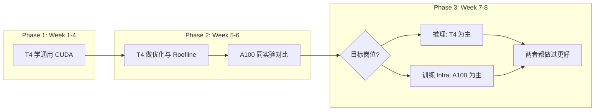

# GPU 卡型专项学习指南

> 本文档说明：**CUDA 学习中哪些与卡无关、哪些与卡相关**，以及你在 **T4 → A100** 路径上后续需要补的 GPU-specific 内容。  
> 配套文档：[T4实战指南.md](T4实战指南.md)（当前环境细节）· [CUDA学习路线图.md](CUDA学习路线图.md)（主课程）

---

## 一、核心结论（先读这段）

```
┌─────────────────────────────────────────────────────────────┐
│  CUDA 编程模型、内存优化、Profiling 方法  →  与卡无关（通用）   │
│  峰值性能数字、Tensor Core 代际、MIG/NVLink  →  与卡相关       │
│  学习策略：T4 打底学通用能力，A100 补高级场景与大规模实验        │
└─────────────────────────────────────────────────────────────┘
```

**你现在可以不管卡类型**，专心学 Week 1–4。  
**从 Week 5 起**，需要知道「同一段代码在不同卡上的差异」，并把卡型信息写进 benchmark 报告。

---

## 二、CUDA 学习与 GPU 的关系（两层模型）

### 2.1 通用层（任何 NVIDIA GPU 都一样）

这部分占就业岗位要求的 **80%+**，换卡不需要重学：

| 主题 | 说明 | 对应课程周 |
|------|------|------------|
| 编程模型 | Grid/Block/Thread、Warp、SIMT | Week 1 |
| 内存层次 | Global/Shared/Register、合并访问 | Week 2 |
| 同步与并行模式 | `__syncthreads`、scan、reduction | Week 3 |
| 异步执行 | Stream、Event、拷贝计算重叠 | Week 3 |
| 库生态 | cuBLAS、Thrust、cuDNN 基本用法 | Week 4 |
| 优化方法论 | Occupancy、Roofline、分块 GEMM | Week 5 |
| 性能分析 | Nsight Systems/Compute 流程 | Week 6 |

**检验标准**：在 T4 上学会的技能，拿到 A100 上 **改编译参数 + 重跑 benchmark** 即可迁移。

### 2.2 卡型相关层（按阶段补）

| 主题 | 为何与卡相关 | 建议学习周 |
|------|--------------|------------|
| Compute Capability (CC) | 决定可用指令、共享内存配置 | Week 1 了解，Week 5 深入 |
| `sm_XX` 编译目标 | 不同卡不同架构码 | Week 1 起 |
| Tensor Core / WMMA | 代际能力不同（FP16/TF32/FP8） | Week 5–7 |
| 显存类型与带宽 | GDDR6 vs HBM2e，Roofline 参数不同 | Week 5–6 |
| 多卡互联 NVLink | T4 通常无，A100 有 | Week 7 |
| MIG 分区 | 仅 A100/H100 部分型号 | Week 7–8 |
| TDP / 功耗墙 | 影响长时间 benchmark 稳定性 | Week 6 |
| FP8 / Transformer Engine | Hopper (H100) 为主 | 求职前了解 |

---

## 三、常见 GPU 对照表（学习用）

> 数字为典型数据中心 SKU 量级，便于建立直觉；精确值以 [NVIDIA 官方 spec](https://www.nvidia.com/en-us/data-center/) 为准。

| GPU | 架构 | CC | sm | 显存 | 带宽 | FP32 峰值 | Tensor | NVLink | MIG | 典型岗位场景 |
|-----|------|----|----|------|------|-----------|--------|--------|-----|--------------|
| **T4** | Turing | 7.5 | 75 | 16GB GDDR6 | ~300 GB/s | ~8 TFLOPS | 2代 FP16/INT8 | 无 | 无 | 推理、边缘、学习 |
| **V100** | Volta | 7.0 | 70 | 32GB HBM2 | ~900 GB/s | ~15 TFLOPS | 1代 FP16 | 有 | 无 | 老训练集群（了解即可） |
| **A100** | Ampere | 8.0 | 80 | 40/80GB HBM2e | ~1.5–2 TB/s | ~19 TFLOPS | 3代 TF32/FP16/BF16 | 有 | 有 | 训练、大模型、多卡 |
| **L4** | Ada Lovelace | 8.9 | 89 | 24GB GDDR6 | ~300 GB/s | ~30 TFLOPS | 4代 | 无 | 无 | 推理（T4 继任） |
| **H100** | Hopper | 9.0 | 90 | 80GB HBM3 | ~3 TB/s | ~67 TFLOPS | FP8/TE | 有 | 有 | LLM 训练/推理 |

### 3.1 架构演进时间线（面试常问）

```
Volta (2017)  →  首次 Tensor Core
Turing (2018) →  T4，INT8 推理强化
Ampere (2020) →  A100，TF32、MIG、结构稀疏
Ada (2022)    →  L4/L40，推理能效
Hopper (2022) →  H100，FP8、Transformer Engine
Blackwell (2024+) → 了解即可，工作中再深入
```

### 3.2 你需要重点掌握的两张卡

| 卡 | 角色 | 原因 |
|----|------|------|
| **T4** | 当前主力学习环境 | 你已有；贴近推理业务；足够覆盖入门到中级 |
| **A100** | 进阶补全环境 | 可申请；训练/多卡/MIG/大显存；简历加分 |

V100/H100 知道差异即可，不必都练一遍。

---

## 四、Compute Capability 速查

CC（计算能力）格式 `X.Y`：Major 变更是架构换代，Minor 是小修订。

| CC | 代表 GPU | nvcc 架构 | 学习优先级 |
|----|----------|-----------|------------|
| 7.0 | V100 | sm_70 | 了解 |
| 7.5 | **T4** | **sm_75** | **当前默认** |
| 8.0 | **A100** | **sm_80** | **Week 5 后建议掌握** |
| 8.6 | RTX 3090 等 | sm_86 | 消费卡，部分特性与 8.0 不同 |
| 8.9 | L4 | sm_89 | 推理向，与 T4 对标 |
| 9.0 | H100 | sm_90 | FP8 等，求职前阅读 |

**查询本机 GPU：**

```bash
nvidia-smi --query-gpu=name,compute_cap --format=csv,noheader
```

**CMake 多架构（代码需在 T4 + A100 都能跑）：**

```cmake
# 按实际拥有的卡配置
set(CMAKE_CUDA_ARCHITECTURES 75 80)
```

```bash
# 命令行等价
nvcc -gencode arch=compute_75,code=sm_75 \
     -gencode arch=compute_80,code=sm_80 \
     -o app app.cu
```

---

## 五、分阶段：GPU-specific 要学什么

### Week 1–2：建立「设备抽象」意识（T4 足够）

**要学**

- [ ] `cudaGetDeviceProperties`：SM 数、最大 block 维度、shared memory/SM、warp size
- [ ] CC 7.5 含义；编译 `-arch=sm_75`
- [ ] 理解：**同一份 kernel 源码，换卡重编译即可**

**暂不学**

- MIG、NVLink、FP8、多卡 NCCL

**小实验**

```bash
# 打印设备属性（Week 1 项目 device_query）
nvidia-smi --query-gpu=name,compute_cap,memory.total --format=csv
# SM 数量请用 cudaGetDeviceProperties → multiProcessorCount（Week 1 device_query）
```

**笔记模板**

| 属性 | T4 实测值 | 含义 |
|------|-----------|------|
| multiprocessorCount | | SM 数量 |
| maxThreadsPerBlock | 1024 | block 上限 |
| sharedMemPerBlock | | 共享内存上限 |
| warpSize | 32 | 几乎所有 NVIDIA GPU 为 32 |

---

### Week 3–4：卡型影响开始显现（仍可不换卡）

**要学**

- [ ] 显存带宽差异如何影响 **memory-bound** kernel（向量加、转置）
- [ ] `cudaMemcpy` 带宽：T4 PCIe 上限 vs A100 可能更高
- [ ] cuBLAS 在同一 API 下自动选不同内部 kernel（**库屏蔽了部分卡差异**）

**卡型相关点**

- T4 16GB：足够跑 1e7 级 Thrust sort、1024³ GEMM
- A100 40/80GB：Week 7 跑更大 batch / 更大模型时再体会

---

### Week 5–6：卡型学习核心周（建议此时用上 A100）

**必学 GPU-specific 内容**

| 知识点 | T4 上做什么 | A100 上补什么 |
|--------|-------------|---------------|
| **Roofline 参数** | P≈8 TFLOPS, B≈300 GB/s | P≈19 TFLOPS, B≈1.5+ TB/s |
| **拐点算术强度** | I*≈27 FLOP/B | I* 不同，同一 kernel「bound 类型」可能变化 |
| **WMMA / Tensor Core** | FP16 16×16×16 tile | TF32 模式、更大吞吐 |
| **Occupancy 上限** | 40 SM，寄存器/SM 限制 | 108 SM，规模效应 |
| **cuBLAS 峰值** | 记录 T4 GFLOPS 作基线 | 同代码对比 A100 加速比 |

**推荐实验：同一项目双卡 benchmark**

```
week05_optimization/gemm/
├── README.md          # 必须含「测试环境」表
├── gemm_tiled.cu
└── results/
    ├── t4_sm75.csv
    └── a100_sm80.csv
```

**README 环境表（强制习惯）**

| 项 | T4 | A100 |
|----|-----|------|
| GPU | Tesla T4 | A100 40GB |
| CC / sm | 7.5 / sm_75 | 8.0 / sm_80 |
| Driver | xxx | xxx |
| CUDA | 13.x | 13.x |
| 功耗上限 | 70W | 依机房策略 |

**心态**

- 优化 **思路**（分块、合并访问）通用
- 优化 **绝对数字** 不可跨卡直接比，要写清环境

---

### Week 7：按方向选 GPU-specific 深入

#### 方向 A：推理优化（T4 更有代表性）

| 主题 | 说明 |
|------|------|
| INT8 量化 | T4 Tensor Core 支持，TensorRT 常用 |
| 延迟 vs 吞吐 | batch=1 在 T4 上测 latency 有意义 |
| 能效 | 70W TDP，边缘部署面试话题 |
| L4 对比 | 了解 T4 继任者，非必须实测 |

**A100 补充**：更大模型、更高 batch 吞吐对比。

#### 方向 B：训练 / 多卡 Infra（A100 必选）

| 主题 | 说明 |
|------|------|
| **NCCL** | AllReduce、AllGather；多 A100 |
| **NVLink** | 机内 GPU 通信带宽远高于 PCIe |
| **大显存** | 40/80GB 训练 batch 规划 |
| **MIG** | 一卡多租户；`nvidia-smi mig` |

```bash
# MIG 了解（A100 上，需管理员权限）
nvidia-smi mig -lgip   # 列出 MIG 配置
```

#### 方向 C：HPC（A100 优先，T4 可练算法）

| 主题 | 说明 |
|------|------|
| 双精度 FP64 | A100 FP64 远强于 T4 |
| 多卡扩展 | 强扩展效率与 NVLink 相关 |
| HBM 带宽 | 稀疏 SpMV 等 memory-bound 差异大 |

---

### Week 8 / 求职前：架构差异面试题

确保能口头回答（不依赖某一张卡）：

1. T4 和 A100 架构差在哪？对编程有何影响？
2. 什么是 Compute Capability？T4 是几？
3. Tensor Core 是什么？与 CUDA Core 分工？
4. 为什么同一段优化代码在 T4 有效，在 A100 上可能收益不同？
5. NVLink 和 PCIe 对多卡训练意味着什么？
6. MIG 解决什么问题？
7. FP16 / BF16 / TF32 / FP8 各适合什么场景？
8. Roofline 模型如何随 GPU 峰值变化？

---

## 六、Tensor Core 代际学习清单

Tensor Core 是 **卡型差异最集中的编程特性**之一。

| 代际 | 架构 | 主要精度 | 你的学习动作 |
|------|------|----------|--------------|
| 1代 | Volta | FP16 | 了解历史 |
| 2代 | Turing (**T4**) | FP16, INT8, INT4 | **Week 5：跑通 WMMA FP16 样例** |
| 3代 | Ampere (**A100**) | TF32, FP16, BF16, INT8 | **Week 5–6：对比 TF32 与 FP32** |
| 4代 | Ada (L4) | FP16, INT8 更强 | 阅读 spec 即可 |
| 5代+ | Hopper (H100) | FP8, Transformer Engine | 读文档 + 1 篇博客 |

**WMMA 最小示例路径（Week 5）**

1. 读 Programming Guide «Warp Matrix Functions»
2. 跑 CUDA sample 或 CUTLASS `examples/00_basic_gemm`
3. 记录：FP32 naive vs WMMA FP16 在 **T4** 上的 GFLOPS
4. （可选）在 **A100** 上重跑，注意 TF32 模式

**不必一开始就手写 CUTLASS 级 GEMM**；会用 WMMA API + 理解原理即可。

---

## 七、T4 vs A100：学习路径建议



| 时间 | 建议 | 动作 |
|------|------|------|
| **现在** | 只用 T4 | Week 1 推进，申请 A100 可并行进行 |
| **Week 4 末** | 确认 A100 是否到位 | 未到位也不阻塞；Week 5 仍用 T4 |
| **Week 5** | T4 + A100 双跑 GEMM | 作品集「跨卡 benchmark」一节 |
| **Week 7** | 按岗位倾斜 | 推理多写 T4；训练多写 A100 + NCCL |
| **求职** | 简历写清环境 | 「T4 上 XX；A100 上 YY」优于模糊表述 |

---

## 八、何时必须关心卡型 vs 何时可忽略

| 场景 | 是否关心卡型 | 说明 |
|------|--------------|------|
| 学 thread/block 映射 | 否 | warp=32 通用 |
| 学 shared memory 合并访问 | 否 | 原理通用 |
| 写 transpose/reduction | 否 | 带宽数字不同，方法相同 |
| 画 Roofline | **是** | 峰值 P、B 随卡变 |
| 报 benchmark 结果 | **是** | 必须注明 GPU |
| 编译 binary | **是** | sm_75 vs sm_80 |
| 用 WMMA/FP8 | **是** | 指令与支持随 CC 变 |
| 多卡 NCCL | **是** | T4 单卡难练，需 A100 或多卡环境 |
| MIG 运维 | **是** | 仅 A100/H100，Infra 岗 |
| TensorRT 部署 | 部分 | INT8/FP16 支持因卡而异，引擎 often 卡绑定 |

---

## 九、GPU-specific 学习检查清单

复制到笔记，按进度勾选。

### 基础（Week 1–2）

- [ ] 能读出本机 GPU 名称、CC、显存、SM 数
- [ ] 知道 T4 = sm_75，会写 `-arch=sm_75`
- [ ] 理解「源码通用，二进制卡相关」
- [ ] 能解释 warp size = 32 与 block 维度的关系

### 进阶（Week 5–6）

- [ ] 能为 T4 填 Roofline 的 P 和 B
- [ ] 能为 A100 填一版 Roofline（或知道如何查 spec）
- [ ] 跑通至少 1 个 WMMA/Tensor Core 样例
- [ ] 同一 kernel 有 T4 benchmark 表；有 A100 则加对比列
- [ ] README 含完整「测试环境」表

### 高级（Week 7–8）

- [ ] 能口述 NVLink vs PCIe 对 AllReduce 的影响
- [ ] 知道 MIG 是什么、解决什么问题（即使没亲手配过）
- [ ] 知道 FP16/BF16/TF32/FP8 适用场景
- [ ] 简历至少 1 个项目标明 GPU 型号与量化指标

---

## 十、常见问题

### Q1: 我现在只有 T4，会不会学偏了？

不会。岗位核心考的是 **编程与优化能力**，T4 完全够。推理岗 T4 反而贴近业务。A100 是 **放大器**，不是 **前提**。

### Q2: 申请了 A100，代码要重写吗？

一般 **不用**。改 `CMAKE_CUDA_ARCHITECTURES` 或 `nvcc -arch`，重编译，重跑 benchmark。若用了 CC 8.0+ 独有 API（少见），才需 `#if __CUDA_ARCH__ >= 800` 条件编译。

### Q3: 需要买/练消费卡 RTX 吗？

学习阶段 **不必**。数据中心 T4/A100 与岗位更对口。RTX 的 sm_86/89 与 A100 的 sm_80 在部分 Tensor 行为上有差异，工作中再补即可。

### Q4: H100 / Blackwell 要学多深？

求职初级阶段：**知道 Hopper 有 FP8、Transformer Engine** 即可。入职后按项目深入。不必现在为 H100 改整条学习路线。

### Q5: 官方资料哪里查某张卡的 CC 和特性？

- [CUDA GPUs 列表](https://developer.nvidia.com/cuda-gpus)（CC 权威表）
- [Programming Guide — Compute Capabilities](https://docs.nvidia.com/cuda/cuda-programming-guide/index.html) — **5.1 Compute Capabilities**（Appendix）
- 各卡 Data Center 产品页

---

## 十一、推荐阅读（GPU 架构向）

| 资料 | 用途 |
|------|------|
| NVIDIA CUDA GPUs 官方列表 | CC 与 sm 对照 |
| Programming Guide — 5.1 Compute Capabilities | 每代 CC 特性差异 |
| Ampere Architecture Whitepaper | A100 深入（Week 5 后） |
| Turing Architecture Whitepaper | 理解 T4（选读） |
| Hopper Architecture Whitepaper | H100/FP8（Week 8 前浏览） |
| [T4实战指南.md](T4实战指南.md) | 当前 T4 实验基准 |

---

## 十二、与主课程文档的关系

```
CUDA学习路线图.md     →  学什么、按周推进（主路线）
GPU卡型专项学习指南.md →  哪些内容因卡而异、T4/A100 如何配合（本文）
T4实战指南.md         →  当前 T4 环境的编译、基准、实验清单
学习资料索引.md       →  外部链接汇总
```

**学习顺序**：主路线 Week 1 正常推进；遇到「性能数字」「Tensor Core」「多卡」时回来查阅本文对应章节。

---

**返回**：[CUDA学习路线图.md](CUDA学习路线图.md) · [T4实战指南.md](T4实战指南.md)
