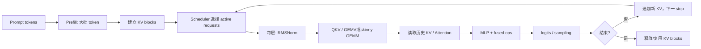

# Week 5：LLM 推理优化与 Decode——7 天自包含高强度教材

> 面向：会一些 CUDA，但刚接触 LLM 推理。硬件以 A100 `sm_80` 为主。
> 目标：不是背“decode memory-bound”，而是能从 shape、FLOP、bytes、launch 和状态生命周期推导瓶颈，并亲手写出核心 kernel。

## 0. 学习规则

每天建议 3–5 小时，固定流程：

```text
理解今天在一次 token 生成中的位置
→ 用小数字手算
→ 看 CPU/reference
→ 映射到 CUDA
→ 完成 TODO
→ 跑边界与正确性
→ 用 ncu/nsys 找证据
→ 闭卷口述
```

核心代码由你完成；正文提供外围框架、reference、测试方法和三级提示。

### 统一符号

| 符号 | 含义 |
|---|---|
| `B` | 同时处理的请求/序列数 |
| `N` | 当前序列 token 数 |
| `D` | hidden dimension |
| `Hq` | query head 数 |
| `Hkv` | key/value head 数 |
| `Dh` | 每个 head 的维度 |
| `L` | Transformer 层数 |
| `M,N,K` | GEMM/GEMV 的矩阵维度，需结合上下文辨认 |

### 7 天总览

| Day | 主线 | 你要完成 |
|---:|---|---|
| 1 | token→prefill→decode→KV | 两组 KV 显存账 + 完整推理时间线 |
| 2 | GEMV 数学→CPU→CUDA | 一线程/一 warp 一行 GEMV |
| 3 | GEMV 性能工程 | 向量化、occupancy、ncu/nsys 对照 |
| 4 | RMSNorm/Residual/SiLU 融合 | fused kernel + HBM 账本 + sanitizer |
| 5 | CUDA Graph + grid sync | 伪 decode graph + cooperative reduction |
| 6 | INT8 weight-only GEMV | 量化手算 + dequant GEMV |
| 7 | Paged Attention/框架/Hopper | block table 手推 + 完整 decode 图 |

建议目录：

```text
week05_inference/
  gemv.cu
  fused_rmsnorm.cu
  decode_graph.cu
  grid_reduce.cu
  dequant_gemv.cu
notes/week05.md
```

---

# Day 1：从文本到新 token——Prefill、Decode 与 KV Cache

## 1. 今天处在整条链的哪里

```text
文本
→ tokenizer 变成 token id
→ embedding 查表得到向量
→ 多层 Transformer
→ 最后一个位置得到 logits
→ sampling/argmax 选出新 token id
→ 把新 token 继续送回模型
```

这里先不研究 tokenizer 和 sampling 算法，只要知道它们是模型计算的输入和输出边界。

## 2. 六个零基础概念

### 2.1 Token 与 token id

token 是模型处理的文本单位，token id 是词表中的整数编号：

```text
"CUDA 很快" → tokenizer → [317, 9281, 64]
```

数字只是示意，不同 tokenizer 结果不同。

### 2.2 Embedding

embedding 表可以看成 `[vocab_size,D]` 矩阵。用 token id 选一行：

```text
id=317 → X[0,:]，shape [D]
```

多个 token 得到 `[N,D]` hidden states。

### 2.3 Hidden state

它是模型对每个 token 当前信息的浮点表示。微型例子：

```text
B=1, N=3, D=4
X shape = [1,3,4]
```

真实 `D` 可能几千，但 shape 推理完全相同。

### 2.4 Transformer block

一个 Transformer block 可以先理解为：**让每个 token 先和上下文交换信息，再独立加工自己的特征，同时用 residual 保留原来的表示。**

模型会连续经过 `L` 个结构相似、参数不同的 block。每个 block 的输入和输出 shape 都是 `[B,N,D]`，这样上一层输出才能直接交给下一层。“shape 不变”不等于数值没变：hidden state 每经过一层都会融入新的上下文信息。

#### 2.4.1 一个 block 的完整数据流

本周使用现代 decoder-only LLM 常见的 **Pre-Norm** 结构：

```text
输入 X [B,N,D]
│
├──────────────────────────────────────┐  residual 支路保留 X
│                                      │
└→ RMSNorm → Q/K/V 投影 → Attention   │
                          ├─ 写当前 K/V │
                          └─ 读历史 K/V │
                → 输出投影 → AttnOut   │
                                        ▼
                              H = X + AttnOut
                              │
                              ├──────────────────────┐
                              └→ RMSNorm → MLP       │
                                                     ▼
                                           Y = H + MLPOut

输出 Y [B,N,D]
```

对应四行公式：

$$
X_{norm}=\operatorname{RMSNorm}(X)
$$

$$
H=X+\operatorname{Attention}(X_{norm})
$$

$$
H_{norm}=\operatorname{RMSNorm}(H)
$$

$$
Y=H+\operatorname{MLP}(H_{norm})
$$

先抓住两个大分支：

1. **Attention 子层**：让一个 token 根据需要读取其他 token 的信息；
2. **MLP 子层**：每个 token 分别使用同一套小型神经网络加工自身特征。

KV Cache 只属于 Attention 子层，不属于 RMSNorm、residual 或 MLP。

#### 2.4.2 RMSNorm：先整理数值尺度

`X[B,N,D]` 中每个 token 都有长度为 `D` 的向量。RMSNorm 分别处理每个 token 的这一行：

```text
X[b,n,0:D] → 计算均方根 → 归一化 → 乘可学习权重
```

$$
\operatorname{RMSNorm}(x)
=\frac{x}{\sqrt{\frac{1}{D}\sum_{d=0}^{D-1}x_d^2+\epsilon}}
\odot\gamma
$$

- `x`：一个 token 的 hidden vector，长度为 `D`；
- `epsilon`：防止分母过小；
- `gamma[D]`：训练得到的逐元素缩放参数；
- 输入和输出都是 `[B,N,D]`。

直觉上，它先避免某层数值整体过大或过小，再送入后面的重计算。Pre-Norm 的关键是：**先 Norm 再进入 Attention/MLP，但 residual 支路保留 Norm 之前的输入。**

#### 2.4.3 Attention：让 token 从上下文取信息

归一化结果经过线性投影生成 Q、K、V：

```text
X_norm
├─ × Wq → Q：当前 token 想查找什么
├─ × Wk → K：每个 token 用什么“标签”被匹配
└─ × Wv → V：匹配后真正取回的信息
```

概念流程：

```text
Q 与各位置 K 计算相关分数
→ causal mask 禁止看到未来位置
→ softmax 得到权重
→ 用权重加权求和 V
→ 输出投影 Wo
→ AttentionOut [B,N,D]
```

为什么最后必须回到 `D`？因为接下来要做 `H=X+AttentionOut`。逐元素相加要求 shape 相同。因此，即使 Q/K/V 内部拆成多个 head，输出投影也会把结果整理回 `[B,N,D]`。

完整 Attention 数学、head 和 FlashAttention 请看
[Week4 Attention 与 FlashAttention 完整学习资料](../attention/Week4_Attention与FlashAttention完整学习资料.md)。

#### 2.4.4 KV Cache 在哪里读写

K/V 是 Attention 内由 hidden state 投影得到的中间结果。历史 token 的 K/V 在推理时不会改变，因此可以缓存：

```text
Prefill，N=3：
  为 t0、t1、t2 生成 Q/K/V
  把 K0..K2、V0..V2 写入 KV Cache
  每个位置按 causal 规则读取可见的历史 K/V

Decode，新 token=t3：
  只为 t3 生成 Q3、K3、V3
  把 K3、V3 追加到 KV Cache
  Q3 读取 K0..K3，并用权重加权 V0..V3
```

decode 虽然只新计算一个位置的 Q/K/V，但 Attention 读取范围会随上下文增长。这就是长上下文 decode 中 KV 读取带宽越来越重要的原因。

#### 2.4.5 第一次 residual add：保留旧信息

```text
H = X + AttentionOut

主支路：X → RMSNorm → Attention → 学习上下文改动
直通路：X ─────────────────────→ 保留原表示
最后：  原表示 + 新改动
```

它不是把两个 token 相加，而是对相同 `(b,n,d)` 位置逐元素相加：

$$
H[b,n,d]=X[b,n,d]+AttentionOut[b,n,d]
$$

所以 `X`、`AttentionOut` 和 `H` 都是 `[B,N,D]`。

#### 2.4.6 第二个子层：RMSNorm、MLP、residual

`H` 先经过第二次 RMSNorm，再进入 MLP。MLP 不负责 token 之间交流；它对每个 token 独立使用同一组权重：

```text
H_norm[b,0,:] ─→ 同一个 MLP ─→ MLPOut[b,0,:]
H_norm[b,1,:] ─→ 同一个 MLP ─→ MLPOut[b,1,:]
H_norm[b,2,:] ─→ 同一个 MLP ─→ MLPOut[b,2,:]
```

MLP 可先记成“升维—非线性—降维”：

```text
[D]
→ 第一组线性层
→ [Dff]，通常 Dff > D
→ 激活函数或门控（如 SiLU/SwiGLU）
→ 第二组线性层
→ [D]
```

不同模型细节可能不同。例如门控 MLP 常有 gate/up 两个投影，但 shape 主线不变：中间扩到 `Dff`，最后降回 `D`。

最终做 `Y=H+MLPOut`。第二次 residual 保留 Attention 之后的 `H`，同时叠加 MLP 的新变换。`Y[B,N,D]` 可直接送入下一个 block。

#### 2.4.7 用微型 shape 走一遍

假设 `B=1,N=3,D=4,Dff=8`：

| 步骤 | 张量 | shape | 发生了什么 |
|---|---|---|---|
| block 输入 | `X` | `[1,3,4]` | 3 个 token，每个 4 个特征 |
| 第一次归一化 | `X_norm` | `[1,3,4]` | 每个 token 沿 D 维归一化 |
| Attention 内部 | `Q/K/V` | 内部 head shape | token 间交换信息，K/V 可缓存 |
| 输出投影 | `AttentionOut` | `[1,3,4]` | 回到 D，准备 residual |
| 第一次残差 | `H` | `[1,3,4]` | `X + AttentionOut` |
| 第二次归一化 | `H_norm` | `[1,3,4]` | 为 MLP 整理尺度 |
| MLP 中间 | activation | `[1,3,8]` | 每个 token 独立升维与激活 |
| MLP 输出 | `MLPOut` | `[1,3,4]` | 降回 D |
| 第二次残差 | `Y` | `[1,3,4]` | `H + MLPOut` |

真实模型的 `D`、`Dff` 和 head 数大得多，但 shape 推理方法相同。

#### 2.4.8 Prefill 与 Decode 经过同一个 block

| 阶段 | block 输入 | 线性层视角 | Attention 的 KV 行为 |
|---|---|---|---|
| Prefill | `[B,N,D]`，N 可较大 | 常形成较大 GEMM | 为 prompt 各位置生成并写入 K/V |
| Decode | `[B,1,D]`（单请求） | 低 batch 时接近 GEMV | 追加新 K/V，并读取历史 K/V |

结构和权重没有更换，变化的是 shape 与状态：

```text
Prefill：一次处理许多 token，建立初始 KV Cache
Decode ：每步处理新 token，复用并扩展 KV Cache
```

continuous batching 会将多条请求的新 token 打包，输入可近似为 `[active_batch,1,D]`；所以 decode 不应永远机械等同于单条 GEMV。

#### 2.4.9 与本周 CUDA 任务的对应

```text
Q/K/V、Wo、MLP 投影 → Day 2/3：GEMV/GEMM
RMSNorm + residual + activation → Day 4：融合 kernel
每步重复执行许多小 kernel → Day 5：CUDA Graph
Attention 读写历史 K/V → Day 7：Paged Attention 与 KV 管理
```

#### 2.4.10 常见误区与闭卷口述

1. **Attention 就是整个 Transformer。** 不对；block 还有 Norm、residual 和 MLP，模型又由许多 block 堆叠。
2. **MLP 也混合不同 token。** 标准 MLP 对各 token 独立，token 间交流主要发生在 Attention。
3. **KV Cache 缓存 Q/K/V。** 常规缓存的是每层历史 K/V；新 token 的 Q 用后不必作为历史查询对象缓存。
4. **residual add 改变 shape。** 它是同 shape 逐元素相加，输出 shape 不变。
5. **decode 使用另一套模型层。** 它经过同一组 block 和权重，只是 `N`、batch 组织和 KV 状态不同。

闭卷口述：

> 一个 Pre-Norm Transformer block 有 Attention 和 MLP 两个主子层。输入 `X[B,N,D]` 先做 RMSNorm，再生成 Q/K/V；Attention 让 token 从可见上下文读取信息，输出投影回 D 后与原 X 做第一次 residual。结果再 RMSNorm，经过逐 token 的升维、激活或门控、降维 MLP，然后做第二次 residual，输出仍是 `[B,N,D]`。Prefill 与 decode 使用同一结构；prefill 一次处理多个 token 并建立 KV Cache，decode 每步只新增少量 token 的 K/V，但 Attention 要读取历史 K/V。

Day 2/3 研究线性层，Day 4 研究 norm/residual/activation，Day 7 研究 KV 管理。

### 2.5 Logits

最后 hidden state 乘输出权重，得到 `[vocab_size]` 分数：

```text
hidden[D] × W_vocab[D,V] → logits[V]
```

### 2.6 Sampling

argmax 选最高分；temperature/top-k/top-p 等会改变概率和选择。本周不实现 sampling，只把它当一次 decode step 的末端。

## 3. Prefill 与 Decode 的真实时间线

假设 prompt 有 3 个 token：

```text
Prefill：
  输入 token [t0,t1,t2]
  hidden shape [B=1,N=3,D]
  每层同时计算 3 个位置，并建立 t0..t2 的 KV
  输出最后位置 logits，选出 t3

Decode step 1：
  新输入只有 t3，hidden shape [1,1,D]
  query 来自 t3，attention 读取 t0..t3 的 KV
  写入 t3 的 K/V
  选出 t4

Decode step 2：
  新输入 t4
  attention 读取 t0..t4 的 KV
  写入 t4 的 K/V
```

单请求时很多线性层可近似看成 `M=1`。线上 continuous batching 中，同一步可能有几十个 active sequences，新 token 行会被打包，所以有效 `M≈active_batch`，不应把 decode 永远写死为 M=1。

## 4. 为什么需要 KV Cache

在第 `t` 步，历史 token 的 K/V 只依赖历史 hidden state 和固定投影权重。没有 cache 时，为得到历史 K/V，会重复计算：

```text
step 1：重新算 t0,t1,t2
step 2：重新算 t0,t1,t2,t3
step 3：重新算 t0,t1,t2,t3,t4
```

有 cache 后：

```text
step 1：只算新 token t3 的 K/V，追加
step 2：只算 t4 的 K/V，追加
```

代价是显存和读取带宽随缓存 token 增长。

## 5. KV 显存公式

对标准按 KV heads 存储的缓存：

$$
\text{KV bytes}=2\times L\times B\times N\times H_{kv}\times D_h\times \text{dtype bytes}
$$

- `2`：K 和 V 两份；
- `Hkv` 不是一定等于 query heads；
- 不含 block metadata、padding、workspace、fragmentation。

### 5.1 手算一

```text
L=32, B=1, N=4096, Hkv=8, Dh=128, FP16=2 bytes

bytes = 2×32×1×4096×8×128×2
      = 536,870,912 bytes
      = 512 MiB
```

### 5.2 手算二

同模型，`B=16,N=8192`：

```text
512 MiB × 16 × 2 = 16 GiB
```

这还没算权重、activation/workspace 和碎片。

### 5.3 MHA/MQA/GQA

```text
MHA：Hkv=Hq
MQA：Hkv=1
GQA：1 < Hkv < Hq
```

MLA 的缓存表示不同，不能机械套 `Hkv×Dh`；需要按潜在向量和位置部分实际 shape 算。

## 6. 性能指标

| 指标 | 含义 |
|---|---|
| TTFT | 请求进入到首 token 的时间，常受排队/prefill 影响 |
| TPOT | 后续 token 之间时间，常关注 decode |
| throughput | 单位时间生成 token/完成请求 |
| latency | 单请求端到端或阶段耗时 |

prefill 往往形成更大 GEMM，decode 低 batch 往往权重/KV bytes 相对 FLOP 高，但是否 compute/memory-bound 必须结合 shape、batch、dtype、kernel 和硬件实测。

## 7. Day 1 练习与验收

填写：

```text
模型：L=__, Hq=__, Hkv=__, Dh=__, dtype=__
配置A：B=__, N=__ → KV=__ MiB
配置B：B=__, N=__ → KV=__ GiB
权重约=__ GiB
剩余显存能放多少 cached tokens=__
```

闭卷回答：

1. prefill 和 decode 的输入 shape 如何变化？ prefill阶段[B,N,D] decode阶段，[1,1,D]
2. KV cache 避免了什么重复计算？ 历史token的k和v的重复计算，
3. 为什么 cache 省 FLOP 却增加显存/带宽？
4. 为什么 GQA 公式用 `Hkv`？ 多个ATTENTION复用投影向量
5. 为什么不能无条件说所有 decode 都 memory-bound？

口述：

> Decode 每步只新增少量 token，但要读取模型权重和随上下文增长的 KV。低 batch 时算术强度往往低；batching、量化和融合会改变 shape 与 bytes，所以我会先做 FLOP/byte 账本再用 profiler 判断，而不是只凭阶段名称贴标签。

---

# Day 2：GEMV——从一行数学到一个 Warp

## 8. 今天在 decode 中的位置

Transformer 的线性层本质是：

$$Y=XW+b$$

prefill 中 `X` 有多个 token 行，常是 GEMM；单请求 decode 中 `X` 只有一个新 token 行，可写成 GEMV：

$$y=Wx+b$$

## 9. 3×4 完整手算

```text
W = [[1, 2, 0,-1],
     [0, 1, 3, 2],
     [2, 0, 1, 1]]       shape [N=3,K=4]

x = [2,1,-1,3]           shape [K=4]
b = [1,0,-2]             shape [N=3]

y0 = 1×2 + 2×1 + 0×(-1) + (-1)×3 + 1 = 2
y1 = 0×2 + 1×1 + 3×(-1) + 2×3 + 0 = 4
y2 = 2×2 + 0×1 + 1×(-1) + 1×3 - 2 = 4
```

每个输出是一行点积，行之间独立。

## 10. GEMV 的 FLOP 与 bytes

约：

```text
FLOP ≈ 2NK
主要 bytes ≈ sizeof(W)=NK×dtype_bytes
             + x/y/b（规模更低，缓存行为另算）
```

单个 GEMV 中每个 `W` 元素通常只用于一次乘加；`x` 会被所有输出行复用。因此不是“完全没有复用”，而是矩阵权重的跨输出复用远弱于大 GEMM。

## 11. CPU Reference

```cpp
void gemv_cpu(const float* W, const float* x, const float* b,
              float* y, int N, int K) {
    for (int row = 0; row < N; ++row) {
        double sum = b ? b[row] : 0.0;
        for (int k = 0; k < K; ++k)
            sum += double(W[row*K+k]) * x[k];
        y[row] = float(sum);
    }
}
```

## 12. CUDA v0：一个线程一行

```cpp
__global__ void gemv_thread(const float* W, const float* x,
                            const float* b, float* y, int N, int K) {
    int row = blockIdx.x * blockDim.x + threadIdx.x;
    if (row >= N) return;
    float sum = b ? b[row] : 0.0f;
    for (int k = 0; k < K; ++k)
        sum = fmaf(W[row*K+k], x[k], sum);
    y[row] = sum;
}
```

它正确但同一时刻相邻线程在不同 row、同一个 k，地址 stride 为 `K`，大 K 时 warp 访问不连续。

## 13. CUDA v1：一个 Warp 一行（你来写）

```cpp
__global__ void gemv_warp(const float* W, const float* x,
                          const float* b, float* y, int N, int K) {
    int lane = threadIdx.x & 31;
    int warp_in_block = threadIdx.x >> 5;
    int warps_per_block = blockDim.x >> 5;
    int row = blockIdx.x * warps_per_block + warp_in_block;
    if (row >= N) return;

    float sum = 0.0f;
    // TODO 1：lane-stride 遍历 k=lane; k<K; k+=32，累加 W[row,k]*x[k]。
    // TODO 2：用正确 mask 做 warp reduction。
    // TODO 3：lane 0 加 bias 并写 y[row]。
}
```

### 三级提示

1. `W[row*K+k]` 中同一 warp 的 lane 在同轮访问连续 k；
2. 对 `K<32` 或最后不完整迭代，mask 描述“哪些 lane 仍参与该次 collective”；更简单的教学方案可让所有 lane 始终参与、越界 lane 累加 0；
3. reduction 使用偏移 `16,8,4,2,1`，每步把另一 lane 的部分和加回来。

## 14. 统一测试框架要点

你的 `main` 至少完成：

```text
生成固定随机 W/x/b
CPU reference
cudaMalloc/cudaMemcpy
warmup
CUDA Event 重复计时
复制 y
max_abs/max_rel
logical GB/s 和 GFLOPS
```

计算：

```text
GB/s = logical_bytes / seconds / 1e9
GFLOPS = 2*N*K / seconds / 1e9
```

logical bytes 是算法账本，不等于 DRAM 实际 transaction；ncu 用来观察后者。

## 15. Day 2 测试

```text
N=3,    K=4      对齐手算
N=37,   K=24     非 warp/向量整除
N=4096, K=4096   典型大权重
N=1,    K=4097   极少输出
```

验收：

- [ ] CPU/GPU 误差合理；
- [ ] memcheck 0 errors；
- [ ] 能解释 v0/v1 的地址模式；
- [ ] 不用“GEMV 完全没有复用”描述 `x`。

---

# Day 3：GEMV 性能深化——向量化、Occupancy、ncu 与 nsys

## 16. 优化顺序

```text
先保证地址连续
→ 减少 load/地址指令
→ 利用 x 的缓存/shared 复用
→ 保持足够 warps 隐藏延迟
→ 才讨论更复杂的多行 tile
```

## 17. float4/half2

`float4` 可让每 lane 每轮加载 4 个连续值，但要求：

- 基地址和行首满足 16-byte 对齐；
- `K` 尾部单独处理；
- `x` 同样安全；
- 用 SASS 验证最终宽 load，而不是只看源码类型。

练习框架：

```cpp
// TODO 1：当 K/地址满足条件时读取 float4 W4 和 x4。
// TODO 2：把四个分量分别 FMA 到 local sum。
// TODO 3：处理 K%4 尾部，不读越界。
```

## 18. `x` 放哪里

| 方案 | 适用条件 | 代价 |
|---|---|---|
| 依赖 cache | x 较小且反复访问 | 行为需实测 |
| shared | 一个 block 多 warp 处理多行，共享 x tile | shared、同步、分 tile |
| constant | warp 线程常读相同地址时广播好 | GEMV lane 常读不同 k，未必理想 |

不要因为 constant 是只读就默认更快。

## 19. Occupancy、ILP、TLP

```text
TLP：更多 ready warps 隐藏 load latency
ILP：同一 warp 发起多个独立 load/accumulator
```

理论 active blocks 受：

```text
registers/thread × threads/block
shared/block
threads/block
blocks/SM 架构上限
```

编译：

```bash
nvcc -O3 -lineinfo -arch=sm_80 -Xptxas=-v gemv.cu -o gemv
```

观察 registers/spill。不要设“带宽必须 >70%”的固定及格线；小 `N`、启动开销、cache、指令和归约都可能限制有效比例。

## 20. ncu 与 nsys

```bash
ncu --section SpeedOfLight --section LaunchStats \
    --section Occupancy --section SchedulerStats \
    --section MemoryWorkloadAnalysis --section SourceCounters \
    ./gemv 4096 4096

nsys profile --trace=cuda,nvtx -o /tmp/gemv_loop ./gemv_loop
```

`ncu` 回答单 kernel 的资源和管线；`nsys` 回答多次 GEMV/整个 decode 循环的 launch gap、同步和 CPU/GPU 时间线。

## 21. 实验表

| 版本 | N/K | time | logical GB/s | GFLOPS | reg | occupancy | 主要证据 |
|---|---|---:|---:|---:|---:|---:|---|
| thread/row | | | | | | | |
| warp/row | | | | | | | |
| vectorized | | | | | | | |
| x tiled | | | | | | | |

必须先写假设，例如：

> warp/row 会改善 W 的合并访问；若成立，sector 利用率和时间应改善，但归约指令会增加。

## 22. Day 3 自测

1. GEMV 的主要 logical bytes 是什么？
2. warp/row 为什么改善 coalescing？
3. `x` 有什么复用，为什么 shared 不一定赢？
4. occupancy 高为什么仍可能没有 eligible warps？
5. nsys 与 ncu 各回答什么？
6. 怎样证明 `float4` 真正落成宽指令？

---

# Day 4：Residual、RMSNorm、SiLU 与算子融合

## 23. 今天在 decode 中的位置

Transformer 层中有许多“小而频繁”的操作：

```text
输入 x + 子层输出 r → residual
→ RMSNorm
→ SiLU/GELU 等激活
```

这些算子 FLOP 少、读写 activation 多，常比 GEMM 更容易受 HBM/launch 影响。

## 24. 三个数学组件

### 24.1 Residual

```text
z_i = x_i + r_i
```

### 24.2 RMSNorm

$$
\mathrm{rms}=\sqrt{\frac{1}{D}\sum_i z_i^2+\epsilon},\qquad
o_i=\frac{z_i}{\mathrm{rms}}\gamma_i
$$

它不减均值；LayerNorm 还会计算均值和方差。

### 24.3 SiLU

$$
\mathrm{SiLU}(x)=x\,\sigma(x)=\frac{x}{1+e^{-x}}
$$

## 25. 四元素手算

```text
x=[1,2,-1,0], r=[0,1,1,2]
z=x+r=[1,3,0,2]
mean_square=(1+9+0+4)/4=3.5
epsilon 暂忽略，rms=sqrt(3.5)≈1.8708
gamma=[1,1,1,1]
norm≈[0.5345,1.6036,0,1.0690]
再逐元素做 SiLU
```

真实代码保留 epsilon，累加建议 FP32。

## 26. CPU Reference

```cpp
void residual_rms_silu_cpu(const float* x, const float* r,
                           const float* gamma, float* out,
                           int rows, int D, float eps) {
    for (int row=0; row<rows; ++row) {
        double ss=0;
        for (int d=0; d<D; ++d) {
            double z=double(x[row*D+d])+r[row*D+d];
            ss += z*z;
        }
        float inv=rsqrtf(float(ss/D)+eps);
        for (int d=0; d<D; ++d) {
            float z=x[row*D+d]+r[row*D+d];
            float n=z*inv*gamma[d];
            out[row*D+d]=n/(1.0f+expf(-n));
        }
    }
}
```

## 27. 未融合与融合 HBM 账本

假设 FP32，每个中间结果都落 HBM：

```text
residual：读 x,r（8B/elem），写 z（4B）
rmsnorm：读 z,gamma（8B），写 n（4B）
silu：读 n（4B），写 out（4B）
合计 logical ≈ 28B/element（忽略统计量）

融合：读 x,r,gamma（12B），写 out（4B）
≈16B/element
```

实际 transaction/cache 由 ncu 测；这个账本解释为什么值得尝试。

## 28. Fused Kernel（你来完成）

```cpp
__global__ void fused_residual_rms_silu(
    const float* x,const float* r,const float* gamma,
    float* out,int rows,int D,float eps) {
    int row=blockIdx.x;
    if(row>=rows) return;
    float local=0.0f;
    for(int d=threadIdx.x;d<D;d+=blockDim.x){
        float z=x[row*D+d]+r[row*D+d];
        local += z*z;
    }
    // TODO 1：block reduction 得到 sum of squares。
    // TODO 2：计算 inv_rms，并让 block 所有线程可用。
    // TODO 3：再次读 x/r 或保存合理状态，计算 norm、SiLU、写 out。
}
```

### 三级提示

1. 复用你已有的 warp reduction，再让 warp leaders 经 shared 合并；
2. `inv_rms` 可由线程 0 写 shared，`__syncthreads()` 后读取；
3. 把整行 `z` 存寄存器在大 D 时不可行；教学版第二遍重读 x/r，之后再分析是否值得缓存。

## 29. 融合的代价

- kernel 更复杂；
- register/live range 变大；
- 归约与逐元素阶段的并行需求不同；
- 可能降低 occupancy；
- 重读输入与保存中间量需权衡；
- FP16/BF16 输入时仍建议 FP32 统计。

## 30. 正确性与 Sanitizer

测试：

```text
rows=1,D=4 对齐手算
rows=3,D=37 非整除
D=4096 常见维度
全零、大值、正负混合、固定随机
检查 NaN/Inf、max_abs/max_rel
```

```bash
compute-sanitizer --tool memcheck ./fused_rmsnorm
compute-sanitizer --tool initcheck ./fused_rmsnorm
compute-sanitizer --tool racecheck ./fused_rmsnorm
compute-sanitizer --tool synccheck ./fused_rmsnorm
```

工具无 error 不等于数值正确；仍须 CPU 对拍。

## 31. Profiler 表

| 版本 | logical bytes | time | DRAM bytes | reg | occupancy | error |
|---|---:|---:|---:|---:|---:|---:|
| 3 kernels | | | | | | |
| fused | | | | | | |

闭卷回答：RMSNorm 与 LayerNorm 差异、融合省了什么、为何可能变慢、四种 sanitizer 各查什么。

---

# Day 5：CUDA Graph 与 Cooperative Grid Sync

## 32. 为什么短 kernel 会看到 launch 气泡

CPU 要提交 kernel，GPU 才能执行。decode 每步包含许多短算子时：

```text
CPU: launch A | launch B | launch C | ...
GPU:    A      gap   B      gap   C
```

kernel launch 通常是微秒量级，但具体数字取决于系统；不要背固定 `5μs`。

## 33. Graph 生命周期

```text
BeginCapture
→ 在 stream 发出代表性 kernel/memcpy 序列
→ EndCapture 得到 cudaGraph_t
→ Instantiate 得到 cudaGraphExec_t
→ 多次 cudaGraphLaunch 重放
→ destroy exec/graph
```

Graph 主要减少重复提交开销，不改变单个 kernel 的 FLOP/bytes。

## 34. 伪 Decode Graph（你来完成）

```cpp
cudaStream_t stream;
cudaStreamCreate(&stream);
cudaGraph_t graph=nullptr;
cudaGraphExec_t exec=nullptr;

// TODO 1：BeginCapture(stream, 合适 mode)。
gemv_warp<<<grid,block,0,stream>>>(...);
fused_residual_rms_silu<<<... ,stream>>>(...);
tiny_update<<<... ,stream>>>(...);
// TODO 2：cudaStreamEndCapture(stream,&graph)。
// TODO 3：cudaGraphInstantiate(&exec,graph,...) 得到可执行图。

for(int step=0;step<steps;++step){
    // 更新的数据放在预先约定地址；动态参数需符合 graph 设计。
    // TODO 4：cudaGraphLaunch(exec,stream)。
}
cudaStreamSynchronize(stream);
// TODO 5：按逆生命周期销毁资源。
```

### 三级提示

1. capture 期间不要调用不允许 capture 的同步/分配操作；
2. instantiate 成本只付一次，benchmark 分开报告首次和稳态；
3. `cudaGraphLaunch` 仍是异步的，最终测量需正确 event/stream 同步。

## 35. Graph 的现实限制

- dynamic batching 使 shape、节点参数和地址变化；
- KV block table/active requests 每步变化；
- 可用预分配、bucket、node update 或多 graph，但复杂度上升；
- 大 kernel 主导时 launch 节省比例小；
- Graph 不能消除数据依赖造成的 GPU wait。

## 36. 怎样用 nsys 验证

```bash
nsys profile --trace=cuda,nvtx -o /tmp/decode_plain ./decode_plain
nsys profile --trace=cuda,nvtx -o /tmp/decode_graph ./decode_graph
```

分别记录 CPU wall、稳态每 step、kernel gap 和 GPU 利用，不只截一张好看的时间线。

## 37. 为什么普通 kernel 没有任意 grid barrier

block 可按任意顺序调度。若已运行 blocks 自旋等待尚未调度 blocks，而它们占满 SM，可能死锁。

普通全局阶段边界常用第二个 kernel：

```text
kernel1：每 block 归约到 partial[block]
kernel2：归约 partial
```

## 38. Cooperative Launch

cooperative kernel 可获得 `grid_group`：

```cpp
#include <cooperative_groups.h>
namespace cg=cooperative_groups;

__global__ void grid_reduce(const float* x,float* partial,float* out,int n){
    cg::grid_group grid=cg::this_grid();
    // TODO 1：每 block 归约并由 leader 写 partial[blockIdx.x]。
    // TODO 2：grid.sync()，保证所有 partial 已写。
    // TODO 3：一个 block/线程组归约 partial，写 out。
}
```

必须：

- 查询设备 cooperative launch 支持；
- 用 `cudaLaunchCooperativeKernel`/对应 API；
- grid block 数不能超过该 kernel 能同时驻留的范围；
- 计算 active blocks/SM 时考虑 register/shared/block；
- 所有 grid 线程一致到达 collective。

## 39. Day 5 验收

- [ ] plain vs graph 分开报告首次/稳态；
- [ ] nsys 指出 gap 是否变化；
- [ ] graph 结果与 plain 相同；
- [ ] 两阶段 reduction 与 grid-sync 版本对拍；
- [ ] 解释 cooperative 约束，不能声称单 kernel 一定更快。

---

# Day 6：INT8 Weight-only 量化 GEMV

## 40. 量化为什么出现在 Decode

低 batch GEMV 常需要读取大量权重。把权重从 FP16（2B）存成 INT8（1B）可降低存储和读取 bytes，但需要 scale、反量化与合适 kernel；字节减半不保证时间等比减半。

## 41. 对称 INT8 手算

给一行权重：

```text
w=[-1.0,-0.25,0.5,1.2]
max_abs=1.2
scale=max_abs/127≈0.0094488
q=round(w/scale) 并 clamp 到 [-127,127]
q≈[-106,-26,53,127]
dequant=q×scale≈[-1.0016,-0.2457,0.5008,1.2]
```

量化误差是 `dequant-w`。若 `x=[1,2,-1,0.5]`，分别用原权重和反量化权重算 dot，比较输出误差。

### 方案区别

| 方案 | scale | 优点 | 代价 |
|---|---|---|---|
| per-tensor | 整个 W 一个 | metadata 少 | 不同通道范围差异大 |
| per-channel | 每输出行一个 | 精度通常更好 | 多读 scale |
| per-group | 每小组一个 | 精度/开销折中 | 索引更复杂 |

非对称量化还引入 zero point；本日先实现对称 per-channel。

```text
weight-only：W int8，x/acc/out 浮点
W8A8：W 与 activation 都低精度，需要不同硬件路径
KV quant：压缩缓存，attention 内读取时反量化
```

## 42. CPU Quantize 与 Reference

```cpp
void quantize_per_row(const float* W,int8_t* Q,float* scales,int N,int K){
  for(int r=0;r<N;++r){
    float amax=0;
    for(int k=0;k<K;++k) amax=fmaxf(amax,fabsf(W[r*K+k]));
    float s=amax==0?1.0f:amax/127.0f;
    scales[r]=s;
    for(int k=0;k<K;++k){
      int q=int(lrintf(W[r*K+k]/s));
      Q[r*K+k]=int8_t(max(-127,min(127,q)));
    }
  }
}

void dequant_gemv_cpu(const int8_t* Q,const float* scales,
                      const float* x,float* y,int N,int K){
  for(int r=0;r<N;++r){
    double sum=0;
    for(int k=0;k<K;++k) sum+=double(Q[r*K+k])*scales[r]*x[k];
    y[r]=float(sum);
  }
}
```

比较两种误差：

```text
GPU vs CPU dequant reference：验证 kernel 实现
dequant result vs original FP result：衡量量化误差
```

不要把两者混在一个 tolerance 中。

## 43. CUDA Kernel（你来完成）

```cpp
__global__ void dequant_gemv_warp(const int8_t* Q,const float* scales,
                                  const float* x,float* y,int N,int K){
  int lane=threadIdx.x&31;
  int warp=(blockIdx.x*(blockDim.x/32))+(threadIdx.x/32);
  if(warp>=N) return;
  float scale=scales[warp];
  float sum=0;
  // TODO 1：lane-stride 读取 int8 Q 与 float x。
  // TODO 2：反量化 q*scale，FMA 到 sum。
  // TODO 3：warp reduction，lane0 写 y。
}
```

### 三级提示

1. 最简单版本先标量读取，正确后再尝试 `char4`/packed load；
2. `int8_t` 转 float 要注意 signedness；
3. scale 每行相同，可由各 lane 读取并依赖 cache，之后再尝试广播。

## 44. 性能账本

| 版本 | 权重 bytes/elem | 额外 scale | 转换计算 | 输出误差 | time | DRAM bytes |
|---|---:|---:|---|---:|---:|---:|
| FP32 | 4 | 0 | 无 | baseline | | |
| FP16 | 2 | 0 | half→acc | | | |
| INT8 per-row | 1 | `4/K` 摊销 | q×scale | | | |

若 INT8 不快，检查：

- kernel 是否仍用低效标量 load；
- 反量化/转换吞吐；
- x 读取和归约是否主导；
- shape 太小是否 launch-bound；
- 是否真的比较相同精度/工作量。

## 45. Day 6 验收

```text
N=3,K=4 手算
N=37,K=29 非整除
N=4096,K=4096 性能
全零行、极端范围、固定随机
```

- [ ] kernel 对齐 CPU dequant reference；
- [ ] 单独报告量化误差；
- [ ] ncu 比较 bytes/指令/occupancy；
- [ ] 不把权重 bytes 减半直接说成端到端 2×。

---

# Day 7：Paged Attention、推理框架与 Hopper

## 46. 连续 KV Buffer 的问题

若每个请求预留最大长度：短请求浪费；若按当前长度连续扩容：后面可能无连续空间，需要搬迁；请求随时完成又会留下孔洞。

```text
时间0：A 需要2 token，B需要2 token
时间1：A增长，B结束，C到达
连续大块方案：预留/搬迁/碎片三者难兼顾
```

Paged Attention 将 KV 分成固定 token block：请求看到逻辑连续序列，物理块可分散。

## 47. Block Table 手推

设 block size=2 tokens，物理 blocks `P0..P3`：

```text
请求 A 有 token 0..4，需要逻辑块 L0,L1,L2
block_table_A=[P2,P0,P3]

token t：
logical_block=t/2
offset=t%2
physical_block=block_table_A[logical_block]
```

因此：

| token | logical block | offset | physical |
|---:|---:|---:|---|
| 0 | 0 | 0 | P2 |
| 1 | 0 | 1 | P2 |
| 2 | 1 | 0 | P0 |
| 3 | 1 | 1 | P0 |
| 4 | 2 | 0 | P3 |

地址还要乘 layer/KV head/head dimension/dtype stride。block table 解决映射，不减少每个有效 KV 元素本身。

### Block size 权衡

```text
太大：最后块内部浪费、调度粒度粗
太小：metadata/查表更多，连续访问和 kernel 效率可能变差
```

Paged Attention 改善 KV 管理和 kernel 访问组织，不自动把 dense attention FLOP 从平方变线性。

## 48. Continuous Batching

每一步 scheduler 重新选择 active requests：

```text
step0：[A,B,C]
step1：B完成，加入D → [A,C,D]
step2：A的KV容量不足，可能暂停/抢占/换出
```

目标同时包括 throughput、TTFT、TPOT、P99、公平性和 KV capacity。大 batch 提吞吐可能恶化排队/延迟；chunked prefill 可限制一次占用，但增加调度复杂度。

## 49. 框架地图（以当前官方文档为准）

| 框架 | 回答时抓住的职责 |
|---|---|
| vLLM | 高吞吐 serving、PagedAttention/KV 管理与调度生态 |
| TensorRT-LLM | NVIDIA GPU kernel、量化、编译/runtime 与服务组件 |
| SGLang | serving/runtime、结构化生成和缓存/调度机制 |

不要背永久“功能支持排行榜”；版本变化快，应按模型、硬件、精度、SLA 和当前版本 benchmark 选择。

官方入口：[vLLM](https://docs.vllm.ai/)、[TensorRT-LLM](https://nvidia.github.io/TensorRT-LLM/latest/)、[SGLang](https://docs.sglang.ai/)。

## 50. A100 到 Hopper

先回忆 A100：

```text
多个线程发 cp.async：global→shared
warp 用 ldmatrix/mma.sync
CTA 内 shared + barrier
```

Hopper：

| A100 | Hopper | 变化 |
|---|---|---|
| `cp.async` | TMA | descriptor+坐标发 bulk 多维搬运，减少 per-thread 地址/copy 指令 |
| warp `mma.sync` | WGMMA | 4-warp group 异步矩阵计算 |
| CTA | Thread Block Cluster | 一组 CTA 在同一 GPC 协同调度 |
| 本 CTA shared | DSM | cluster 内访问其他 CTA shared 分区 |
| 普通阶段同步 | mbarrier/transaction | 将异步事务完成纳入 stage 状态 |

这促成 producer/consumer warp specialization：少量 producer 发 TMA，consumer warp-group 发 WGMMA，stage barrier 管生命周期。

没有 H100 时，你能做架构和源码阅读，不能声称性能实测。深入见 [CUDA 深水区教材](../../topics/performance/CUDA深水区_PTX_SASS_MMA_异步流水与Hopper.md)。

## 51. 完整 Decode 数据流



标注瓶颈时写条件：

```text
低 batch GEMV：权重 bytes 可能主导
长上下文 decode attention：KV 读取增长
大量短算子：launch 与中间 HBM 往返
大 batch/chunked prefill：计算利用率提高但调度/延迟改变
多 GPU：collective/KV transfer 可能进入 critical path
```

## 52. Day 7 与全周验收

闭卷：

1. 从 token 到下一个 token 画完整流程；
2. 手算两组 KV bytes；
3. 解释 GEMV 一线程/一 warp 一行的访存差异；
4. 用 HBM 账本解释融合；
5. Graph 降低什么、不降低什么；
6. cooperative grid sync 为什么有驻留约束；
7. INT8 weight-only 的 scale、误差和性能条件；
8. block table 如何把 token 映射到 physical KV；
9. continuous batching 如何改变有效 M；
10. TMA/WGMMA/cluster/DSM 分别解决什么。

最终产出：

```text
week05_inference/gemv.cu
week05_inference/fused_rmsnorm.cu
week05_inference/decode_graph.cu
week05_inference/grid_reduce.cu
week05_inference/dequant_gemv.cu
notes/week05.md
```

---

# 附录 A：工具命令

```bash
# 编译
nvcc -O3 -lineinfo -arch=sm_80 source.cu -o app

# 资源
nvcc -O3 -lineinfo -arch=sm_80 -Xptxas=-v source.cu -o app

# 正确性
compute-sanitizer --tool memcheck ./app
compute-sanitizer --tool racecheck ./app
compute-sanitizer --tool initcheck ./app
compute-sanitizer --tool synccheck ./app

# 单 kernel
ncu --set full -o /tmp/report ./app

# 系统时间线
nsys profile --trace=cuda,nvtx -o /tmp/timeline ./app
```

# 附录 B：继续深挖

- [Week4 Attention 与 FlashAttention](../attention/Week4_Attention与FlashAttention完整学习资料.md)
- [AI Infra 面试八股](../../interview/AI_Infra面试核心题库.md)
- [KV Cache 专项](../../topics/kv_cache/大模型KVCache系统学习指南.md)
- [Occupancy 详解](../../topics/performance/Occupancy详解_从入门到调优.md)
- [Nsight Compute 详解](../../topics/performance/Nsight_Compute_ncu详解.md)
- [CUDA 深水区：PTX/SASS/MMA/流水/Hopper](../../topics/performance/CUDA深水区_PTX_SASS_MMA_异步流水与Hopper.md)
- [CUDA Graph 教材](../../../cuda_deep_course/course/volume07_async_system/04_CUDA_Graph.md)
- [NVIDIA Hopper Tuning Guide](https://docs.nvidia.com/cuda/hopper-tuning-guide/)

> 链接用于深挖；完成本周主线不要求先通读这些长文档。
