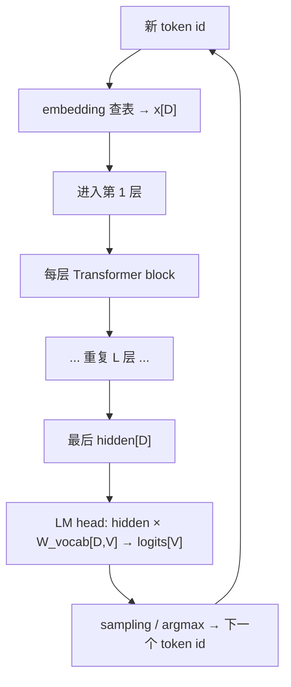
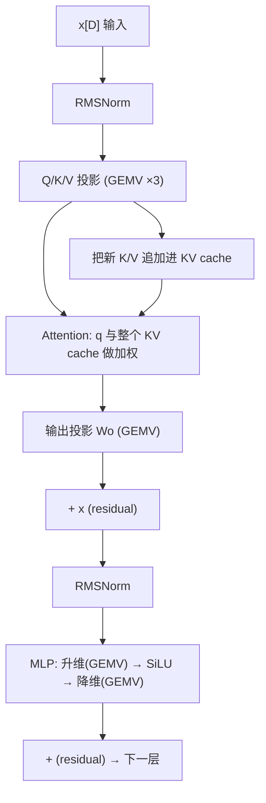

# 一次 Decode Step 的数据流与瓶颈

> 对应：docs/Week5增强版_LLM推理优化与decode.md（Day7 §51）
> 硬件：A100 80GB PCIe（sm_80，HBM 峰值约 1935 GB/s，FP32 19.5 TFLOPS）
> 目的：把 Week5 写过的 kernel（gemv / fused_rmsnorm / dequant_gemv / decode_graph）
>       串成「生成一个 token 要走哪些算子、每个算子卡在哪」的完整图景。

---

## 0. 一句话总览

> Decode 每步只处理 **1 个新 token**（M=1），流过全部 L 层，每层做 `RMSNorm → QKV 投影 → Attention(读历史 KV) → 输出投影 → RMSNorm → MLP`，
> 最后过 LM head 出 logits、采样出下一个 token，再把它接回输入。
> **绝大多数线性层塌成 GEMV（memory-bound）**，attention 读 KV cache 的量随上下文增长，大量小算子还带来 launch 开销。

---

## 1. Prefill vs Decode（先分清）

| | Prefill | Decode |
|---|---|---|
| 输入 shape | `[B, N, D]`（N=prompt 长度，大） | `[B, 1, D]`（每步 1 个 token） |
| 线性层 | 大 GEMM | **GEMV（M=1）** |
| 瓶颈 | compute-bound（喂满 Tensor Core） | **memory-bound（搬权重/KV 带宽）** |
| KV cache | 一次建好 | 每步追加 1 个 + 读全部历史 |
| 并行 | 整段 token 并行 | 严格串行（下个 token 依赖上个） |

decode 一切劣势的根源：**每步 M=1**。

---

## 2. 一次 Decode Step 的完整数据流



### 单层内部（Pre-Norm）



---

## 3. 逐算子拆解：瓶颈 + 对应 kernel

| 算子 | 运算 | 瓶颈 | 为什么 | 我写的 kernel |
|------|------|------|--------|--------------|
| embedding 查表 | gather | memory | 一次索引，访存为主 | — |
| **RMSNorm** | 归约+缩放 | memory | FLOP 少、读写 activation | `fused_rmsnorm.cu` |
| **Q/K/V 投影** | `x·Wqkv` | **memory (GEMV)** | M=1，权重零复用 | `gemv.cu` |
| KV cache 追加 | 写 1 行 K/V | memory | 少量写 | — |
| **Attention** | q·Kᵀ→softmax→·V | memory | 读整个 KV cache，随上下文增长 | (Week4 attention) |
| **输出投影 Wo** | GEMV | **memory** | 同上 | `gemv.cu` |
| residual add | 逐元素加 | memory | 纯访存 | (可融进 norm) |
| **MLP 升/降维** | 2×GEMV | **memory** | 最大的两个权重矩阵 | `gemv.cu` |
| SiLU 激活 | 逐元素 | memory | 零复用 | `fused_rmsnorm.cu`(融合) |
| **LM head** | `hidden·W_vocab` | **memory (GEMV)** | V 很大(几万~十几万)，权重大 | `gemv.cu` |
| sampling | argmax/top-k | memory | 一次扫 logits | — |

**结论：整条链几乎全是 memory-bound**。时间主要花在「把权重和 KV cache 从 HBM 搬进来」。

---

## 4. 瓶颈标注（带条件，不贴死标签）

```text
低 batch GEMV（QKV/Wo/MLP/LMhead）：权重 bytes 主导 → 打满带宽是关键
长上下文 attention：           KV 读取量随 seq 增长 → 越生成越慢
大量小算子（norm/激活/residual）：launch 开销 + 中间 HBM 往返 → 融合 + CUDA Graph
大 batch / continuous batching： M 从 1 → 几十，GEMV 回到 GEMM 特性，可能转 compute-bound
量化（INT8 权重）：             权重 bytes 减半 → 缓解 GEMV 带宽压力（但字节减半 ≠ 时间减半）
多 GPU：                        collective / KV transfer 可能进 critical path
```

---

## 5. Week5 的优化各治哪个瓶颈

| 优化 | 治的瓶颈 | 对应文件 | 实测 |
|------|---------|---------|------|
| **GEMV 合并访问**(warp 一行) | 访存不合并浪费带宽 | `gemv.cu` | 72 → 1360 GB/s（19×） |
| float4 向量化 | load 指令数 | `gemv.cu` | 已 memory-bound，仅 +4% |
| **算子融合**(RMSNorm+residual+SiLU) | 小算子的 HBM 往返 | `fused_rmsnorm.cu` | ~28B → 16B/元素 |
| **CUDA Graph** | 每步大量 kernel 的 launch 开销 | `decode_graph.cu` | 15.9 → 9.2 us/step（1.73×） |
| **INT8 量化 GEMV** | 权重搬运 bytes | `dequant_gemv.cu` | 权重 4B → 1B |
| continuous batching | M=1 占用率低 | (框架层) | M→active_batch |

---

## 6. 时间都花在哪（直觉账）

单请求 decode 一步，忽略常数：

```text
主要开销 ≈ Σ(每层权重 bytes) / 有效带宽  +  Σ(KV cache bytes) / 有效带宽  +  launch 开销
           └── QKV+Wo+MLP 权重，固定 ─┘     └── 随上下文线性增长 ──┘      └ Graph 可省 ┘
```

- **权重项**：每步都要把全模型权重读一遍（decode 无复用）→ 固定大头
- **KV 项**：短上下文时小，长上下文时逼近甚至超过权重项 → 长文本变慢的主因
- **launch 项**：一步几十个小 kernel × L 层 → 不用 Graph 时不可忽略

---

## 7. 闭卷口述

> Decode 每步只有一个新 token，流过全部 L 层。每层先 RMSNorm，再做 Q/K/V 投影（GEMV），把新 K/V 追加进 cache，用 query 和整个 KV cache 做 attention，输出投影后残差，再 RMSNorm + MLP（升维 GEMV→SiLU→降维 GEMV），残差进下一层。最后 LM head（GEMV，V 很大）出 logits、采样出下一个 token 接回输入。因为 M=1，线性层几乎全是 memory-bound GEMV，瓶颈是搬权重和 KV cache 的带宽；小算子还有 launch 开销。所以优化对症下药：GEMV 打满带宽（合并访问）、算子融合减 HBM 往返、CUDA Graph 省 launch、INT8 量化减权重 bytes、continuous batching 把 M 拉大回到 compute-bound。是否 memory-bound 要看 batch/dtype/shape，用账本 + profiler 判定，不凭阶段名贴标签。
