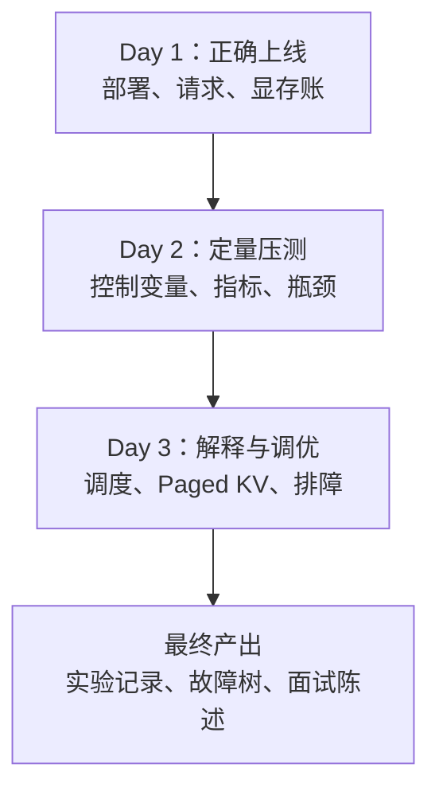
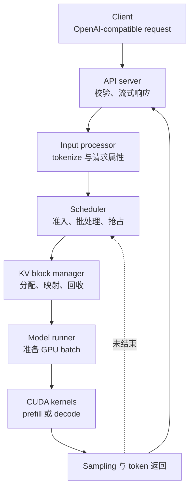

# vLLM 三天岗位实战学习文档设计

## 背景

当前仓库已经覆盖 prefill、decode、KV Cache、PagedAttention、continuous batching 和 CUDA 性能分析，但 vLLM 只作为推理框架被简要提及。面向 AI Infra、Model Serving 和推理性能岗位，还需要一份把已有 CUDA/推理知识迁移到真实 serving 工作流的短周期教材。

本文档采用岗位任务驱动方式：模拟接手一个 Qwen 8B 在线推理服务，依次完成正确上线、定量压测、调优排障和面试表达，而不是罗列 vLLM API 或完整通读源码。

## 目标

默认使用 Linux、单张 A100 80GB 和 Qwen 8B 级模型。学习者完成三天内容后应能够：

1. 启动 vLLM 的 OpenAI-compatible server，并完成健康检查和正确性验证。
2. 设计控制输入长度、输出长度、请求速率和并发量的可复现 benchmark。
3. 区分 TTFT、TPOT、ITL、端到端延迟、请求吞吐和 token 吞吐。
4. 从模型权重、CUDA runtime、KV Cache 和临时 workspace 解释显存占用。
5. 沿请求生命周期解释 API 层、输入处理、scheduler、KV block manager、worker、model runner 和 CUDA kernels 的职责。
6. 根据吞吐、延迟和显存目标调整关键参数，并排查 OOM、低吞吐、TTFT 高和 TPOT 抖动。
7. 用两到三分钟完成面试级项目陈述，并明确哪些数据来自实测。

## 非目标

- 不完整通读 vLLM 源码，不逐文件解释内部实现。
- 不开展多机、多节点或生产 Kubernetes 部署。
- 不枚举所有模型、量化格式和版本兼容矩阵。
- 不承诺脱离具体版本仍永久有效的命令、类名或参数默认值。
- 不伪造 A100 性能结果；教材只提供记录表、现象预测和分析方法。
- 不重复大篇讲解 Attention、KV Cache 和 PagedAttention 基础，而是链接仓库已有专题。

## 组织方案

采用“先使用、再测量、后解释与调优”的三天闭环。

### Day 1：把服务正确跑起来

- 先做驱动、CUDA、GPU、Python 和 vLLM 安装验证，说明每项检查能排除什么问题。
- 解释模型权重、KV Cache 与运行时显存的基本账本，避免把 80GB 全部视为可分配 KV 空间。
- 跑通离线推理，再启动 OpenAI-compatible server。
- 使用健康检查、models 接口、chat/completions 请求和服务端日志完成四层验收。
- 记录版本、模型 revision、启动命令、环境和结果，保证后续实验可复现。

### Day 2：证明服务性能如何

- 先定义 TTFT、TPOT、ITL、端到端延迟、吞吐及 percentile，说明不同指标对应的用户体验。
- 固定随机种子、数据集、输入/输出长度、sampling 参数和 warmup。
- 依次扫描输入长度、输出长度、并发量或请求速率，一轮只改变一个主变量。
- 使用 vLLM 官方 benchmark 入口完成实验；命令以目标和参数语义组织，不依赖单个永久不变的 CLI 拼写。
- 根据 prefill compute、decode 权重/KV 读取、continuous batching、排队和显存容量解释曲线。
- 输出实验矩阵、原始数据位置、结果表和结论模板，不预填虚构数字。

### Day 3：定位问题并讲清架构

- 从一次请求进入服务到 token 流式返回，建立组件职责图。
- 解释 scheduler 如何在 waiting/running 请求间选择工作，以及 continuous batching 如何动态加入和退出请求。
- 将 Paged KV、block table、KV capacity、prefix caching 和 preemption 放回请求生命周期。
- 将关键参数按显存、调度/批处理、上下文、执行/并行和观测分类，讲清调参方向和副作用。
- 用决策树处理启动 OOM、运行时 OOM、低吞吐、高 TTFT、高 TPOT/ITL 和抖动。
- 给出 30 秒框架回答、两分钟项目回答、常见追问与边界表述。

## 请求生命周期

教材使用下图贯穿三天。Day 1 从外部使用这条路径，Day 2 用指标观察它，Day 3 再打开内部组件解释现象。

> 具体内部类名和文件路径会随 vLLM 版本演进。最终教材应区分“稳定职责”与“当前源码入口”，并要求读者以安装版本和官方文档为准。

## 文档组件

最终只新增一份主体教材，并修改知识目录入口：

- `docs/courses/inference/vLLM三天岗位实战.md`：完整三天教材、实验、排障和面试内容。
- `docs/README.md`：在 Attention / KV / 推理分区增加教材入口。

主体教材包含以下固定组件：

1. 开篇的适用人群、前置知识、环境和三天验收表。
2. 每天的“学习目标 → 原理最小集 → 动手实验 → 结果记录 → 闭卷验收”。
3. 命令前的用途说明、可变占位符和版本检查，不给无法解释的一长串参数。
4. 指标公式、显存账本、参数取舍表和实验记录表。
5. 请求生命周期图、benchmark 数据流图和故障排查树。
6. 当前官方资料链接及仓库内部专题链接。
7. 面试回答、项目表达和后续源码深挖入口。

## 版本与事实策略

vLLM 演进较快，最终写作遵循以下规则：

- 安装、serve、benchmark、metrics、参数和架构结论优先查 vLLM 当前官方文档。
- 当前日期写入文档，并提示读者先运行版本查询和 `--help`。
- 将稳定概念与易变接口分开：scheduler、continuous batching、Paged KV 和性能指标讲稳定职责；命令及源码入口标记版本敏感。
- 不复制大型官方参数清单，只选择能形成岗位实验闭环的参数。
- 若官方文档与历史 PagedAttention 论文表述不同，以当前实现文档为准，并保留原论文作为思想来源。

## 实验与验收

### 正确性证据

- 服务进程和端口正常。
- 模型列表接口返回目标模型。
- 非流式请求获得合法响应。
- 流式请求逐 token 返回并正常结束。
- 服务端无 CUDA、OOM 或模型加载错误。

### 性能证据

每轮实验至少记录：

- vLLM、Python、PyTorch、CUDA 和驱动版本；
- GPU 型号、模型、dtype、revision 与启动参数；
- 数据集或 synthetic 输入定义、输入/输出长度；
- 请求数、并发量或请求速率、warmup 方式；
- TTFT、TPOT/ITL、端到端延迟、请求吞吐和 token 吞吐的适用指标；
- GPU 显存和利用率观测；
- 原始结果文件位置和一句基于证据的结论。

### 文档验收

1. 所有关键命令之前都说明用途，命令中的模型和路径使用统一变量。
2. 指标定义不存在 TTFT、TPOT、ITL 混用。
3. benchmark 至少包含低并发基线、并发扫描和长上下文对照。
4. 参数表对每项参数说明影响对象、调大收益、代价和适用场景。
5. 故障树覆盖启动 OOM、运行时 OOM、吞吐低、TTFT 高及 TPOT/ITL 抖动。
6. 内部链接和外部官方链接有效，Markdown 结构通过仓库校验。
7. 不出现虚构实测数据、无来源版本断言或永久化功能排行榜。

## 实施边界

本次只创建 vLLM 主体教材、必要的设计/计划文档，并在知识目录添加入口。不会修改当前四周聚焦计划的执行阶段；vLLM 教材作为后续岗位速成专题存在，不抢占当前 PTX/SASS 主线。