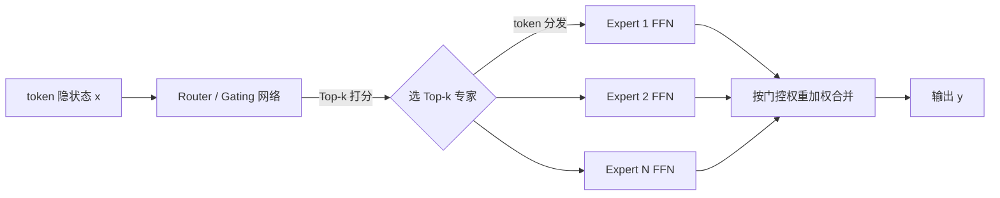
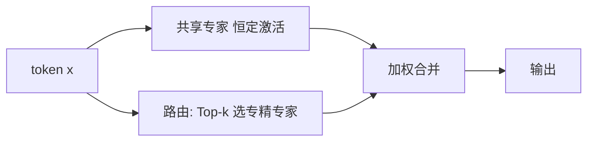
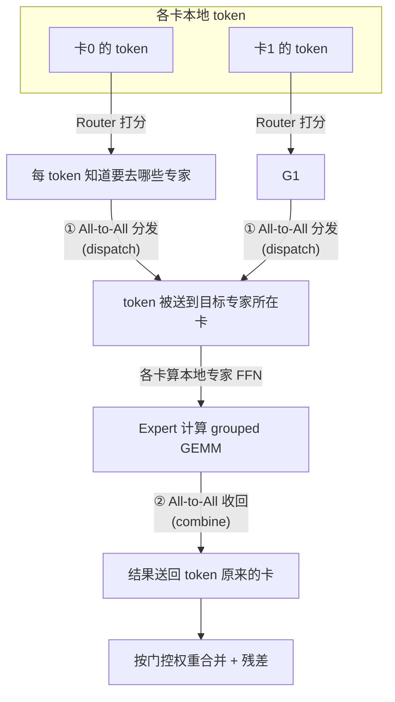

# MoE 与多卡并行 · 系统学习

> 面向对象：资深 C++ 高性能工程师，已完成单卡 CUDA Week1-5（GEMM 优化阶梯 / FlashAttention / online softmax / 融合 RMSNorm / CUDA Graph / INT8 GEMV），会用 Nsight Compute 做 roofline 分析。单卡能力够，**MoE 与多卡并行是最大盲区**。本文补这块。
>
> **诚实边界（务必先读）**：本文绝大部分是**理解性知识 + 原理推导**。你只有单卡 A100，没有多卡环境，**没有跑过真实 NCCL / all-to-all / 多卡训练**。
> - ✅ 面试可以讲：这些原理、通信量推导、并行策略取舍、DeepSeek 开源栈在解决什么。
> - ❌ 简历/面试**不能声称**：做过多卡实测、跑过 NCCL busbw、训过 MoE、有 EP 落地经验。
> - 被问到就诚实说"这块我理解原理，但没有多卡环境实测过"。原理讲清楚本身就是加分，谎称实测一旦被追问细节就崩。
> - 全文凡涉及"需要真机才能验证"的数字/现象，用 `【需实测】` 标注。

---

## 目录

1. [为什么要 MoE](#1-为什么要-moe)
2. [MoE 的结构](#2-moe-的结构)
3. [DeepSeek MoE 的设计特点](#3-deepseek-moe-的设计特点)
4. [四种并行策略：DP / TP / PP / EP](#4-四种并行策略dp--tp--pp--ep)
5. [专家并行 EP 深讲](#5-专家并行-ep-深讲)
6. [混合并行：DeepSeek 实际怎么切](#6-混合并行deepseek-实际怎么切)
7. [集合通信原语与通信量](#7-集合通信原语与通信量)
8. [NCCL 关键点](#8-nccl-关键点)
9. [all-to-all 为什么难优化](#9-all-to-all-为什么难优化)
10. [DeepSeek 开源栈在解决什么](#10-deepseek-开源栈在解决什么)
11. [面试追问 20 题](#11-面试追问-20-题)

---

## 1. 为什么要 MoE

### 1.1 一句话

**MoE 把"模型参数量"和"单次前向的计算量"解耦了。** 稠密模型每个 token 都要走过全部参数；MoE 让每个 token 只激活一小部分专家，于是可以把总参数量堆到很大（记忆容量大），但每个 token 的 FLOPs 几乎不变。

> **CPU 类比**：像一个大型服务集群里做**一致性哈希路由**——请求总量不变，但你可以横向扩很多分片（专家），每个请求只打到 Top-2 个分片，而不是广播到全部分片。总容量涨了，单请求成本没涨。

### 1.2 稠密 vs 稀疏激活

| | 稠密 Dense FFN | 稀疏 MoE FFN |
| --- | --- | --- |
| 参数总量 | $P$ | $E \times P_{expert}$（可远大于 $P$） |
| 单 token 激活参数 | 全部 $P$ | 只激活 $k$ 个专家 ≈ $k \times P_{expert}$ |
| FLOPs / token | 高 | 低（只算 Top-k） |
| 显存（存权重） | 小 | **大**（所有专家都要存显存） |

核心权衡：**MoE 用"更多显存存参数"换"更低的单 token 计算量 + 更强的模型容量"**。这也决定了它天然需要多卡——参数太大单卡存不下。

### 1.3 经济学动机

- 训练/推理算力越来越贵，稠密模型想变强只能堆 FLOPs（线性涨成本）。
- MoE 让"总参数（能力）"和"激活 FLOPs（成本）"分离：DeepSeek-V3 总参 671B，但每 token 只激活约 37B。**用 5% 的激活量拿到接近全量的能力**。
- 代价转移到：显存容量（存全部专家）+ 通信（token 要路由到专家所在卡，产生 all-to-all）。**MoE 把"计算瓶颈"换成了"访存 + 通信瓶颈"**——这正好是你擅长的领域。

> **关键结论**：MoE = 参数量与激活量解耦；省的是 FLOPs，付出的是显存和通信。理解 MoE 系统优化，本质是理解**怎么把 all-to-all 通信藏起来**。

> **高频易错**：说"MoE 省算力所以更快"——不对。省的是 FLOPs，但引入 all-to-all 通信和负载不均，**端到端不一定更快**（尤其 decode 小 batch 时）。省的是"达到同等能力所需的算力"，不是"同等参数下更快"。

---

## 2. MoE 的结构

一个 MoE 层替换掉 Transformer block 里的 FFN。数据流：



### 2.1 Router / Gating（门控）

- 一个小的线性层：$g = \text{softmax}(W_g \cdot x)$，输出每个专家的得分。
- **Top-k 路由**：只保留得分最高的 $k$ 个专家（如 Top-2）。其余专家对这个 token 不激活。
- 输出 = $\sum_{i \in \text{TopK}} g_i \cdot \text{Expert}_i(x)$，用门控得分做加权。

### 2.2 Expert（专家）

- 每个专家就是一个独立的 FFN（通常是 SwiGLU / GLU 结构）。
- 专家之间参数**不共享**。$E$ 个专家 = $E$ 份 FFN 权重。

### 2.3 负载均衡（MoE 的头号工程难题）

路由是学出来的，容易**塌缩**：所有 token 都爱去某几个热门专家，冷专家饿死。后果：热专家算力打满（拖慢整层），冷专家白占显存。

对策：

| 机制 | 作用 |
| --- | --- |
| **Auxiliary loss（负载均衡损失）** | 训练时加一项惩罚，鼓励 token 均匀分布到各专家 |
| **Capacity factor（容量因子）** | 每个专家设一个 token 容量上限 $C = \text{factor} \times \frac{\text{tokens}}{E}$，超出的 token 被 **drop（丢弃/走残差）** 或 **pad（补空）** |
| **Drop / Pad** | 为了让每个专家收到**定长** token（GPU 喜欢规整 shape，便于批量 GEMM），超容量丢弃、不足补零 |
| **无 aux-loss 均衡** | DeepSeek-V3 用的：给每个专家一个可动态调整的 bias 项来均衡，避免 aux-loss 损害模型质量 |

> **CPU 类比**：capacity factor 就是**令牌桶 / 限流**——每个专家（后端分片）有固定处理配额，超了就降级丢弃，保证系统不被热点打垮，也保证 batch 是定长好并行。

> **关键结论**：MoE 的路由是"学出来的哈希"，天然不均衡；capacity factor + drop/pad 是"用限流换规整 shape"。均衡好坏直接决定 GPU 利用率。

> **高频易错**："Top-2 就是选 2 个专家算然后平均"——不是平均，是**用 softmax 门控得分加权**。也别忘了容量溢出的 token 会被 drop，drop 率高会掉点。

---

## 3. DeepSeek MoE 的设计特点

DeepSeek 相比经典 MoE（如 Switch/GShard）两个关键改动：

### 3.1 细粒度专家（Fine-grained Experts）

- 把每个专家切得更小、专家数更多（比如从 16 个大专家 → 64 个小专家，每个 FFN 中间维度更小）。
- 同样激活预算下（如激活 8 个小专家 vs 2 个大专家），**组合数爆炸**：$\binom{64}{8} \gg \binom{16}{2}$，模型能表达更精细的知识分工。
- 代价：专家更多 → 路由更碎 → all-to-all 更不规则（对通信库要求更高，所以要 DeepEP）。

### 3.2 共享专家隔离（Shared Expert Isolation）

- 拿出 1-2 个专家当**共享专家**：**所有 token 都过**（不参与路由，恒定激活）。
- 其余是路由专家（Top-k 选）。
- 动机：通用知识（每个 token 都需要的）交给共享专家统一承载，路由专家就能专注学**差异化/专精知识**，减少每个路由专家都重复学一遍公共部分的冗余。



> **关键结论**：DeepSeek MoE = 细粒度（更多更小专家，组合表达力强）+ 共享专家（公共知识隔离，专精专家不做重复功）。这两点也让它的路由更碎、更依赖高效 all-to-all。

---

## 4. 四种并行策略：DP / TP / PP / EP

多卡训练/推理的四种切法。**关键是分清：切的是什么、卡之间通信什么、通信量多大。**

| 并行 | 切什么 | 每张卡有什么 | 卡间通信 | 通信原语 | 通信频率 |
| --- | --- | --- | --- | --- | --- |
| **DP** 数据并行 | 切 **batch**（数据） | 每卡一份**完整模型** | 同步梯度 | **AllReduce** | 每步一次（反向后） |
| **TP** 张量并行 | 切**单个算子内的矩阵** | 每卡一片权重（列/行切） | 每层前后拼接激活 | AllReduce / AllGather | **每层多次**（很频繁） |
| **PP** 流水并行 | 切**层**（模型纵向分段） | 每卡若干连续层 | 传激活/梯度到下一段 | **P2P Send/Recv** | 段边界，点对点 |
| **EP** 专家并行 | 切 **MoE 的专家** | 每卡若干专家 | token 路由到专家所在卡 | **All-to-All** | 每个 MoE 层两次 |

### 4.1 DP（数据并行）

- 最简单：每卡完整模型副本，各喂不同 batch，反向后 **AllReduce 梯度**求平均。
- 瓶颈：模型必须能单卡放下；AllReduce 通信量 ∝ 模型参数量。
- ZeRO / FSDP 是 DP 的优化：把优化器状态/梯度/参数分片到各卡省显存，用 ReduceScatter + AllGather 替代 AllReduce。

### 4.2 TP（张量并行）

- 把一个大矩阵乘 $Y = XW$ 按列切 $W = [W_1, W_2]$，各卡算 $XW_i$，再 AllGather 拼起来；或按行切配 AllReduce。
- **通信非常频繁**（每层 forward/backward 都要通信），所以 **TP 只在单机内 NVLink 卡间用**（带宽高），不跨机。
- 典型：一台 8 卡机内 TP=8。

### 4.3 PP（流水并行）

- 模型按层纵向切成 stage，卡1 算 layer 1-8，卡2 算 9-16……激活在 stage 间 P2P 传递。
- 问题：**流水气泡（bubble）**——前几个和后几个 micro-batch 时段有卡空转。用 micro-batch + 调度（1F1B、interleaved）减少气泡。DeepSeek 的 **DualPipe** 就是干这个。

### 4.4 EP（专家并行）—— MoE 专属

- 专家太多单卡放不下，就把 $E$ 个专家分到 $N$ 张卡（如 64 专家 / 8 卡 = 每卡 8 专家）。
- token 经过路由，要被送到它选中的专家所在的卡 → **All-to-All**。下一节详讲。

> **关键结论**：
> - DP 切数据、AllReduce 梯度、每步一次；
> - TP 切矩阵、通信最频繁、只在 NVLink 机内用；
> - PP 切层、P2P 传激活、要防气泡；
> - EP 切专家、All-to-All 路由 token、是 MoE 独有。

> **高频易错**：把 TP 和 EP 混为一谈。TP 切的是**同一个算子内部的权重矩阵**（一个 FFN 被拆到多卡协作算完）；EP 切的是**不同的专家**（每卡算完整的几个专家，token 去找专家）。TP 是"一个活多卡分工"，EP 是"多个活分给多卡，把活的输入运过去"。

---

## 5. 专家并行 EP 深讲

### 5.1 为什么 MoE 用 EP 而不是纯 TP

- 专家彼此独立（不同 FFN），天然适合"一卡负责几个完整专家"——这比把每个专家再 TP 切开通信少。
- 如果纯 TP 切每个专家，通信会爆炸（每个专家每层都要 AllReduce）。EP 只在 MoE 层做两次 all-to-all，粒度粗得多。

### 5.2 EP 的数据流（核心）

假设 8 卡，每卡 8 专家。一个 MoE 层内：



两次 all-to-all：
1. **Dispatch（分发）**：每张卡把自己的 token，按路由结果，发给专家所在的卡。
2. **Combine（收回）**：专家算完，把结果发回 token 原来所在的卡。

中间的专家计算是 **grouped GEMM**（每个专家收到一批 token，做一次批量矩阵乘）。

### 5.3 为什么 all-to-all 是 MoE 的性能瓶颈

- 每个 MoE 层都要 **2 次 all-to-all**，一个大模型几十层 MoE → 几十上百次 all-to-all。
- all-to-all 通信量大且**不规则**（每卡发给每卡的量取决于路由，动态变化）。
- 计算（grouped GEMM）夹在两次通信中间，**天然串行**，难重叠 → GPU 容易空等通信。

> **通信量直觉**：设每卡 $T$ 个 token，hidden 维 $H$，Top-k=$k$。dispatch 阶段每张卡要发出约 $k \cdot T \cdot H$ 个元素（每 token 复制 k 份去 k 个专家），均匀情况下发给其他 $N-1$ 卡。combine 对称。**通信量 ∝ token 数 × hidden × k**，与专家数关系体现在分布是否均匀上。

> **关键结论**：EP 每层两次 all-to-all（dispatch + combine），中间夹 grouped GEMM。瓶颈不是算，是**通信 + 通信和计算难重叠**。优化 MoE 系统 = 优化 all-to-all + 想办法让它和计算 overlap。

> **高频易错**：以为 EP 里"token 不动、只同步结果"。恰恰相反——**EP 是把 token（激活）搬到专家那里**，搬来搬去正是开销来源。这跟 DP（搬梯度）、TP（搬激活片段）都不同。

---

## 6. 混合并行：DeepSeek 实际怎么切

真实大模型不是只用一种，而是**组合**（3D/4D 并行）：

```
总卡数 = DP × PP × TP × EP  （维度相乘，各自负责一块）
```

典型组合思路：
- **TP** 在机内（NVLink 高带宽），切注意力和稠密部分的大矩阵。
- **EP** 切 MoE 专家，可能跨机（靠 all-to-all）。
- **PP** 切层，把超深模型分到更多机器，用 DualPipe 压气泡。
- **DP / ZeRO** 在最外层切 batch + 分片优化器状态省显存。

DeepSeek-V3 的做法（理解要点，非实测）：
- 大规模 **EP**（专家跨很多卡），配 **DeepEP** 做高效 all-to-all（含跨机 RDMA + 机内 NVLink 分层）。
- **DualPipe** 做流水并行，让 all-to-all 通信和计算**双向重叠**，压 PP 气泡。
- FP8 训练（**DeepGEMM**）省算力和带宽。

> **关键结论**：真实系统是 DP×TP×PP×EP 的乘积组合，按"通信频率匹配带宽层级"分配：越频繁的通信（TP）放越快的链路（机内 NVLink），越粗的（DP/EP 可跨机）放较慢链路（RDMA）。

> **高频易错**：说"多卡就调 NCCL 自动线性扩展"。**扩展效率受通信/计算比、拓扑、负载均衡制约**，尤其 MoE 的 all-to-all 极易成为扩展瓶颈，远非线性。

---

## 7. 集合通信原语与通信量

这是多卡的"指令集"。必须能背语义 + 数据分布 + 通信量。

设 $N$ 张卡，每卡持有数据量 $S$。

| 原语 | 语义 | 结果 | 单卡通信量（ring） |
| --- | --- | --- | --- |
| **Broadcast** | 一卡的数据发给所有卡 | 大家都有这份 | ~$S$ |
| **Reduce** | 所有卡数据求和到一张卡 | 一卡有总和 | ~$S$ |
| **AllReduce** | 所有卡求和，结果所有卡都有 | 大家都有总和 | $2\frac{N-1}{N}S$ |
| **ReduceScatter** | 求和，但每卡只留一段结果 | 各卡持结果的 1/N | $\frac{N-1}{N}S$ |
| **AllGather** | 每卡出一段，拼成全量给所有卡 | 大家都有全量拼接 | $\frac{N-1}{N}S$ |
| **All-to-All** | 每卡给每卡发**不同**的一段（转置） | 各卡结果不同 | ~$\frac{N-1}{N}S$ |

### 7.1 关键恒等式

$$\text{AllReduce} = \text{ReduceScatter} + \text{AllGather}$$

先各卡负责规约一段（ReduceScatter），再把各段广播拼全（AllGather）。这就是 ring-AllReduce 的实现，通信量 $2\frac{N-1}{N}S$——**注意是 2 倍**，别答成 $S$。

### 7.2 AllGather vs All-to-All（最爱考）

- **AllGather**：每卡出一段，最后**所有卡拿到同样的全量拼接**（结果相同）。像"大家交作业，然后每人复印一份全班合集"。
- **All-to-All**：每卡给**每个其他卡发不同的一段**，各卡收到的不一样（结果不同）。像**矩阵转置** / 分布式 **shuffle**。

> **CPU 类比**：All-to-All 就是 MapReduce 里的 **shuffle 阶段**——每个 mapper 按 key 把数据分发给不同的 reducer，正是"个性化重分布"。你做过分布式数据平台，这个直觉是现成的。

> **关键结论**：AllReduce 通信量 $2\frac{N-1}{N}S$（=RS+AG）；AllGather 是"广播式收集，人人相同"；All-to-All 是"个性化重分布，人人不同"，就是 shuffle/转置，MoE 的 EP 靠它。

> **高频易错**：① AllReduce 通信量答成 $S$（漏了 2 倍）。② 把 AllGather 和 All-to-All 搞混。③ 认为集合通信量只跟数据大小有关——还跟拓扑和算法（ring/tree）强相关。

---

## 8. NCCL 关键点

NCCL = NVIDIA 的集合通信库，在 GPU 拓扑上实现上面这些原语。

### 8.1 算法由拓扑决定，不是固定的

- **Ring 算法**：把卡连成环，适合**大消息**（带宽最优，通信量 $2\frac{N-1}{N}S$）。
- **Tree 算法**：树形规约，适合**小消息/多机**（延迟低）。
- NCCL 会根据消息大小、卡数、拓扑**自动选**。别说"NCCL 永远用 ring"。

### 8.2 有效带宽 ≠ 标称带宽

- NVLink/NVSwitch/PCIe 的标称带宽是**物理峰值**（双向、理想）。
- 实际有效带宽打折扣，受：协议开销、消息大小（小消息 latency-bound 拿不到峰值）、拓扑（是否过 NVSwitch）、争用、单/双向、对齐。
- 用 **nccl-tests** 实测，看两个指标：
  - **algbw（算法带宽）**：数据量 / 时间，用户视角。
  - **busbw（总线带宽）**：换算到物理链路的等效带宽（algbw 乘以算法系数，如 AllReduce ×$\frac{2(N-1)}{N}$），用来对比是否接近硬件峰值。【需实测】

### 8.3 带宽层级（决定并行策略怎么放）

| 链路 | 量级 | 放什么并行 |
| --- | --- | --- |
| 机内 NVLink / NVSwitch | 数百 GB/s ~ TB/s | TP（最频繁通信） |
| 跨机 RDMA / IB | 数十~百 GB/s | DP / EP（较粗通信） |
| PCIe | 十几 GB/s | 尽量避开热路径 |

> **关键结论**：NCCL 算法随拓扑/消息大小自适应；标称带宽只是上限，真实看 busbw 实测；并行策略要"频繁通信配高带宽链路"。

> **高频易错**：① "调了 NCCL 就线性扩展"。② 把标称带宽当有效带宽。③ 把数学原语（AllReduce）和固定拓扑算法（ring）绑死。

---

## 9. all-to-all 为什么难优化

这是 MoE 系统优化的核心难点，也是 DeepEP 存在的理由。

1. **不规则/动态**：每卡发给每卡多少，取决于本 step 的路由结果，运行时才知道，无法静态排布。
2. **突发流量**：一个 MoE 层瞬间产生一波密集全交换，链路瞬时打满、易拥塞。
3. **和计算难重叠**：数据流是 `dispatch(通信) → grouped GEMM(计算) → combine(通信)`，天然串行——计算要等 token 到齐才能开始，结果要等算完才能发回。GPU 容易卡在通信上空转。
4. **跨机 + 机内混合**：token 有的去本机专家（走 NVLink），有的去别的机（走 RDMA），要分层调度才高效。
5. **小消息多**：细粒度专家 + Top-k 让每对卡之间的消息变小变多，落到 latency-bound 区间，拿不到带宽峰值。

**优化方向**：
- **计算通信重叠**：把 token 分块（chunk），一批在通信时另一批在计算，流水起来（类似你熟悉的 double buffering，但跨卡）。
- **分层 all-to-all**：先机内 NVLink 聚合，再跨机 RDMA，减少跨机小消息数。
- **通信 kernel 融合**：把 dispatch/combine 做成高效 CUDA kernel，减少拷贝。

DeepEP 就是把这些做到极致的专用库。

> **关键结论**：all-to-all 难在"动态 + 突发 + 难重叠 + 跨层级"。优化就是"分块流水重叠 + 分层聚合 + kernel 融合"——本质和你在 CPU 上做的"隐藏延迟、批量化、减少拷贝"是同一套思想，换到跨卡场景。

---

## 10. DeepSeek 开源栈在解决什么

把前面讲的瓶颈和 DeepSeek 开源的几个库对上号（这是你目标岗位的"必读清单"）：

| 库 | 解决什么 | 对应前文哪个瓶颈 |
| --- | --- | --- |
| **DeepEP** | EP 的高效 all-to-all 通信库：机内 NVLink + 跨机 RDMA 分层、dispatch/combine kernel、计算通信重叠、低延迟 decode 模式 | §5/§9 的 all-to-all 瓶颈 |
| **DeepGEMM** | 高效 FP8 GEMM 库（含 MoE 的 grouped GEMM），用 FP8 省算力和带宽 | §5.2 专家计算的 grouped GEMM + 精度/带宽 |
| **FlashMLA** | 针对 DeepSeek MLA（Multi-head Latent Attention）优化的 attention decode kernel，省 KV cache 带宽 | attention/decode 访存瓶颈（你 FlashAttention 的进阶） |
| **DualPipe** | 双向流水并行调度，让前向/反向和 all-to-all 通信**双向重叠**，压 PP 气泡 | §4.3 PP 气泡 + §9 计算通信重叠 |
| **3FS / smallpond** | 高性能分布式文件系统 / 数据处理，喂数据用 | 数据 IO（你的数据平台老本行） |

学习顺序建议：**FlashMLA（延续你的 attention）→ DeepGEMM（延续你的 GEMM）→ DeepEP（补 EP/all-to-all）→ DualPipe（补流水）**。前两个能接上你已有的单卡功底，后两个是多卡新知识。

> **关键结论**：DeepSeek 开源栈就是"把 MoE 多卡训练/推理的每个瓶颈各配一把专用刀"。你能从 FlashMLA/DeepGEMM 切入（有单卡基础），再往 DeepEP/DualPipe 扩多卡认知。

---

## 11. 面试追问 20 题

> 用法：先自己闭卷答，再对照要点。带 `【需实测】` 的诚实说"没多卡环境实测过，讲原理"。

**Q1. MoE 相比稠密模型省了什么，代价是什么？**
省 FLOPs（激活量与参数量解耦），代价是显存（存全部专家）+ 通信（all-to-all 路由）+ 负载不均。省的是"达到同等能力的算力"，不是无条件更快。

**Q2. Top-2 路由具体怎么算输出？**
Router 出各专家 softmax 得分，取 Top-2 专家，输出 = 两个专家 FFN 输出按门控得分加权和，再加残差。不是简单平均。

**Q3. 什么是 capacity factor？为什么要 drop token？**
每专家 token 容量上限 $C=\text{factor}\times \text{tokens}/E$。为让每专家收到**定长** batch（GPU 批量 GEMM 需要规整 shape），超容量的 token 被 drop（走残差）或 pad 补齐。类比令牌桶限流。

**Q4. DP / TP / PP / EP 分别切什么、通信什么？**
DP 切数据、AllReduce 梯度；TP 切算子内矩阵、每层 AllReduce/AllGather 激活；PP 切层、P2P 传激活；EP 切专家、All-to-All 路由 token。见 §4 表格。

**Q5. 为什么 TP 只在机内用，EP 可以跨机？**
TP 通信最频繁（每层多次），必须配最高带宽（NVLink）。EP 每 MoE 层才 2 次 all-to-all，粒度粗，可容忍跨机 RDMA。

**Q6. MoE 为什么用 EP 不用纯 TP 切专家？**
专家彼此独立，一卡负责几个完整专家通信最省。纯 TP 切每个专家会让每专家每层都 AllReduce，通信爆炸。

**Q7. EP 里一个 MoE 层有几次通信？分别是什么？**
两次 all-to-all：dispatch（token 发到专家所在卡）+ combine（结果发回原卡）。中间是 grouped GEMM。

**Q8. all-to-all 通信量怎么估算？**
∝ token 数 × hidden × Top-k。每卡约发 $k\cdot T\cdot H$ 元素给其他卡，dispatch/combine 对称。均匀性由负载均衡决定。

**Q9. AllReduce 的通信量是多少？为什么？**
$2\frac{N-1}{N}S$。因为 AllReduce = ReduceScatter($\frac{N-1}{N}S$) + AllGather($\frac{N-1}{N}S$)，是 2 倍，别答成 $S$。

**Q10. AllGather 和 All-to-All 的区别？**
AllGather：每卡出一段，人人拿到相同全量拼接。All-to-All：每卡给每卡发不同段，人人结果不同，是转置/shuffle。MoE 的 EP 用 All-to-All。

**Q11. 为什么 all-to-all 难和计算重叠？怎么优化？**
数据流 dispatch→GEMM→combine 天然串行，计算要等 token 到齐。优化：token 分 chunk 做流水，一批通信时另一批计算；分层 all-to-all（机内 NVLink 先聚合再跨机）；kernel 融合。DeepEP 做这些。

**Q12. NCCL 一定用 ring 吗？**
不是。ring 适合大消息（带宽优），tree 适合小消息/多机（延迟低），NCCL 按消息大小/拓扑/卡数自动选。

**Q13. 标称 NVLink 带宽和实际能拿到的一样吗？**【需实测】
不一样。标称是物理峰值，实际受协议开销、消息大小、拓扑、争用影响。用 nccl-tests 看 busbw 实测，通常是峰值的折扣。

**Q14. busbw 和 algbw 区别？**【需实测】
algbw = 数据量/时间（用户视角）；busbw = algbw × 算法系数（如 AllReduce ×$\frac{2(N-1)}{N}$），换算到物理链路等效带宽，用来判断是否接近硬件上限。

**Q15. MoE 负载不均衡有什么后果？怎么缓解？**
热专家算力打满拖慢整层、冷专家白占显存。缓解：aux-loss、capacity factor + drop/pad、DeepSeek 的无 aux-loss bias 均衡。

**Q16. DeepSeek MoE 的细粒度专家 + 共享专家各解决什么？**
细粒度：更多更小专家 → 组合表达力强。共享专家：公共知识统一承载，路由专家专注专精、不重复学公共部分。

**Q17. 稀疏激活省了 FLOPs，为什么不一定省 latency？**
引入 all-to-all 通信 + 负载不均 + 小 batch 下 grouped GEMM 利用率低。decode 阶段尤其明显：batch 小、专家激活稀疏、访存 bound，通信占比高，可能比稠密还慢。

**Q18. decode 阶段 MoE 的特殊挑战？**
batch 小（每 step 少量 token），专家被稀疏激活、每专家 token 数少 → grouped GEMM 是访存/延迟 bound；all-to-all 变成大量小消息 latency-bound。所以 DeepEP 专门有低延迟 decode 模式。

**Q19. DualPipe 解决什么？**
PP 的流水气泡 + all-to-all 难重叠。用双向流水调度让前向/反向计算和通信双向重叠，提高 GPU 利用率。

**Q20. 你既然没多卡环境，怎么证明你能做 MoE Infra？**（诚实话术）
"多卡实测我没条件做，我不假装有。但我理解 MoE 的通信瓶颈本质是 all-to-all 的隐藏延迟和批量化问题——这和我在 CPU 上做的分布式 shuffle、隐藏 IO 延迟、批处理摊薄开销是同一套思想。我单卡已经手写过 GEMM 优化、FlashAttention、量化 GEMV，会用 Nsight 做 roofline。给我多卡环境，我有信心把这套性能工程直觉迁过去。"

---

## 附：一句话记忆卡

- **MoE**：参数与激活解耦，省 FLOPs 付出显存+通信。
- **负载均衡**：capacity factor = 令牌桶限流换定长 batch。
- **DP** 切数据·AllReduce 梯度；**TP** 切矩阵·机内高频；**PP** 切层·防气泡；**EP** 切专家·All-to-All。
- **AllReduce = RS + AG，通信量 $2\frac{N-1}{N}S$**。
- **AllGather 人人相同；All-to-All 人人不同（=shuffle/转置）**。
- **MoE 瓶颈 = all-to-all（动态+突发+难重叠）**，DeepEP 解决它。
- **DeepSeek 栈**：DeepEP(通信)·DeepGEMM(FP8 GEMM)·FlashMLA(attention)·DualPipe(流水重叠)。
- **诚实**：原理我懂，多卡实测没做过，不吹。
