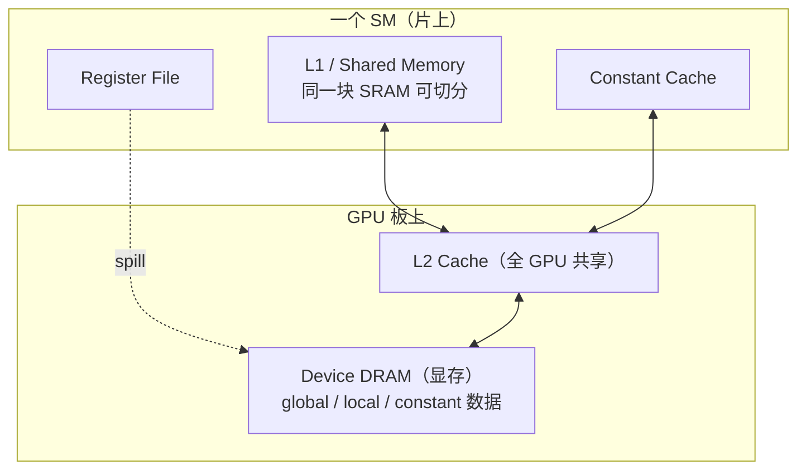

# CUDA 内存模型详解（Deep Dive）

> 目标：从"有哪些内存"一路深入到"多个线程读写同一块内存时，谁先谁后、谁能看见谁"。
> 硬件基准：**Tesla T4 / Turing / Compute Capability 7.5 / `-arch=sm_75`**，标注「架构相关」的数字换卡会变。
> 配套实验：`week02_memory/transpose/`、`cuda_deep_course/labs/03_memory_system/`。

---

## 0. 先分清：CUDA 有"两个"内存模型

很多人把"CUDA 内存模型"只理解成那张内存层次表，其实它有**两层完全不同的含义**，本文都讲：

| 层面 | 回答的问题 | 关键词 |
|------|-----------|--------|
| **存储层次模型** | 数据放在哪？多快？多大？谁能看见？ | register / shared / global / cache |
| **内存一致性模型** | 多个线程并发读写时，操作的**顺序**和**可见性**如何保证？ | scope / ordering / atomic / fence |

第 1–6 章讲存储层次（大多数教材停在这里），**第 7–9 章讲一致性模型**（真正的深水区，面试和正确性 bug 都在这）。

---

## 1. 两个视角：逻辑空间 vs 物理位置

理解内存模型的第一个坎：**CUDA 源码里的"内存空间"是逻辑概念，它和物理上数据存在哪里不是一一对应的。**

### 1.1 逻辑内存空间（你在代码里看到的）

```text
register     —— float sum = 0;
local        —— 线程私有，但可能在显存里（名字骗人）
shared       —— __shared__ float tile[...];
global       —— cudaMalloc 得到的指针
constant     —— __constant__ float coef[...];
texture      —— 通过 texture object 读取
```

### 1.2 物理存储（硬件上真实的器件）

```text
片上（on-chip，在 SM 内部，快）：
    寄存器文件 Register File
    L1 / Shared Memory（同一块 SRAM 物理上分割）
    常量缓存 Constant Cache
    只读/纹理缓存

片外（off-chip，在 GPU 板上的 DRAM，慢）：
    Device DRAM（global / local / constant 的"家"都在这）
    其上覆盖一层全 GPU 共享的 L2 Cache
```

### 1.3 关键对应关系（容易踩坑的地方）

| 逻辑空间 | 物理在哪 | 陷阱 |
|---------|---------|------|
| register | 片上寄存器文件 | 寄存器不够时会 **spill 到 local** |
| **local** | **片外 DRAM**（经 L1/L2 缓存） | 名字叫 local 却不在片上！ |
| shared | 片上 SRAM | 和 L1 共享同一物理 SRAM，可配置切分 |
| global | 片外 DRAM | 延迟高，靠 coalescing + 缓存 |
| constant | 片外 DRAM + 片上常量缓存 | 同地址广播极快，发散地址变慢 |

> **记忆**：`local memory` 是整个 CUDA 里命名最坑的——它**不在片上**，是显存里给线程的"私有溢出区"。寄存器放不下的局部数组就去这里，所以 spill 才会慢。



---

## 2. 内存层次总表（先建立全局印象）

| 内存 | 作用域 | 生命周期 | 物理位置 | 延迟（量级） | 容量（T4） | 声明/获取 |
|------|--------|---------|---------|------------|-----------|-----------|
| Register | 单线程 | 线程 | 片上 | ~1 周期 | 256 KB/SM（65536×32bit） | 自动 |
| Local | 单线程 | 线程 | 片外+缓存 | 几百周期（未命中） | 受显存限 | 自动（spill/大数组） |
| Shared | Block | Block | 片上 SRAM | ~20–30 周期 | 64 KB/SM，最多 48 KB/block 默认 | `__shared__` |
| Global | 整个 Grid + Host | 手动分配到释放 | 片外+L2 | ~400–800 周期 | ~16 GB | `cudaMalloc` |
| Constant | 整个 Grid（只读） | 程序/模块 | 片外+常量缓存 | 命中 ~几周期 | 64 KB 逻辑 | `__constant__` |
| Texture/Surface | 整个 Grid | 手动 | 片外+纹理缓存 | 类似 global，带采样 | 受显存限 | texture object |

> 延迟数字是**数量级直觉**，不是精确值，且强烈依赖架构与是否命中缓存。带宽方面：register/shared 是 TB/s 级，global DRAM 在 T4 上约 **320 GB/s**。

记住一条主线（贯穿所有优化）：

```text
作用域越小 → 越快 → 容量越小
线程  Register / Local
 ↓
Block Shared
 ↓
Grid  Global

优化 = 把数据从下层（慢）搬到上层（快）并尽量复用
```

---

## 3. 逐个深入：七种内存空间

### 3.1 Register（寄存器）

```cpp
int idx = blockIdx.x * blockDim.x + threadIdx.x;  // 标量 → 寄存器
float acc = 0.0f;                                  // 累加器 → 寄存器
```

- **作用域**：单线程私有，别的线程**完全看不到**（warp shuffle 是特例，见 §7.6）。
- **物理**：SM 内的寄存器文件，T4 每 SM 有 **65536 个 32-bit 寄存器**（=256 KB）。
- **分配**：由编译器决定，源码变量 ≠ 一个寄存器（可能被优化掉、复用、或变立即数）。
- **关键约束——寄存器是占用率（occupancy）的硬约束之一**：

```text
每线程用的寄存器越多 → 一个 SM 能同时驻留的线程越少
T4: 65536 寄存器/SM
  每线程 32 寄存器 → 最多 65536/32 = 2048 线程/SM（满）
  每线程 64 寄存器 → 最多 1024 线程/SM（占用率减半）
  每线程 128 寄存器 → 最多 512 线程/SM
```

- **Register Spilling（溢出）**：寄存器不够用时，编译器把值挪到 **local memory（片外！）**，访问骤慢。用以下命令观察：

```bash
nvcc -Xptxas=-v -arch=sm_75 kernel.cu
# 输出 registers、spill stores/loads、shared 用量
```

> **陷阱**：盲目用 `__launch_bounds__` 或 `-maxrregcount` 压低寄存器，可能换来 spill，反而更慢。要看 profiler，不要拍脑袋。

### 3.2 Local Memory（线程私有，但在片外）

什么时候变量会进 local？

```cpp
__global__ void k() {
    float tmp[64];           // 大数组、且下标不是编译期常量 → 极可能进 local
    // ...
}
```

- 触发条件：① 寄存器压力过大 spill；② 无法静态索引的局部数组；③ 太大的私有对象。
- **物理在 DRAM**，但经 L1/L2 缓存，命中时不算太糟，未命中就是几百周期。
- 排查：`-Xptxas=-v` 看 spill；Nsight Compute 看 local memory traffic。

> **记忆**：local 私有 = 逻辑作用域；DRAM = 物理位置。两件事别混。

### 3.3 Shared Memory（片上，Block 内协作的核心）

```cpp
__shared__ float tile[32][33];   // 静态：编译期定大小

extern __shared__ float buf[];   // 动态：launch 时定大小
kernel<<<grid, block, bytes>>>(...);
```

- **作用域**：同一 block 内所有线程共享；跨 block **不可见**。
- **生命周期**：随 block，block 结束即释放。
- **物理**：片上 SRAM，**和 L1 共用同一块物理存储**，可配置切分（见 §6）。
- **三大价值**（没有其一就别用 shared）：
  1. **复用**：一次 global load 被多个线程多次使用（GEMM tile）。
  2. **重排**：以合并方式读入，再换方向读出（transpose）。
  3. **协作**：block 内线程交换中间结果（reduction、scan）。
- **必须配同步**：写完要 `__syncthreads()` 才能让别的线程安全读（§7.2）。
- **Bank Conflict**：见 §5.4，是 shared 特有的性能陷阱。

### 3.4 Global Memory（主战场）

```cpp
float* d_a;
cudaMalloc(&d_a, n * sizeof(float));   // 在 DRAM 分配
cudaMemcpy(d_a, h_a, bytes, cudaMemcpyHostToDevice);
```

- **作用域**：所有 block、所有 kernel、甚至 Host（通过 cudaMemcpy）都能访问。
- **生命周期**：从 `cudaMalloc` 到 `cudaFree`，**跨 kernel 持久**。
- **性能命门**：延迟高（~400–800 周期），但带宽高（T4 ~320 GB/s）——能不能吃满带宽，取决于 **coalescing（§5）** 和**数据复用**。
- `cudaMalloc` 返回的基址保证对齐（至少 256 字节），但你自己 `+1` 偏移可能破坏对齐。

### 3.5 Constant Memory（小、只读、广播友好）

```cpp
__constant__ float coef[64];
// Host 端写入：
cudaMemcpyToSymbol(coef, hostCoef, sizeof(coef));
```

- 逻辑上 64 KB，只读（device 端不能写）。
- **杀手锏——广播**：当一个 warp 的 32 个线程读**同一个地址**时，常量缓存一次广播给全部 lane，极快。
- **退化条件**：如果 32 个线程读 **32 个不同地址**，会被**串行化**成多次访问，比 global 还慢。
- 适合：filter 系数、超参数、所有线程都要读的同一份小常量。

```text
warp 全读 coef[0]      → 1 次广播，飞快   ✅
warp 读 coef[lane]     → 32 次串行        ❌（这种就该用 global/shared）
```

### 3.6 Texture / Surface / Read-Only（`__ldg`）

- 纹理路径提供**专门的缓存、插值采样、边界处理（clamp/wrap）**，源于图形管线，适合有**空间局部性**的 2D/3D 访问。
- 现代 GPU 上普通 global load 也走 L1，所以"texture 一定更快"是过时观念。
- 只读数据可以用 `__ldg(ptr)` 或 `const __restrict__` 提示编译器走只读缓存路径：

```cpp
__global__ void k(const float* __restrict__ in, float* out) {
    out[i] = __ldg(&in[i]);   // 走只读数据缓存
}
```

### 3.7 Host 侧内存（pinned / mapped / managed）

虽然在 CPU 侧，但它们决定 H2D/D2H 传输性能，属于内存模型一部分：

| 类型 | 获取 | 特点 |
|------|------|------|
| Pageable | `malloc`/`new`/`std::vector` | 默认；async 拷贝会退化成同步 |
| **Pinned** | `cudaMallocHost` | 页锁定，DMA 直传，**真正异步**的前提 |
| Mapped/Zero-copy | `cudaHostAlloc(...cudaHostAllocMapped)` | GPU 直接跨 PCIe 访问 host 内存 |
| Managed/统一 | `cudaMallocManaged` | 同一指针，按需页迁移 |

**为什么 pinned 能真异步**：pageable 内存 OS 可随时换出，DMA 不敢直接搬，得先偷偷拷到驱动内部的 pinned 暂存区再 DMA；pinned 省掉这次拷贝且能让 DMA 引擎与计算重叠。

---

## 4. 缓存层次（L1 / L2 / 各种专用缓存）

```text
SM 内：
  L1 Data Cache  ┐ 物理同源，容量可切分
  Shared Memory  ┘
  Constant Cache（只读常量）
  Texture/Read-only Cache（只读数据）

GPU 级：
  L2 Cache（全 GPU 共享，所有 SM 的 global/local 访问都经过它）

板上：
  Device DRAM（显存）
```

- **L2 是关键的全局共享层**：不同 block 之间的数据"复用"主要靠它（或重新读 DRAM）。T4 的 L2 约 **4 MB**。
- 缓存利用**时间局部性**（刚访问的还会访问）和**空间局部性**（附近地址快被访问）。
- **不要用 cache 给烂访问模式擦屁股**：cache 容量有限、会被别的数据挤掉、不同规模下表现会变。先设计 coalesced 访问，cache 当额外红利。

---

## 5. 访存机制：Coalescing、Sector、Alignment、Bank（性能核心）

这一章是 global/shared 性能的物理基础，务必吃透。

### 5.1 分析单位永远是 Warp（32 个线程）

单个线程的访问没意义，硬件**按 warp 把 32 个线程的地址凑在一起**发内存事务。所以分析访存，要把一个 warp 的 32 个地址同时列出来。

### 5.2 硬件搬运的最小单位：Sector = 32 字节

```text
GPU 访存按 32 字节的 sector 为最小事务粒度
（L1/L2 cache line = 128 字节 = 4 个 sector）
```

### 5.3 Coalescing（合并访问）

**一个 warp 的 32 个线程请求的数据量**：

```text
32 线程 × 4 字节(float) = 128 字节  ← 程序"想要"的
```

注意这个 128 不是固定的——换 `double` 就是 256 字节。

**连续对齐访问**（`in[base + threadIdx.x]`）：

```text
地址：0,4,8,...,124  → 连成 128 字节，正好 4 个 sector
利用率 = 128/128 = 100%   ✅
```

**跨步访问**（`in[threadIdx.x * stride]`，stride=32）：

```text
线程0 → 字节0
线程1 → 字节128   ← 隔了一整个 sector
...
每个线程独占一个 32 字节 sector → 32 个 sector = 搬 1024 字节
利用率 = 128/1024 = 12.5%   ❌ 浪费 7/8 带宽
```

> **一句话**：warp 的 32 个地址越连续越对齐，需要的 sector 越少，带宽越省；越分散，搬的废数据越多。这就是 coalescing。

### 5.4 经典案例：Transpose 写回为什么不合并

```cpp
input[row * width + col]      // 读：warp 内 col 连续 → 地址连续 → 合并 ✅
output[col * height + row]    // 写：warp 内 col 连续，但 col 乘了 height
                             //     相邻线程地址差 height 个元素 → 跨步 ❌
```

读连续、写跨步，**转置的本质决定了必有一边跨步**。解法是 shared memory 中转：连续读 global → 写 shared → 换方向读 shared → 连续写 global，把跨步限制在快得多的片上。

### 5.5 Bank Conflict（shared memory 专属）

这是 shared memory 独有的性能陷阱。理解它要先建立"bank = 并行存取通道"的概念。

#### 5.5.1 什么是 bank：32 个并行收银台

把 shared memory 想成一排 4 字节的格子（每格一个 `float`）。这排格子不是只有
一个取货窗口，而是有 **32 个并行通道，叫 bank**。设计目的：让一个 warp 的 32 个
线程能**同时**各取各的，一拍完成。

格子按编号**轮流**分给 32 个 bank，每 32 个一轮：

```text
格子0  → bank0     格子32 → bank0     格子64 → bank0
格子1  → bank1     格子33 → bank1     格子65 → bank1
...                ...
格子31 → bank31    格子63 → bank31

公式：bank = (字地址) % 32
```

> 类比：32 个收银台（bank），顾客（格子）按编号轮流分配。0 号顾客去 0 号台，
> 32 号顾客又绕回 0 号台。

#### 5.5.2 什么是 conflict：撞台就排队

硬件的核心规则只有一条：**每个 bank 一次只能服务一个地址**。一个 warp 的 32 个
线程同时访问时，分三种情况：

| 情况 | 结果 |
|---|---|
| 32 个线程落在 **32 个不同 bank** | 32 台同时开工 → **1 拍** ✅ |
| N 个线程挤进**同一 bank 的不同地址** | 排队串行 → **N 拍**（N-way conflict）❌ |
| 多个线程读**同一 bank 的同一地址** | 广播一次 → **1 拍**（不算冲突）✅ |

所以 bank conflict 的精确定义：**同一个 warp 内，多个线程访问"同一 bank 的不同
地址"**。访问不同 bank、或同 bank 同地址（广播），都不冲突。

#### 5.5.3 为什么转置/按列访问撞出最严重冲突

声明一个 32×32 的二维 shared 数组（行主序铺平）：

```cpp
__shared__ float tile[32][32];
```

格子编号 = `row * 32 + col`，所以：

```text
bank = (row * 32 + col) % 32 = col      ← row*32 是 32 的倍数，%32 抵消
                                          → bank 只由 col 决定，和 row 无关！
```

转置需要**按列访问**——一个 warp 固定同一列 `col`，扫这一列的 32 个不同行：

```text
线程0 读 tile[0][col]  → bank = col
线程1 读 tile[1][col]  → bank = col
...
线程31读 tile[31][col] → bank = col

32 个线程全压在同一个 bank（=col），却要 32 个不同格子（不同 row）
→ 32-way conflict → 串行 32 拍 → 慢约 32 倍
```

```text
理想(无冲突):  ████████████████████████████████  32 bank 并行, 1 拍
冲突(按列读):  █→█→█→ ... →█                      1 bank 串行, 32 拍
```

#### 5.5.4 修复：padding（多开一列错位）

只改一个数字：

```cpp
__shared__ float tile[32][33];   // 32 → 33，多一列 padding
```

现在每行 33 个格子，格子编号 = `row * 33 + col`：

```text
bank = (row * 33 + col) % 32 = (row + col) % 32    ← 33%32=1，于是出现 row 项
                                                     → bank 现在和 row 有关了！
```

再按列读（固定 col，row 变化）：

```text
线程0  row=0  → bank=(0 +col)%32
线程1  row=1  → bank=(1 +col)%32
...
线程31 row=31 → bank=(31+col)%32

32 个 bank 编号变成 32 个连续不同的值 → 落 32 个不同 bank → 冲突消失，回到 1 拍
```

那多出来的第 33 列**从不存数据**，唯一作用是让每行起始 bank 往后错一格，把
按列访问打散到不同 bank。代价是每个 block 多花 `32 * 4 = 128` 字节 shared。

#### 5.5.5 实测（配套 demo）

`week02_memory/bank_conflict_demo/` 用两个除 tile 宽度外完全相同的 kernel 实测：

```text
colSumConflict (tile[32][32], 32 路冲突): 263.27 ms
colSumPadded   (tile[32][33], padding) :   9.81 ms
加速比                                  : 26.85x
```

接近理论 32 倍。验证 bank conflict 计数（需 GPU 计数器权限）：

```bash
ncu --metrics \
  l1tex__data_bank_conflicts_pipe_lsu_mem_shared_op_ld.sum \
  --kernel-name regex:colSum ./bank_conflict_demo
# 冲突版该指标很大，padding 版应接近 0
```

#### 5.5.6 一句话总结

```text
bank   = shared 的 32 个并行存取通道，bank = 字地址 % 32
冲突   = 一个 warp 内多个线程撞进"同一 bank 的不同地址" → 被迫串行
最坏   = 32 线程全撞一个 bank → 慢约 32 倍（按列访问 32x32 数组）
修复   = 开成 [32][33]，padding 把访问错位到不同 bank
记忆图 = 32 个收银台，撞台就排队
```

---

## 6. L1 / Shared 的物理切分（Carveout）

T4 每 SM 有 64 KB 片上 SRAM，**L1 和 shared memory 共用它**，可配置切分：

```cpp
cudaFuncSetAttribute(kernel,
    cudaFuncAttributePreferredSharedMemoryCarveout, 50);  // 提示偏好 50%
```

- shared 用得多 → 留给 L1 的就少，反之亦然。
- 这解释了为什么"每 block 48 KB shared"是默认上限，调整 carveout 后单 block 可用 shared 在 sm_75 上最多约 64 KB（需用动态 shared + opt-in API）。
- **更大的 tile 不总是好**：多占 shared → 每 SM 能驻留的 block 变少 → occupancy 下降。要 profiler 定夺。

---

## 7. 内存一致性模型（深水区：顺序与可见性）

前面讲"数据在哪、多快"。这一章讲**多个线程并发读写同一块内存时，操作的先后顺序和互相可见性如何保证**。这是正确性 bug 和高级面试题的核心。

### 7.1 问题的根源：弱内存模型（Weak / Relaxed）

CUDA（和现代 CPU）采用**弱内存模型**。意思是：**没有显式同步时，一个线程的内存写入，不保证以你写代码的顺序、也不保证及时地被另一个线程看见。** 两层原因：

```text
编译器：可能重排指令、把写入暂存寄存器迟迟不落回内存
硬件：  不同线程的写入到达 global/shared 的顺序和时机不保证
```

所以"我先写、它后读"在源码上成立，运行时**未必**——这就是 data race 的本质。

### 7.2 `__syncthreads()`：Block 级 Barrier（两个作用）

```cpp
tile[threadIdx.x] = input[i];   // 各线程写自己那格
__syncthreads();                // ① 等齐 ② 内存可见
float v = tile[other];          // 现在能安全读别人写的
```

它**同时**干两件事：

1. **同步**：block 内所有线程都到达这一点才放行（像班车"全员到齐才发车"）。
2. **内存栅栏**：barrier 之前的所有 shared/global 写入，对 barrier 之后的全 block 可见（建立 happens-before）。

> 所以它不只是"等一下"，更是"把大家的写入刷新到位"。这是为什么 fence（§7.5）不能替代它——fence 只管顺序不管"等齐"。

**致命陷阱——Divergent Barrier（会死锁）**：

```cpp
if (threadIdx.x < 16) {
    __syncthreads();   // ❌ 后 16 个线程永不到达，前 16 个无限等待
}
```

规则：**barrier 的"到达与否"必须对整个 block 一致**。只能用 `blockIdx`、或全 block 相同的条件来包裹它，绝不能用 `threadIdx` 或随数据变化的条件。

### 7.3 Scope（作用域）——CUDA 一致性模型的核心概念

这是 CUDA 内存模型比 CPU 多出来的关键维度。同一个原子/fence 操作，要指定它的**可见范围**：

| Scope | 含义 | 典型用途 |
|-------|------|---------|
| `.cta` / block | 仅保证 block 内可见 | block 内协作 |
| `.gpu` / device | 全 device 所有线程可见 | 跨 block 通信 |
| `.sys` / system | CPU + 所有 GPU 可见 | GPU 与 CPU/对端 GPU 协同 |

**scope 越大越慢**（要刷新的层级越深）。选最小够用的范围。

```text
block 内同步 → __syncthreads() / __threadfence_block()  便宜
跨 block     → __threadfence()                          较贵
跨 CPU/GPU   → __threadfence_system()                   最贵
```

### 7.4 Atomic（原子操作）

```cpp
atomicAdd(&counter[0], 1);   // 读-改-写 不可被打断
```

- 保证**单个地址**的 read-modify-write 原子完成，解决丢失更新。
- **但 atomic 不等于算法同步**：它不保证"所有线程到齐"，也不保证多个不同地址的复合事务一致。
- **竞争代价**：百万线程 atomic 同一地址 → 串行化，吞吐崩塌。解法是**分层聚合**：

```text
每线程局部累加（寄存器，0 争用）
→ 每 block 在 shared 聚合（片上原子，争用范围小）
→ 每 block 只发 1 次 global atomic（争用从百万降到 block 数级）
```

- **原子的内存序**：CUDA 提供带 scope 和 ordering 的原子（`cuda::atomic`，libcu++），可指定 `relaxed / acquire / release / acq_rel / seq_cst`，语义与 C++ 内存模型对齐。

### 7.5 Memory Fence（内存栅栏）

```cpp
__threadfence_block();   // 本线程的内存操作顺序对 block 内可见
__threadfence();         // 对整个 device 可见
__threadfence_system();  // 对 CPU + 所有 GPU 可见
```

- fence **只约束调用它的那个线程**的内存操作顺序和可见范围。
- fence **不让别的线程"等待"**——它不是 barrier。别的线程怎么知道数据好了？还得配 **atomic flag** 之类的协议。

**经典模式（producer 发布数据 + flag）**：

```cpp
// Producer:
data[0] = 42;
__threadfence();          // 确保 data 的写入先于 flag 可见
atomicExch(&flag, 1);     // 发布
// Consumer:
while (atomicAdd(&flag,0) == 0) { }   // 等 flag
__threadfence();
int v = data[0];          // 保证读到 42 而不是旧值
```

没有那个 fence，consumer 可能看到 `flag==1` 却读到 `data` 的旧值（写入被重排或没刷新）。

### 7.6 Warp 级原语（比 shared 更细的协作）

同一 warp 的 32 个 lane 可以**不经过 shared memory，直接交换寄存器**：

```cpp
// shuffle：lane 间交换寄存器值
v += __shfl_down_sync(0xffffffff, v, 16);   // warp 内归约一步
// vote：把 predicate 收成 mask
unsigned m = __ballot_sync(0xffffffff, x > 0);
// 同步：warp 内栅栏
__syncwarp(mask);
```

- **`_sync` 后缀和 mask 是强制的**：Volta 之后有**独立线程调度**，同一 warp 的 lane 不再天然锁步，必须用 mask 显式声明"哪些 lane 参与"，否则未定义行为。
- mask 必须如实反映存活 lane；`0xffffffff` 表示 32 个全参与。

### 7.7 `volatile` 的作用与局限

```cpp
volatile int* flag;   // 禁止编译器把读写优化/缓存进寄存器，每次真访问内存
```

- 作用：阻止**编译器**层面的优化（如把循环里的 flag 读缓存成一次）。
- 局限：`volatile` **不提供** fence、不提供原子性、不提供跨线程 ordering 保证。现代代码应优先用 `cuda::atomic` + 正确的 memory order，而不是裸 `volatile`。

### 7.8 跨 Block 同步：为什么没有全局 `__syncthreads()`

普通 kernel **没有** grid 级 barrier，因为不同 block 可能不在同一时刻驻留 SM。可移植的跨 block 同步点只有：

```text
1. Kernel launch 边界（最常用）——一个 kernel 完全结束，写入才对下个 kernel 全可见
2. Cooperative Groups + grid.sync()（需 cooperative launch，且所有 block 同时驻留）
3. 自己用 global atomic + fence 搭协议（难写易错）
```

这就是 reduction、scan 大数组要**多阶段 kernel**的根本原因。

---

## 8. 异步内存（新架构能力，了解即可）

Ampere（sm_80）起引入了直接 global→shared 的异步拷贝，绕过寄存器：

```cpp
// cp.async 系列 / cuda::memcpy_async + pipeline
__pipeline_memcpy_async(&smem[i], &gmem[i], sizeof(float4));
__pipeline_commit();
__pipeline_wait_prior(0);
```

- 价值：加载与计算重叠（double buffering），不占用寄存器中转。
- **T4（sm_75）不支持 `cp.async`**，这里只为知识完整性提及。Hopper（sm_90）还有 TMA、分布式 shared memory（cluster）等更强机制。

---

## 9. Unified Memory（统一内存）的内存模型

```cpp
float* data;
cudaMallocManaged(&data, bytes);   // CPU/GPU 同一指针
```

- 方便：不用手写 cudaMemcpy。
- **代价——按需页迁移**：谁访问页就迁到谁那边。CPU/GPU 反复争用同一批页（ping-pong）会触发大量 page fault，**可能比手动 memcpy 还慢**。
- 优化手段：

```cpp
cudaMemPrefetchAsync(data, bytes, deviceId);   // 提前把页迁到 GPU
cudaMemAdvise(data, bytes, cudaMemAdviseSetReadMostly, deviceId);  // 标注访问偏好
```

> Unified Memory 提升的是**可编程性**，性能仍要靠 prefetch/advise 主动管理驻留。

---

## 10. 实战 Checklist（写 kernel / 调性能时对照）

**正确性（一致性模型）**
- [ ] shared 写后读，有没有 `__syncthreads()`？
- [ ] barrier 有没有被 `threadIdx`/数据相关的 if 包住（divergent barrier 死锁）？
- [ ] 跨 block 通信，有没有用错 scope 的 fence / 漏掉 atomic flag？
- [ ] warp 原语有没有正确的 `_sync` mask？
- [ ] 跨 kernel 依赖，有没有靠 launch 边界保证可见性？
- [ ] 用 `compute-sanitizer --tool racecheck / synccheck / memcheck` 跑过？

**性能（存储层次）**
- [ ] global 访问 coalesced 吗？（warp 内 32 地址是否连续对齐）
- [ ] 有没有用 shared 复用/重排，把重复 global load 砍掉？
- [ ] shared 有没有 bank conflict？（按列访问 → padding）
- [ ] 寄存器是否 spill？（`-Xptxas=-v`）occupancy 够不够？
- [ ] 全程热点是 kernel 还是 H2D/D2H 传输？（先 profile 再优化，别优化错地方）
- [ ] 小常量是否该放 constant？只读数据是否该 `__ldg`？

---

## 11. 一页速记（面试前看这个）

```text
存储层次（快→慢）：Register > Shared/L1 > L2 > Global DRAM；Local 在 DRAM（坑）
作用域（小→大）：  Thread(Reg/Local) → Block(Shared) → Grid(Global/Constant)
访存单位：         分析按 warp(32)，硬件搬运按 sector(32B)，cache line=128B
Coalescing：       warp 32 地址越连续对齐 → sector 越少 → 带宽越省
Bank：             shared 32 bank，同 bank 不同址 → N-way 串行；padding 解决
一致性模型：       弱内存模型，无同步则顺序/可见性都不保证
  __syncthreads：  block 内 等齐 + 内存可见（divergent 会死锁）
  atomic：         单地址 RMW 原子，不等于算法同步，分层聚合降竞争
  fence：          只管本线程顺序/可见范围，不让别人等，配 atomic flag 用
  scope：          block < device < system，越大越慢，选最小够用
  warp 原语：      _sync + mask 必填（独立线程调度）
跨 block 同步：     普通 kernel 没有；靠 kernel 边界 / grid.sync / atomic 协议
```

---

## 资料映射

- CUDA C++ Programming Guide：Memory Hierarchy、Memory Model、Synchronization、Unified Memory
- CUDA C++ Best Practices Guide：Memory Optimizations、Coalesced Access、Shared Memory Bank Conflicts
- PTX ISA：Memory Consistency Model（最权威的 ordering/scope 定义）
- libcu++：`cuda::atomic`、`cuda::memcpy_async`
- 配套深读：`cuda_deep_course/course/volume03_memory_system/`、`volume04_parallel_algorithms/01_Race_同步与内存可见性.md`
