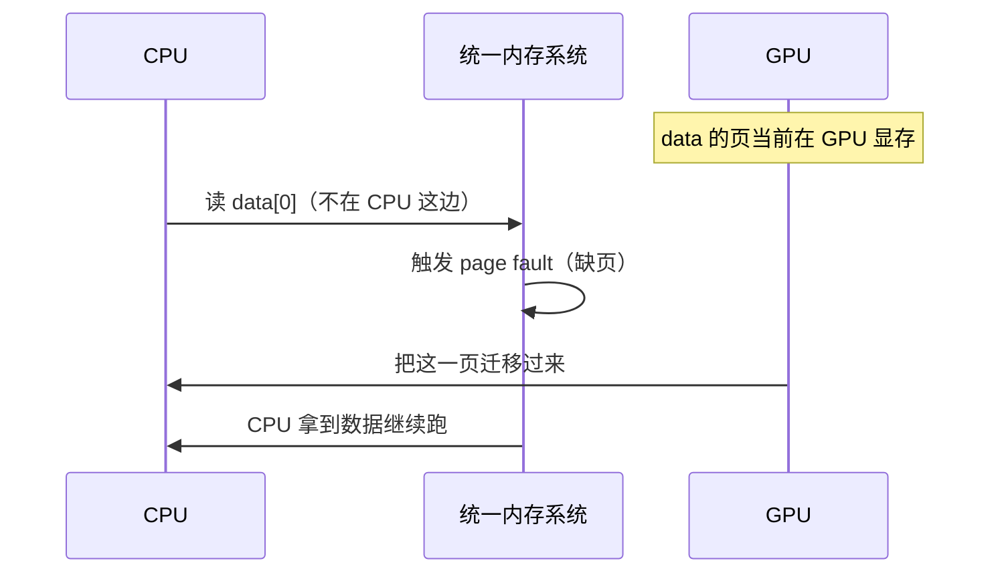

# CUDA 统一内存（Unified Memory）详解（从 0 到 1）

> 目标：你现在完全不知道 Unified Memory 是什么。读完这份文档，你能说清它**解决什么痛点、底层到底做了什么、为什么有时反而更慢、什么时候该用**。
> 硬件基准：**Tesla T4 / Turing / Compute Capability 7.5**（支持完整的"按需页迁移"统一内存）。
> 配套阅读：[CUDA内存模型详解.md](CUDA内存模型详解.md)（统一内存是其中 §9 的展开）。

---

## 0. 先看痛点：传统内存管理有多烦

在认识统一内存之前，先感受它要解决的问题。传统 CUDA 程序里，**Host(CPU) 内存和
Device(GPU) 内存是两个独立的地址空间**，你必须手动搬数据。一个最简单的"数组加一"
要写这么多：

```cpp
float* h_data = new float[N];          // ① CPU 内存
float* d_data;
cudaMalloc(&d_data, N * sizeof(float)); // ② GPU 内存（另一个指针！）

cudaMemcpy(d_data, h_data, bytes, cudaMemcpyHostToDevice); // ③ 手动拷过去
kernel<<<...>>>(d_data, N);                                 // ④ GPU 算
cudaMemcpy(h_data, d_data, bytes, cudaMemcpyDeviceToHost);  // ⑤ 手动拷回来

delete[] h_data;       // ⑥ 两块都要释放
cudaFree(d_data);
```

烦在哪：

- **两个指针**（`h_data` / `d_data`）指向同一份"逻辑数据"，容易搞混、传错。
- 每次 GPU 要用数据，**你得记得手动 `cudaMemcpy` 搬过去**；用完搬回来。
- 数据结构一复杂（比如链表、树、指针套指针），手动深拷贝会写到崩溃。

统一内存就是来消灭这一堆样板代码的。

---

## 1. 什么是 Unified Memory（一句话 + 类比）

> **Unified Memory（统一内存）= 用一个指针，CPU 和 GPU 都能直接访问；数据该在谁那边，由系统自动搬。**

你只用 `cudaMallocManaged` 申请**一块内存、一个指针**，CPU 能读写它，GPU 也能读写它，
**不用再手写 `cudaMemcpy`**。

```cpp
float* data;
cudaMallocManaged(&data, N * sizeof(float));  // 一个指针，两边通用

for (int i = 0; i < N; ++i) data[i] = i;   // CPU 直接写
kernel<<<...>>>(data, N);                  // GPU 直接用同一个指针
cudaDeviceSynchronize();                   // 等 GPU 算完
printf("%f\n", data[0]);                   // CPU 直接读结果

cudaFree(data);                            // 只释放一次
```

对比上面第 0 节，`cudaMemcpy` 没了，两个指针变成一个。代码干净多了。

**类比**：

```text
传统方式 = 你家(CPU)和公司(GPU)各有一份文件，要用就自己来回快递(cudaMemcpy)
统一内存 = 一份放在云盘(统一地址)的文件，谁要用系统自动同步到谁的设备上
```

> **核心澄清（划重点）**：统一内存让编程"看起来"像 CPU/GPU 共享一块内存，
> 但**物理上数据仍然只能待在某一边**（要么 CPU 内存、要么 GPU 显存）。
> 系统只是把"搬运"这件事从你手里接管过去，**自动**做了。
> **拷贝没有消失，只是被隐藏和自动化了。** 这句话是理解后面所有性能问题的钥匙。

---

## 2. 两种写法并排对比

| | 传统手动管理 | Unified Memory |
|---|---|---|
| 申请 | `malloc` + `cudaMalloc`（两块） | `cudaMallocManaged`（一块） |
| 指针 | `h_data` 和 `d_data` 两个 | `data` 一个 |
| 搬数据 | 手动 `cudaMemcpy` 来回 | 系统自动迁移 |
| 释放 | `free` + `cudaFree` | `cudaFree` 一次 |
| 心智负担 | 高（时刻想着数据在哪） | 低（先不用想） |
| 性能可控性 | 高（你完全掌控搬运时机） | **默认较低**（搬运是隐式的，可能踩坑） |

一句话：**统一内存用一点点潜在的性能风险，换来巨大的编程便利。** 怎么把性能风险补回来，
是第 6–7 节的事。

---

## 3. 底层机制：它到底"自动"做了什么——按需页迁移

这是整份文档最关键的一章。统一内存不是魔法，它靠的是 **按需页迁移
（on-demand page migration）+ 缺页中断（page fault）**。

### 3.1 内存是按"页"管理的

操作系统和 GPU 把内存切成固定大小的**页（page）**（典型 4 KB）。统一内存的迁移
**以页为单位**，不是以单个变量为单位。

### 3.2 谁访问，页就迁到谁那边

`cudaMallocManaged` 申请的内存，背后有一套机制跟踪"每一页现在物理上在 CPU 还是 GPU"。
当某一方访问一页**而这页不在它那边**时，会触发一次 **page fault（缺页）**，系统于是
把这页**从另一边搬过来**：

```text
data[0] 这一页当前在 GPU 显存里。

CPU 执行 printf("%f", data[0]):
   CPU 发现这页不在 CPU 内存  → 触发 page fault
   → 系统把这页从 GPU 显存搬到 CPU 内存
   → CPU 拿到数据，继续执行
```



### 3.3 所以"自动 memcpy"发生在 page fault 时

回到第 1 节的代码，把隐藏的迁移标出来：

```cpp
for (int i = 0; i < N; ++i) data[i] = i;  // CPU 写 → 页迁到/留在 CPU
kernel<<<...>>>(data, N);                 // GPU 访问 → page fault → 页迁到 GPU
cudaDeviceSynchronize();
printf("%f\n", data[0]);                  // CPU 读 → page fault → 页迁回 CPU
```

你没写一行 `cudaMemcpy`，但系统在背后做了**两次方向相反的迁移**。这就是"自动"的真相：
**把显式拷贝换成了缺页时的隐式迁移。**

---

## 4. 关键澄清：统一内存 ≠ 零拷贝 ≠ 更快

初学者最大的误解是"统一内存把 CPU/GPU 内存合并了，所以不用拷贝、所以更快"。**三个都错。**

```text
❌ 误解：CPU 和 GPU 共享同一块物理内存
✅ 事实：物理上还是两块（CPU 内存 + GPU 显存），数据每时刻只在一边

❌ 误解：没有拷贝了
✅ 事实：拷贝变成了"缺页时的页迁移"，只是你看不见

❌ 误解：用了统一内存就更快
✅ 事实：默认情况下，它可能和手动 cudaMemcpy 一样快，也可能慢得多（见 §6）
```

统一内存的卖点是**可编程性（programmability）**，不是性能。性能要靠你额外调优（§7）。

---

## 5. 数据物理上在哪：页驻留（residency）

任意时刻，每一页都"驻留"在某个位置：

```text
页可能驻留在：
  - CPU 内存
  - 某块 GPU 的显存
访问发生在"非驻留方"时 → page fault → 迁移 → 驻留位置改变
```

性能分析时，你脑子里要时刻有这个问题：**我现在访问的页，到底在哪边？这次访问会不会
触发迁移？** 这正是后面优化的出发点。

---

## 6. 性能陷阱：ping-pong（来回乒乓迁移）

统一内存最容易踩的坑，是 CPU 和 GPU **交替访问同一批页**，导致页在两边**反复横跳**。

```cpp
for (int it = 0; it < iters; ++it) {
    cpuProcess(data, N);    // CPU 访问 → 整批页迁到 CPU
    gpuKernel<<<...>>>(data, N);   // GPU 访问 → 整批页又迁到 GPU
    cudaDeviceSynchronize();
}
```

每一轮循环，同一批页都要**跨 PCIe 搬两次**：

```text
迭代1: 页 →CPU →GPU
迭代2: 页 →CPU →GPU
迭代3: 页 →CPU →GPU
...     每次都在搬，PCIe 被迁移占满，计算反而在等数据
```

**算笔账**：假设工作集 1 GB，PCIe 约 16 GB/s，一次单向迁移就要约 **60 ms**。
如果 kernel 本身只算几毫秒，那这几十毫秒的来回迁移会**彻底主导**端到端时间——
此时统一内存比"手动 cudaMemcpy 一次、之后都在 GPU 上算"**慢得多**。

> **记忆**：统一内存的性能杀手不是"迁移"本身，而是"**反复**迁移"。一次迁移不可怕，
> 来回乒乓才致命。

---

## 7. 怎么把性能补回来：prefetch 与 advise

统一内存提供两个主动管理工具，让你把"隐式、被动、踩坑"的迁移变成"显式、主动、可控"。

### 7.1 `cudaMemPrefetchAsync`：提前把页搬到位

与其等 kernel 访问时才一页页缺页迁移（慢、零散），不如在 kernel 启动**前**，
一次性把整批页**预迁**到 GPU：

```cpp
// kernel 前：把 data 预取到 GPU，消除 kernel 运行时的缺页
cudaMemPrefetchAsync(data, bytes, deviceId, stream);
kernel<<<...>>>(data, N);

// 算完要给 CPU 用：再预取回 CPU
cudaMemPrefetchAsync(data, bytes, cudaCpuDeviceId, stream);
cudaDeviceSynchronize();
cpuUse(data);
```

效果：把"运行时大量零散 page fault"换成"一次批量、可与计算重叠的迁移"，
通常能让统一内存的性能**追平甚至接近**手动 `cudaMemcpy`。

### 7.2 `cudaMemAdvise`：告诉系统访问偏好

给系统提示，让它的迁移决策更聪明：

```cpp
// 这块数据主要是只读的、会被多处读 → 倾向于在各处保留只读副本
cudaMemAdvise(data, bytes, cudaMemAdviseSetReadMostly, deviceId);

// 这块数据"首选"驻留在某个 GPU → 减少不必要的迁回
cudaMemAdvise(data, bytes, cudaMemAdviseSetPreferredLocation, deviceId);

// 某个处理器会频繁访问这块（即使不驻留也建立映射）→ 避免迁移
cudaMemAdvise(data, bytes, cudaMemAdviseSetAccessedBy, cudaCpuDeviceId);
```

`advise` 不强制搬数据，只是改变系统**何时、往哪迁**的策略，常和 prefetch 配合。

> **一句话**：`cudaMallocManaged` 让代码能跑；`prefetch` + `advise` 让它跑得快。
> 只用前者不调后者，就是在赌运气。

---

## 8. 什么时候用 / 不用统一内存

```text
适合用 ✅：
  - 快速原型、教学、demo —— 先把功能跑通，不想纠结 memcpy
  - 复杂指针数据结构（链表/树/图）—— 手动深拷贝代价太高
  - 数据集大于显存（oversubscription）—— 统一内存能自动换入换出页
  - 访问稀疏/不可预测 —— 难以手写精确的 memcpy 范围
  - CPU 和 GPU 真正需要共享、交替访问同一数据（配合 prefetch/advise）

谨慎/不适合 ❌：
  - 极致性能、访问模式规整且已知 —— 手动 cudaMemcpy + pinned 更可控
  - CPU/GPU 高频交替访问同一批页 —— 当心 ping-pong（§6）
  - 一次拷入、之后全程在 GPU 上算 —— 传统方式天然最优，统一内存无优势
```

经验法则：**先用统一内存把程序跑对**，再用 Nsight 看是不是迁移成了瓶颈，
是的话上 prefetch/advise，还不够就退回手动管理。

---

## 9. 常见误区速查

| 误区 | 真相 |
|---|---|
| "统一内存 = CPU/GPU 共享物理内存" | 物理仍是两块，数据每刻只在一边，靠迁移同步 |
| "用了就没有拷贝了" | 拷贝变成隐式页迁移，没消失 |
| "统一内存一定更快" | 默认可能更慢；要 prefetch/advise 才追平手动 |
| "cudaMallocManaged 后随便访问就行" | 随便访问容易 ping-pong，性能塌方 |
| "迁移以变量为单位" | 以**页**（~4KB）为单位，整页一起搬 |
| "访问前不用同步" | GPU 写完、CPU 读前必须 `cudaDeviceSynchronize`（或 stream 同步） |

---

## 10. 进阶补充：官方 "Unified and System Memory" 深入

前面 0–9 节覆盖了统一内存的核心。下面四块是官方文档里更权威、我前面略过、
**生产环境和深问面试会用到**的内容。

### 10.1 System-Allocated Memory（系统分配内存）—— 统一内存的"进化版"

到目前为止我们都在用 `cudaMallocManaged`。但在**支持的平台**上，还有更激进的一步：
**直接用 `malloc` / `new` / `std::vector` 分配的普通内存，GPU 也能直接访问**——
连 `cudaMallocManaged` 都不需要。

```cpp
// 在支持 system-allocated memory 的平台上：
float* data = new float[N];     // 普通 C++ 分配，没有任何 CUDA API
for (int i = 0; i < N; ++i) data[i] = i;
kernel<<<...>>>(data, N);        // GPU 直接吃这个普通指针！
cudaDeviceSynchronize();
printf("%f\n", data[0]);
delete[] data;
```

- 这是 "**System** Memory" 那半个标题的重点：把"统一"从 CUDA 托管内存推广到
  **整个进程的内存**。
- 背后靠 **HMM（Heterogeneous Memory Management，Linux 内核能力）** 或硬件级的
  地址转换支持，让 GPU 的缺页迁移机制能作用到**任意** host 指针上。
- 迁移/page fault 的原理和前面讲的**完全一样**，只是触发范围从"managed 内存"
  扩大到"所有内存"。

> **平台前提**：System-allocated memory 需要**较新的架构 + 较新驱动 + 支持的 OS
> （主要是 Linux + HMM，或 Grace Hopper 这类有硬件一致性的平台）**。
> **T4（Turing）属于较老架构，通常不具备完整的 system-allocated 能力**——在 T4 上
> 你仍应使用 `cudaMallocManaged`。这正是为什么要先查平台支持（见 10.2）。

### 10.2 平台前提与能力查询（不是所有 GPU 都一样）

统一内存的"能做到什么程度"高度依赖**架构 + 驱动 + 操作系统**，不能想当然。
用设备属性查询，而不是假设：

```cpp
int v;
// 是否支持 managed memory（cudaMallocManaged）
cudaDeviceGetAttribute(&v, cudaDevAttrManagedMemory, dev);
// 是否支持并发访问 + 按需细粒度页迁移（Pascal+ 的关键能力）
cudaDeviceGetAttribute(&v, cudaDevAttrConcurrentManagedAccess, dev);
// 是否支持直接访问 system-allocated（malloc）内存
cudaDeviceGetAttribute(&v, cudaDevAttrPageableMemoryAccess, dev);
```

能力大致分两档（理解"为什么老卡和新卡行为不同"）：

```text
Pre-Pascal（如 Kepler/Maxwell）：
  - 统一内存是"粗粒度"的：kernel 运行期间，CPU 不能碰那块 managed 内存
  - 没有真正的按需页迁移和缺页处理

Pascal 及以后（含 T4=Turing）：
  - 细粒度按需页迁移 + page fault（就是本文 §3 讲的机制）
  - cudaDevAttrConcurrentManagedAccess=1：支持 CPU/GPU 并发访问（有规则，见 10.3）
  - 超额订阅（oversubscription）：managed 内存可以超过显存大小，靠换页支撑

更新平台（部分 Ampere+ on Linux / Grace Hopper）：
  - 进一步支持 system-allocated（malloc）内存直接被 GPU 访问（10.1）
```

> 一句话：**先查 attribute，再决定用哪种统一内存写法。** 同一段代码在 T4 和
> Grace Hopper 上的最优写法可能不同。

### 10.3 一致性（Coherency）与并发访问规则

"CPU 和 GPU 能不能**同时**访问同一块 managed 内存？" 这是官方定义最精确、最容易
出 bug 的地方。规则按架构分档：

```text
Pre-Pascal：
  kernel 一旦启动，CPU 就【不能】访问任何 managed 内存，直到同步完成。
  违反 → 段错误或未定义行为。

Pascal 及以后（含 T4）+ ConcurrentManagedAccess=1：
  CPU 和 GPU 可以【并发】访问 managed 内存，但仍受"内存模型"约束：
    - 访问【不同】页：互不干扰，安全。
    - 同时访问【同一】页、且至少一方写：这是 data race，结果未定义
      —— 和卷四讲的 race 是同一回事，需要同步/原子来协调。
```

实务结论（最该记住的）：

```text
✅ 安全：GPU 写 A 区域、CPU 同时读写 B 区域（不同页）
❌ 危险：GPU 在写某页时，CPU 同时读/写同一页 → race
🔑 经验：GPU kernel 运行期间，CPU 不要去碰 kernel 正在写的那块数据；
        需要交接时，用 cudaDeviceSynchronize / stream 同步 / event 划清边界。
```

这也是为什么本文 §1 的例子里，`kernel` 之后、CPU 读 `data[0]` 之前必须
`cudaDeviceSynchronize()`——不是为了"等结果算完"那么简单，更是为了建立
**CPU 与 GPU 之间合法的访问交接点**。

### 10.4 多 GPU 下的统一内存

单 GPU 的页只在"CPU ↔ 这块 GPU"之间迁移。多 GPU 时，同一块 managed 内存的页
可能在 **CPU 和多块 GPU 之间**流动，迁移决策更复杂，advise 也更有用：

```cpp
// 指定某块数据"首选"驻留在 GPU 0，减少被其它 GPU 访问时来回迁移
cudaMemAdvise(data, bytes, cudaMemAdviseSetPreferredLocation, /*GPU0*/0);
// 告诉系统 GPU 1 也会频繁访问 → 为它建立直接映射（可能走 NVLink/P2P 而非迁移）
cudaMemAdvise(data, bytes, cudaMemAdviseSetAccessedBy, /*GPU1*/1);
```

关键点：

- 多 GPU 间若有 **NVLink / P2P**，访问对端数据可能走高速互联**直接访问**，
  而不必把页迁过来——`SetAccessedBy` 配合 P2P 能避免昂贵的来回迁移。
- 没有 P2P 时，跨 GPU 访问就退化成"经 CPU 中转的迁移"，更慢。
- preferred location + accessed-by 的组合，是多 GPU 统一内存调优的主要手段。

> T4 单卡场景用不到这块，但多卡训练/HPC（卷八）会重度依赖，先建立概念。

---

## 11. 和"内存模型"文档的关系

- [CUDA内存模型详解.md](CUDA内存模型详解.md) 讲的是 **GPU 内部**的存储层次（register/shared/global/cache）
  和一致性模型——那是"数据在 GPU 上怎么放、怎么同步"。
- 这份文档讲的是 **CPU↔GPU 之间**的数据管理——"数据怎么在主机和设备间流动"。
- 两者正交：统一内存解决"搬运"，但数据搬到 GPU 后，**怎么访问 global、要不要用 shared、
  会不会 bank conflict**，仍然适用内存模型文档那一套。统一内存**不会**让你逃过 coalescing。

---

## 12. 一页速记（面试/复习看这个）

```text
是什么：cudaMallocManaged 申请一块内存、一个指针，CPU/GPU 都能直接访问
机制：  按需页迁移 + page fault。谁访问、页就迁到谁那边（以 ~4KB 页为单位）
真相：  物理仍两块内存；拷贝没消失，只是变成隐式迁移；卖点是可编程性不是性能
陷阱：  ping-pong —— CPU/GPU 交替访问同一批页 → 反复跨 PCIe 迁移 → 比手动还慢
优化：  cudaMemPrefetchAsync 提前批量迁页；cudaMemAdvise 提示访问偏好
同步：  GPU 写后 CPU 读前必须同步（cudaDeviceSynchronize / stream 同步）
何时用：原型/复杂指针结构/超显存/稀疏访问 → 用；极致性能且模式已知 → 手动 memcpy
不变量：数据到 GPU 后仍要管 coalescing / shared / bank conflict（见内存模型文档）
进阶：  system-allocated(malloc 也能被 GPU 访问) 需新平台+HMM；T4 仍用 managed
平台：  先查 cudaDevAttrConcurrentManagedAccess / PageableMemoryAccess，别假设
一致性：Pascal+ 可 CPU/GPU 并发访问；同一页且有写 = race；同步划清交接边界
多GPU：preferred location + accessed-by + NVLink/P2P 避免跨卡来回迁移
```

---

## 资料映射

- CUDA C++ Programming Guide：Unified Memory Programming、**Unified and System Memory**（最权威）
- CUDA C++ Best Practices Guide：Unified Memory、Data Prefetching
- CUDA Runtime API：`cudaMallocManaged`、`cudaMemPrefetchAsync`、`cudaMemAdvise`、`cudaDeviceGetAttribute`
- 关键设备属性：`cudaDevAttrManagedMemory`、`cudaDevAttrConcurrentManagedAccess`、`cudaDevAttrPageableMemoryAccess`
- 背景概念：HMM（Heterogeneous Memory Management）、NVLink / P2P、Grace Hopper 一致性
- 配套：[CUDA内存模型详解.md](CUDA内存模型详解.md) §9、卷三第 04 章（Cache、Host 传输与 Unified Memory）
